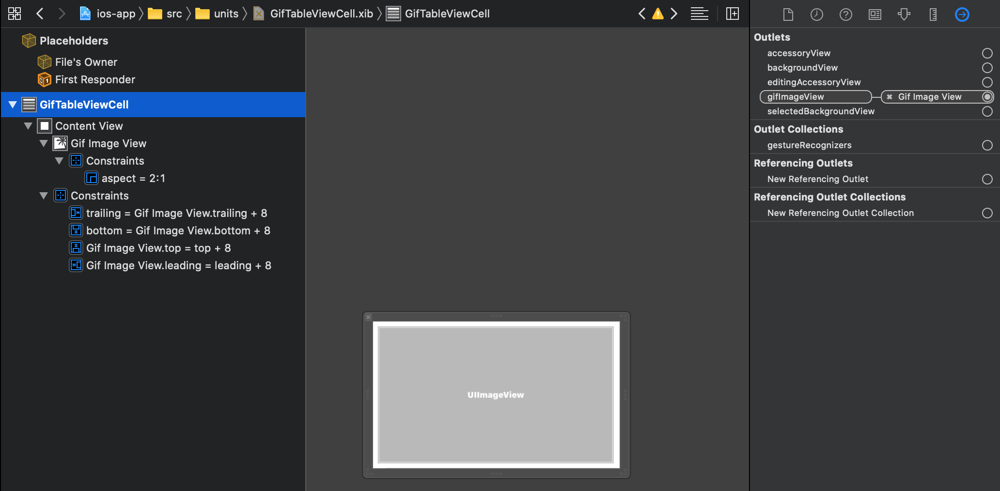

summary: Gif list development 
id: giphy-app-2
categories: multiplatform
environments: moko-template
status: published
Feedback Link: https://github.com/icerockdev/kmp-codelabs/issues
Analytics Account: UA-81805223-5
Author: Aleksey Mikhailov <am@icerock.dev>

# GiphyApp #2 - Development list of Gifs
## Intro

This manual is the second part in GiphyApp series, before you start we would recommend to do [GiphyApp #1](https://codelabs.kmp.icerock.dev/codelabs/giphy-app-1).

The result of this lession is available on [github](https://github.com/Alex009/giphy-mobile).

## Implement common logic of Gif list in shared library
Duration: 30

App should get list of Gifs from GIPHY service. There is an example with getting list of news from newsapi in the project template (using [moko-network](https://github.com/icerockdev/moko-network) with generating network entites and API classes from OpenAPI specification). 

We can get OpenAPI spec of GIPHY from [apis.guru](https://apis.guru/browse-apis/) and can replace getting news by getting Gif. 

Positive
: Фича списка уже присутствует в шаблоне, поэтому логику не придется реализовывать. Для большего понимания как устроена фича следует ознакомиться с [схемой модуля](https://github.com/icerockdev/moko-template#list-module-scheme) и посмотреть код в `mpp-library:feature:list`.

: Feature List is already in the project template and you have not to implement any additional logic. You can see [scheme of module](https://github.com/icerockdev/moko-template#list-module-scheme) and look into `mpp-library:feature:list` for detail information about it.

### Replace OpenAPI spec

Replace file `mpp-library/domain/src/openapi.yml` by the content from [OpenAPI spec of GIPHY service](assets/giphy-openapi.yml). After it please do `Gradle Sync` and as the result you will see some errors in the `newsapi` code. Let's update code by new API. 

Positive
: You can find generated files here `mpp-library/domain/build/generate-resources/main/src/main/kotlin`

### Replace news by gifs in domain module
You have to update the following classes after replacing OpenAPI spec in `domain` module:
- `News` should be replaced by `Gif`;
- `NewsRepository` – should be replaced by `GifRepository`;
- `DomainFactory` – add `gifRepository` and set necessary dependencies.

#### News -> Gif
Let's modify `News` class to the following one:
```kotlin
@Parcelize
data class Gif(
    val id: Int,
    val previewUrl: String,
    val sourceUrl: String
) : Parcelable
```
This domain entity contains gif's `id` and two URL (full and preview variant). `id` is used for correct identifying element in a list and in UI animations.

Let's transform network entity `dev.icerock.moko.network.generated.models.Gif` to domain entity. To do this add one more construct method:

```kotlin
@Parcelize
data class Gif(
    ...
) : Parcelable {

    internal constructor(entity: dev.icerock.moko.network.generated.models.Gif) : this(
        id = entity.url.hashCode(),
        previewUrl = requireNotNull(entity.images?.downsizedMedium?.url) { "api can't respond without preview image" },
        gifUrl = requireNotNull(entity.images?.original?.url) { "api can't respond without original image" }
    )
}
```
Above there is a field mapping from network entity to domain entity - it will reduce the number of edits if API has been changed.  The application doesn't depend on API implementation.  

#### NewsRepository -> GifRepository
Let's change `NewsRepository` to `GifRepository` with the following content:
```kotlin
class GifRepository internal constructor(
    private val gifsApi: GifsApi
) {
    suspend fun getGifList(query: String): List<Gif> {
        return gifsApi.searchGifs(
            q = query,
            limit = null,
            offset = null,
            rating = null,
            lang = null
        ).data?.map { Gif(entity = it) }.orEmpty()
    }
}
```

In this class you have to get `GifsApi` object (generated by `moko-network`) and call a method API `searchGifs`, where we use just `query` string, but other arguments are by default. 

Network entities we have to modify in domain entities, what can be public (network entites generated with `internal` modifier only). 

#### DomainFactory
In `DomainFactory` we have to replace creation `newsApi` and `newsRepository` by the following code:

```kotlin
private val gifsApi: GifsApi by lazy {
    GifsApi(
        basePath = baseUrl,
        httpClient = httpClient,
        json = json
    )
}

val gifRepository: GifRepository by lazy {
    GifRepository(
        gifsApi = gifsApi
    )
}
```

`GifsApi` - it's a generated class, for creation you need a several parameters:
- `baseUrl` – server url, it will come from factory of native layer. It needed for set up different envoiroment configuration. 
- `httpClient` - http client object for work with server  (from [ktor-client](https://github.com/ktorio/ktor/)) 
- `json` - JSON serialization object (from [kotlinx.serialization](https://github.com/Kotlin/kotlinx.serialization))

`GifRepository` is available outside of module, you can create it using `gifsApi` object only.

There is a `lazy` initialization – API and repository are Singleton objects (objects are alive while the factory is alive and  the factory is created `SharedFactory` exists during life cycle of an application).

Also we need to send Api Key for work with GIPHY API. To do this we can use `TokenFeature` for `ktor`. It was already connected, we just have to configure it: 

```kotlin
install(TokenFeature) {
    tokenHeaderName = "api_key"
    tokenProvider = object : TokenFeature.TokenProvider {
        override fun getToken(): String? = "o5tAxORWRXRxxgIvRthxWnsjEbA3vkjV"
    }
}
```
Every query comes throught `httpClient` will be append by header `api_key: o5tAxORWRXRxxgIvRthxWnsjEbA3vkjV` in this case (this is a sample app key, you can create a your one in [GIPHY admin area](https://developers.giphy.com/dashboard/) if you are  exceed the limit).

### Update connection between `domain` and `feature:list` from SharedFactory  

In `SharedFactory` we have to change interface of units list factory, `NewsUnitsFactory`, and replace singleton `newsFactory` by `gifsFactory` with `Gif` configuration. 

#### NewsUnitsFactory -> GifsUnitsFactory
Interface of units list factory should be replaced by:  
```kotlin
interface GifsUnitsFactory {
    fun createGifTile(
        id: Long,
        gifUrl: String
    ): UnitItem
}
```
То есть из общей логики будет выдаваться `id` для корректного определения diff'а списка с анимированием обновления и `gifUrl` в котором будет url для вывода анимации на UI.
So, there will be `id` (for proper diff list calculation for UI animation ) and `gifUrl` (this is url for animation output) from shared code. 

#### newsFactory -> gifsFactory
List Factory should be replaced by the following code: 
```kotlin
val gifsFactory: ListFactory<Gif> = ListFactory(
    listSource = object : ListSource<Gif> {
        override suspend fun getList(): List<Gif> {
            return domainFactory.gifRepository.getGifList("test")
        }
    },
    strings = object : ListViewModel.Strings {
        override val unknownError: StringResource = MR.strings.unknown_error
    },
    unitsFactory = object : ListViewModel.UnitsFactory<Gif> {
        override fun createTile(data: Gif): UnitItem {
            return gifsUnitsFactory.createGifTile(
                id = data.id.toLong(),
                gifUrl = data.previewUrl
            )
        }
    }
)
```

In code above there is a data source `listSource` and we call `gifRepository` from `domain` module there. Temporary `query` is set up as `test` value, but we will change it in next lessons. 
Also there is a parameter `strings`, localization strings, will be implemented in `feature:list` module (this module requires only one string "unknown error"). 
The last required parameter is `unitsFactory`, but the module works with 1 method factory, `createTile(data: Gif)`, and for native platforms it will be better to use a specific list factory (so every UI-related field was defined from common code). That's why we use `gifsUnitsFactory.createGifTile`. 


The last thing to do - replace `SharedLibrary` constructor by the following code: 
```kotlin
class SharedFactory(
    settings: Settings,
    antilog: Antilog,
    baseUrl: String,
    gifsUnitsFactory: GifsUnitsFactory
)
```
So native platforms will return `GifsUnitsFactory` object. 

## Implement Gif list on Android
Duration: 30

### Set server URL
There is a working server URL will be passed from application layer to the common code library so we avoid rebuilding when server url had changed. 

In our current configuration there is only one environment and only one server url. It set up in `android-app/build.gradle.kts`, let's replace it: 

```kotlin
android {
    ...
    defaultConfig {
        ...

        val url = "https://api.giphy.com/v1/"
        buildConfigField("String", "BASE_URL", "\"$url\"")
    }
}
```

### Dependencies Injection 
We have to use [glide](https://github.com/bumptech/glide) library for gif rendering and we use [constraintLayout](https://developer.android.com/training/constraint-layout) library for setting aspect ratio 2:1 of list's unit. 

`constraintLayout` is already declared in project dependencies and we just need to include it on `android-app`, let's add it in `android-app/build.gradle.kts`:

```kotlin
dependencies {
    ...
    implementation(Deps.Libs.Android.constraintLayout.name)
}
```

A `glide` has to be appended in dependencies injection script in `buildSrc/src/main/kotlin/Versions.kt`: 
```kotlin
object Versions {
    ...
    object Libs {
        ...
        object Android {
            ...
            const val glide = "4.10.0"
        }
    }
}
```
And in `buildSrc/src/main/kotlin/Deps.kt`:
```kotlin
object Deps {
    ...
    object Libs {
        ...
        object Android {
            ...
            val glide = AndroidLibrary(
                name = "com.github.bumptech.glide:glide:${Versions.Libs.Android.glide}"
            )
        }
```

After this we can add in `android-app/build.gradle.kts` the following code: 
```kotlin
dependencies {
    ...
    implementation(Deps.Libs.Android.glide.name)
}
```

### Инициализация SharedFactory
Для создания `SharedFactory` теперь требуется `gifsUnitsFactory` вместо `newsUnitsFactory`. Чтобы предоставить эту зависимость преобразуем класс `NewsUnitsFactory` в следующий:
```kotlin
class GifListUnitsFactory : SharedFactory.GifsUnitsFactory {
    override fun createGifTile(id: Long, gifUrl: String): UnitItem {
        TODO()
    }
}
```
А в `SharedFactory` будем передавать его:
```kotlin
AppComponent.factory = SharedFactory(
    baseUrl = BuildConfig.BASE_URL,
    settings = AndroidSettings(getSharedPreferences("app", Context.MODE_PRIVATE)),
    antilog = DebugAntilog(),
    gifsUnitsFactory = GifListUnitsFactory()
)
```

### Реализация GifListUnitsFactory
Интерфейс `SharedFactory.GifsUnitsFactory` требует, чтобы мы создали `UnitItem` из `id` и `gifUrl`. Сам интерфейс `UnitItem` относится к библиотеке [moko-units](https://github.com/icerockdev/moko-units) и реализации можно генерировать из DataBinding layout'ов. 

Создадим `android-app/src/main/res/layout/tile_gif.xml` с содержимым:
```xml
<?xml version="1.0" encoding="utf-8"?>
<layout xmlns:android="http://schemas.android.com/apk/res/android"
    xmlns:app="http://schemas.android.com/apk/res-auto"
    xmlns:tools="http://schemas.android.com/tools">

    <data>

        <variable
            name="gifUrl"
            type="String" />
    </data>

    <androidx.constraintlayout.widget.ConstraintLayout
        android:layout_width="match_parent"
        android:layout_height="wrap_content"
        android:padding="8dp">

        <ImageView
            android:layout_width="match_parent"
            android:layout_height="0dp"
            app:gifUrl="@{gifUrl}"
            app:layout_constraintBottom_toBottomOf="parent"
            app:layout_constraintDimensionRatio="2:1"
            app:layout_constraintLeft_toLeftOf="parent"
            app:layout_constraintRight_toRightOf="parent"
            app:layout_constraintTop_toTopOf="parent"
            tools:ignore="ContentDescription" />
    </androidx.constraintlayout.widget.ConstraintLayout>
</layout>
```
И после этого запустим `Gradle Sync` – после этого автоматически будет сгенерирован класс `TileGif`, который мы и используем в `GifListUnitsFactory`:
```kotlin
class GifListUnitsFactory : SharedFactory.GifsUnitsFactory {
    override fun createGifTile(id: Long, gifUrl: String): UnitItem {
        return TileGif().apply {
            itemId = id
            this.gifUrl = gifUrl
        }
    }
}
```

В самом layout'е мы использовали нестандартный Binding Adapter - `app:gifUrl`. Нужно его реализовать, для этого создадим файл `android-app/src/main/java/org/example/app/BindingAdapters.kt` с содержимым:
```kotlin
package org.example.app

import android.widget.ImageView
import androidx.databinding.BindingAdapter
import androidx.swiperefreshlayout.widget.CircularProgressDrawable
import com.bumptech.glide.Glide

@BindingAdapter("gifUrl")
fun ImageView.bindGif(gifUrl: String?) {
    if (gifUrl == null) {
        this.setImageDrawable(null)
        return
    }

    val circularProgressDrawable = CircularProgressDrawable(context).apply {
        strokeWidth = 5f
        centerRadius = 30f
        start()
    }

    Glide.with(this)
        .load(gifUrl)
        .placeholder(circularProgressDrawable)
        .error(android.R.drawable.stat_notify_error)
        .into(this)
}
```
Это добавит нам возможность задавать `gifUrl` для `ImageView` из layout'а. Причем на время загрузки будет отображаться прогресс бар, а при ошибке отобразится иконка ошибки.

### Создание экрана списка Gif
Остается только создать экран, который будет отображать данные из нашей общей логики.
Создадим `android-app/src/main/res/layout/activity_gif_list.xml` с содержимым:
```xml
<?xml version="1.0" encoding="utf-8"?>
<layout xmlns:android="http://schemas.android.com/apk/res/android"
    xmlns:app="http://schemas.android.com/apk/res-auto">

    <data>
        <import type="org.example.library.domain.entity.Gif"/>
        <import type="org.example.library.feature.list.presentation.ListViewModel" />

        <variable
            name="viewModel"
            type="ListViewModel&lt;Gif&gt;" />
    </data>

    <FrameLayout
        android:layout_width="match_parent"
        android:layout_height="match_parent">

        <androidx.swiperefreshlayout.widget.SwipeRefreshLayout
            android:id="@+id/refresh_layout"
            android:layout_width="match_parent"
            android:layout_height="match_parent"
            app:visibleOrGone="@{viewModel.state.ld.isSuccess}">

            <androidx.recyclerview.widget.RecyclerView
                android:layout_width="match_parent"
                android:layout_height="match_parent"
                app:adapter="@{`dev.icerock.moko.units.adapter.UnitsRecyclerViewAdapter`}"
                app:bindValue="@{viewModel.state.ld.dataValue}"
                app:layoutManager="androidx.recyclerview.widget.LinearLayoutManager" />

        </androidx.swiperefreshlayout.widget.SwipeRefreshLayout>

        <ProgressBar
            android:layout_width="wrap_content"
            android:layout_height="wrap_content"
            android:layout_gravity="center"
            app:visibleOrGone="@{viewModel.state.ld.isLoading}" />

        <TextView
            android:layout_width="match_parent"
            android:layout_height="wrap_content"
            android:layout_gravity="center"
            android:gravity="center"
            android:text="@string/no_data"
            app:visibleOrGone="@{viewModel.state.ld.isEmpty}" />

        <LinearLayout
            android:layout_width="match_parent"
            android:layout_height="wrap_content"
            android:layout_gravity="center"
            android:padding="16dp"
            android:orientation="vertical"
            app:visibleOrGone="@{viewModel.state.ld.isError}">

            <TextView
                android:layout_width="match_parent"
                android:layout_height="wrap_content"
                android:gravity="center"
                android:text="@{viewModel.state.ld.errorValue}" />

            <Button
                android:layout_width="wrap_content"
                android:layout_height="wrap_content"
                android:layout_gravity="center_horizontal"
                android:onClick="@{() -> viewModel.onRetryPressed()}"
                android:text="@string/retry_btn" />
        </LinearLayout>
    </FrameLayout>
</layout>
```
Layout использует Data Binding и отображает одно из 4 состояний полученное от `ListViewModel`. В состоянии данных отображается `SwipeRefreshLayout` с `RecyclerView` внутри, а `RecyclerView` использует `LinearLayoutManager` и `UnitsRecyclerViewAdapter` для отрисовки `UnitItem`'ов полученных из `UnitsFactory`.

Теперь создадим `android-app/src/main/java/org/example/app/view/GifListActivity.kt` с содержимым:
```kotlin
class GifListActivity : MvvmActivity<ActivityGifListBinding, ListViewModel<Gif>>() {
    override val layoutId: Int = R.layout.activity_gif_list
    override val viewModelClass = ListViewModel::class.java as Class<ListViewModel<Gif>>
    override val viewModelVariableId: Int = BR.viewModel

    override fun viewModelFactory(): ViewModelProvider.Factory = createViewModelFactory {
        AppComponent.factory.gifsFactory.createListViewModel()
    }

    override fun onCreate(savedInstanceState: Bundle?) {
        super.onCreate(savedInstanceState)

        with(binding.refreshLayout) {
            setOnRefreshListener {
                viewModel.onRefresh { isRefreshing = false }
            }
        }
    }
}
```
Мы получаем из фабрики `gifsFactory` нашу `ListViewModel<Gif>` и она будет выставлена в поле `viewModel` в layout'е `activity_gif_list`. 

Также для корректной работы `SwipeRefreshLayout` кодом задаем `setOnRefreshListener` и вызываем `viewModel.onRefresh`, который сообщит в лямбду что обновление завершено и мы сможем выключить анимацию обновления.

### Замена стартового экрана
Сделаем чтобы запускалось приложение сразу с `GifListActivity`. Для этого в `android-app/src/main/AndroidManifest.xml` добавим `GifListActivity`, а другие уберем (они нам не нужны):
```xml
<application ...>

    <activity android:name=".view.GifListActivity" >
        <intent-filter>
            <action android:name="android.intent.action.MAIN" />
            <category android:name="android.intent.category.LAUNCHER" />
        </intent-filter>
    </activity>
</application>
```

### Удаление лишних классов
Теперь можно удалить все лишние файлы из примера:
- `android-app/src/main/java/org/example/app/view/ConfigActivity.kt`
- `android-app/src/main/java/org/example/app/view/NewsActivity.kt`
- `android-app/src/main/res/layout/activity_news.xml`
- `android-app/src/main/res/layout/tile_news.xml`

### Запуск
Теперь можно запустить приложение на Android и увидеть список Gif.

## Реализация списка Gif на iOS
Duration: 30

### Указание URL сервера
Так же как и на android, адрес сервера, с которым работаем, внедряется с уровня приложения в общую библиотеку, чтобы не тратить время на пересборку общей библиотеки когда просто сменили сервер с которым работаем. Настройка на iOS делается в `ios-app/src/AppDelegate.swift`:
```swift
AppComponent.factory = SharedFactory(
    ...
    baseUrl: "https://api.giphy.com/v1/",
    ...
)
```

### Подключение зависимостей
Для отображения gif нам потребуется [SwiftyGif](https://github.com/kirualex/SwiftyGif), для его подключения нужно добавить в `ios-app/Podfile` зависимость:
```ruby
target 'ios-app' do
  ...
  pod 'SwiftyGif', '5.1.1'
end
```
и после этого выполнить команду `pod install` в директории `ios-app`.

### Инициализация SharedFactory
Для создания `SharedFactory` теперь требуется `gifsUnitsFactory` вместо `newsUnitsFactory`. Чтобы предоставить эту зависимость преобразуем класс `NewsUnitsFactory` в следующий:
```swift
class GifsListUnitsFactory: SharedFactoryGifsUnitsFactory {
    func createGifTile(id: Int64, gifUrl: String) -> UnitItem {
        // TODO
    }
}
```
А в `SharedFactory` будем передавать его:
```swift
AppComponent.factory = SharedFactory(
    settings: AppleSettings(delegate: UserDefaults.standard),
    antilog: DebugAntilog(defaultTag: "MPP"),
    baseUrl: "https://api.giphy.com/v1/",
    gifsUnitsFactory: GifsListUnitsFactory()
)
```

### Реализация GifListUnitsFactory
Интерфейс `SharedFactoryGifsUnitsFactory` требует, чтобы мы создали `UnitItem` из `id` и `gifUrl`. Сам интерфейс `UnitItem` относится к библиотеке [moko-units](https://github.com/icerockdev/moko-units) и реализация требует создания xib с интерфейсом ячейки и специального класса ячейки.

Создадим `ios-app/src/units/GifTableViewCell.swift` с содержимым:
```swift
import MultiPlatformLibraryUnits
import SwiftyGif

class GifTableViewCell: UITableViewCell, Fillable {
    typealias DataType = CellModel
    
    struct CellModel {
        let id: Int64
        let gifUrl: String
    }
    
    @IBOutlet private var gifImageView: UIImageView!
    
    private var gifDownloadTask: URLSessionDataTask?
    
    override func prepareForReuse() {
        super.prepareForReuse()
        
        gifDownloadTask?.cancel()
        gifImageView.clear()
    }
    
    func fill(_ data: GifTableViewCell.CellModel) {
        gifDownloadTask = gifImageView.setGifFromURL(URL(string: data.gifUrl)!)
    }
    
    func update(_ data: GifTableViewCell.CellModel) {
        
    }
}

extension GifTableViewCell: Reusable {
    static func reusableIdentifier() -> String {
        return "GifTableViewCell"
    }
    
    static func xibName() -> String {
        return "GifTableViewCell"
    }
    
    static func bundle() -> Bundle {
        return Bundle.main
    }
}
```
И нужно создать `ios-app/src/units/GifTableViewCell.xib` с версткой ячейки.
Итоговый результат выглядит так:

У самой `UITableViewCell` нужно указать класс `GifTableViewCell`:

А так же указать идентификатор для переиспользования:


Теперь в `GifListUnitsFactory` можно написать реализацию создания `UnitItem`:
```swift
class GifsListUnitsFactory: SharedFactoryGifsUnitsFactory {
    func createGifTile(id: Int64, gifUrl: String) -> UnitItem {
        return UITableViewCellUnit<GifTableViewCell>(
            data: GifTableViewCell.CellModel(
                id: id,
                gifUrl: gifUrl
            ),
            configurator: nil
        )
    }
}
```

### Создание экрана списка Gif
Остается только создать экран, который будет отображать данные из нашей общей логики.

Создадим `ios-app/src/view/GifListViewController.swift` с содержимым:
```swift
import MultiPlatformLibraryMvvm
import MultiPlatformLibraryUnits

class GifListViewController: UIViewController {
    @IBOutlet private var tableView: UITableView!
    @IBOutlet private var activityIndicator: UIActivityIndicatorView!
    @IBOutlet private var emptyView: UIView!
    @IBOutlet private var errorView: UIView!
    @IBOutlet private var errorLabel: UILabel!
    
    private var viewModel: ListViewModel<Gif>!
    private var dataSource: FlatUnitTableViewDataSource!
    private var refreshControl: UIRefreshControl!
    
    override func viewDidLoad() {
        super.viewDidLoad()
        
        viewModel = AppComponent.factory.gifsFactory.createListViewModel()

        // binding methods from https://github.com/icerockdev/moko-mvvm
        activityIndicator.bindVisibility(liveData: viewModel.state.isLoadingState())
        tableView.bindVisibility(liveData: viewModel.state.isSuccessState())
        emptyView.bindVisibility(liveData: viewModel.state.isEmptyState())
        errorView.bindVisibility(liveData: viewModel.state.isErrorState())

        // in/out generics of Kotlin removed in swift, so we should map to valid class
        let errorText: LiveData<StringDesc> = viewModel.state.error().map { $0 as? StringDesc } as! LiveData<StringDesc>
        errorLabel.bindText(liveData: errorText)

        // datasource from https://github.com/icerockdev/moko-units
        dataSource = FlatUnitTableViewDataSource()
        dataSource.setup(for: tableView)

        // manual bind to livedata, see https://github.com/icerockdev/moko-mvvm
        viewModel.state.data().addObserver { [weak self] itemsObject in
            guard let items = itemsObject as? [UITableViewCellUnitProtocol] else { return }
            
            self?.dataSource.units = items
            self?.tableView.reloadData()
        }
        
        refreshControl = UIRefreshControl()
        tableView.refreshControl = refreshControl
        refreshControl.addTarget(self, action: #selector(onRefresh), for: .valueChanged)
    }
    
    @IBAction func onRetryPressed() {
        viewModel.onRetryPressed()
    }
    
    @objc func onRefresh() {
        viewModel.onRefresh { [weak self] in
            self?.refreshControl.endRefreshing()
        }
    }
}
```
И перепривяжем в `MainStoryboard` `NewsViewController` к `GifListViewController`:


### Замена стартового экрана
Чтобы приложение запускалось сразу с экрана гифок, нужно указать у `Navigation Controller` `rootViewController` связь с `GifListViewController`:


### Удаление лишних файлов
Теперь можно удалить все лишнее:
- `ios-app/src/units/NewsTableViewCell.swift`
- `ios-app/src/units/NewsTableViewCell.xib`
- `ios-app/src/view/ConfigViewController.swift`
- `ios-app/src/view/NewsViewController.swift`

### Запуск
Теперь можно запустить приложение на iOS и увидеть список Gif.
