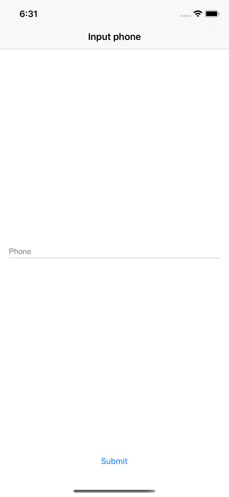

summary: MOKO Widgets #2 - роутинг
id: moko-widgets-2
categories: moko
environments: kotlin-mobile-mpp
status: published
Feedback Link: https://github.com/icerockdev/kmp-codelabs/issues
Analytics Account: UA-81805223-5
Author: Aleksey Mikhailov <am@icerock.dev>

# MOKO Widgets #2 - routing
## Вводная
Duration: 5

Урок является продолжением [MOKO Widgets #1 - hello world](https://codelabs.kmp.icerock.dev/codelabs/moko-widgets-1/). Для выполнения данного урока нужно иметь проект, полученный в результате выполнения предыдущего урока.

Результатом прошлого урока был экран входа с полем ввода имени и кнопкой отправки:

|android app|ios app|
|---|---|
|||

На этом уроке мы добавим навигацию между экранами. Схема переходов будет следующая:

Будут разобраны переходы:
- Обычный переход вперед;
- Переход назад;
- Переход вперед с передачей данных;
- Нижняя навигация табами;
- Переход с обработкой возвращаемого результата.

## Обновляем свой проект
Duration: 2

В этом уроке потребуется обновленная версия moko-widgets, поэтому сначала требуется обновиться до версии [0.1.0-dev-7](https://github.com/icerockdev/moko-widgets/releases/tag/release%2F0.1.0-dev-7). 
Изменения, которые нужно сделать можно посмотреть в [коммите](https://github.com/icerockdev/moko-widgets-template/commit/a617b9bfc6e42fa4203253825d7e530fc496a4d2)

## Схема авторизации
Duration: 2

Согласно схеме экранов процесс авторизации состоит из 2 экранов, после чего переход выполняется на главную.


## Авторизация - экран ввода телефона
Duration: 30

Переименуем полученный на прошлом уроке `LoginScreen` в `InputPhoneScreen` и перенесем в пакет `org.example.mpp.auth` - в нем соберем все классы относящиеся к авторизации, при чем сделаем это так, чтобы никаких внешних зависимостей у классов лежащих в этом пакете не было. Это позволит вынести эти классы в отдельный gradle модуль (разделение по фичам).

### Реализация ViewModel
Далее реализуем обработку действий пользователя, для этого заведем `InputPhoneViewModel`, в которой будет `phoneField` (ранее мы просто создавали инстанс поля не запоминая ссылку на него. Этот объект требуется для `input` виджета). 

```kotlin
class InputPhoneViewModel() : ViewModel() {

    val phoneField: FormField<String, StringDesc> = FormField(
        initialValue = "",
        validation = liveBlock { null }
    )

    fun onSubmitPressed() {
        val phone = phoneField.data.value
        println("phone: $phone")
    }
}
```
Описанная выше `ViewModel` содержит в себе поле ввода телефона, с выключенной валидацией (блок `liveBlock { null}` означает ошибки всегда нет), а так же обработчик нажатия `onSubmitPressed`, который выведет введенный телефон в лог.

### Привязка Screen к ViewModel
Теперь нужно привязать экран к `InputPhoneViewModel`.

Positive
: `ViewModel` переживает смену конфигурации на android. Это означает что если пользователь повернет экран или сменит язык в системе или включит разделение экрана, то данные, которые хранятся в `ViewModel`, а так же и все действия которые она выполняет, останутся доступны и новый пересозданный системой экран подключится к старой вьюмодели, без потерь данных. Чтобы эта логика работала нужно использовать функции получения `ViewModel` у `Screen`: `getViewModel {}` где в лямбде указывается как создать новую вьюмодель, если старой еще нет.

```kotlin
class InputPhoneScreen(
    ...
    private val viewModelFactory: () -> InputPhoneViewModel
) : ... {

    override fun createContentWidget() = with(theme) {
        val viewModel = getViewModel {
            viewModelFactory()
        }

        constraint(size = WidgetSize.AsParent) {
            val nameInput = +input(
                ...
                field = viewModel.phoneField
            )

            val submitButton = +button(
                ...
                onTap = viewModel::onSubmitPressed
            )

            ...
        }
    }
}
```
Из вне в экран передается фабрика `InputPhoneViewModel` через конструктор (внедрение зависимости позволяет ослабить связанность компонентов и реже вносить изменения в код экрана). Далее перед созданием виджетов мы получаем объект `InputPhoneViewModel` вызовом функции `getViewModel` (эта функция либо вернет существующую вьюмодель либо создаст новую). В лямбде `getViewModel` мы указываем как создать новую вьюмодель (в нашем случае вызовом `viewModelFactory`).
После получения `InputPhoneViewModel` мы можем привязать поле ввода к `phoneField` и обработчик нажатия кнопки `viewModel::onSubmitPressed` (таким образом передается функция объекта, чтобы не созадвать новую лямбду).

### Добавление оповещения Screen'а о необходимости перехода
Теперь нам осталось сообщить из `InputPhoneViewModel` что нужно произвести переход на следующий экран. В реальной логике мы выполним запрос к серверу, передав туда телефон, а сервер отдаст нам токен, с которым мы дальше должны работать. Мы сделаем подобие этой логики в вьюмодели.

Positive
: Для связи `ViewModel` -> `Screen` используются либо `LiveData`, которые автоматически подпишутся и отпишутся от получения изменений в нужный момент жизненного цикла либо `EventsDispatcher` (тоже работает учитывая жизненный цикл). Разница в том, что `LiveData` хранит постоянно значения, которые в ней записаны, а `EventsDispatcher` предназначен для разовых оповещенй, например "перейди на следующий экран" или "покажи тост с ошибкой".

```kotlin
class InputPhoneViewModel(
    override val eventsDispatcher: EventsDispatcher<EventsListener>
) : ViewModel(), EventsDispatcherOwner<InputPhoneViewModel.EventsListener> {

    val phoneField: FormField<String, StringDesc> = FormField(
        initialValue = "",
        validation = liveBlock { null }
    )

    fun onSubmitPressed() {
        val token = "token:" + phoneField.data.value
        eventsDispatcher.dispatchEvent { routeInputCode(token) }
    }

    interface EventsListener {
        fun routeInputCode(token: String)
    }
}
```
В `InputPhoneViewModel` мы добавляем внутри интерфейс - `EventsListener`, это интерфейс со всеми событиями, которые может вызвать `ViewModel` у `Screen`'а.
Когда уже есть интерфейс событий, нужно добавить к вьюмодели реализацию интерфейса `EventsDispatcherOwner<InputPhoneViewModel.EventsListener>` и добавить в конструктор `override val eventsDispatcher: EventsDispatcher<EventsListener>` - сам `EventsDispatcher` передается из вне.
Остается вызвать у `eventsDispatcher` метод `dispatchEvent` в нужный момент и указать какой именно метод должен быть вызван у `Screen`'а.

Для эмуляции действий сервера мы сформировали некую строку `token` и передаем ее в вызов `routeInputCode`.

### Реакция Screen'а на оповещения о необходимости перехода
Теперь `ViewModel` имеет дополнительный аргумент в конструкторе, который должен быть передан самим экраном. А так же в `ViewModel` есть `eventsDispatcher`, на который нужно подписаться.

```kotlin
class InputPhoneScreen(
    ...
    private val viewModelFactory: (
        EventsDispatcher<InputPhoneViewModel.EventsListener>
    ) -> InputPhoneViewModel,
    private val routeInputCode: Route<String>
) : ..., InputPhoneViewModel.EventsListener {
    ...

    override fun createContentWidget() = with(theme) {
        val viewModel = getViewModel {
            viewModelFactory(createEventsDispatcher())
        }

        viewModel.eventsDispatcher.listen(this@InputPhoneScreen, this@InputPhoneScreen)

        ...
    }

    ...

    override fun routeInputCode(token: String) {
        routeInputCode.route(this, token)
    }
}
```
В данном коде мы добавили в лямбду фабрики вьюмодели что будет передан `EventsDispatcher`, а так же добавили в конструкторе `InputPhoneScreen` новый аргумент - `routeInputCode`.
`routeInputCode` является типом `Route<String>` и обозначает, что экрану требуется предоставить способ перехода на экран ввода кода, при чем при переходе передаются данные типа `String`.
В получении вьюмодели методом `createEventsDispatcher` мы создаем новый `EventsDispatcher` (это происходит только в момент создания новой вьюмодели, а когда она уже есть создания не будет). После получения новой (или старой) вьюмодели, мы обращаемся к ее `eventsDispatcher` и подписываемся на события методом `listen`. Туда нужно передать сам экран (на его жизненный цикл будет завязана подписка) и объект, который будет слушать события по интерфейсу `InputPhoneViewModel.EventsListener` (в нашем случае это сам экран).
И сам переход выполняется вызовом метода `route` у `routeInputCode` с передачей текущего экрана и данных, которые отправляются (строка с токеном).

### Добавление настроек навигации к экрану
Экран `InputPhoneScreen` будет использоваться в `NavigationScreen` (это экран с `Toolbar`/`UINavigationBar`) и для получения настроек панели навигации `NavigationScreen` требует имплементации интефрейса `NavigationItem` у всех экранов, которые добавляются в `NavigationScreen`. Поэтому нам нужно добавить этот интерфейс и определить требуемые поля.

```kotlin
class InputPhoneScreen(
    ...
) : ..., NavigationItem {

    override val navigationBar: NavigationBar get() = NavigationBar.Normal("Input phone".desc())

    ...
}
```
Интерфейс `NavigationItem` требует добавления свойства `navigationBar`, которое и определяет вид панели навигации (в нашем случае обычная навигация с заголовком "Input phone").

## Авторизация - экран ввода кода
Duration: 20

Экран ввода кода практически идентичен экрану ввода телефона. Имеются следующие отличия:
- Экран ввода кода требует передачи аргумента - `token: String`;
- Переход дальше происходит на главный экран, без передачи каких либо данных;
- Другое название в панели навигации;
- Другое название поля ввода.

### Реализуем ViewModel
```kotlin
class InputCodeViewModel(
    override val eventsDispatcher: EventsDispatcher<EventsListener>,
    private val token: String
) : ViewModel(), EventsDispatcherOwner<InputCodeViewModel.EventsListener> {

    val codeField: FormField<String, StringDesc> = FormField(
        initialValue = token,
        validation = liveBlock { null }
    )

    fun onSubmitPressed() {
        eventsDispatcher.dispatchEvent { routeMain() }
    }

    interface EventsListener {
        fun routeMain()
    }
}
```
В этой вьюмодели добавили аргумент в конструкторе вьюмодели - `token`, который должен передать нам предыдущий экран, а так же изменено имя поля (`codeField`) и роутинг не имеет аругментов (`routeMain`).
Для наглядности выставляем `token` как начальное значение поля `codeField` - так мы увидим что данные успешно переданы.

### Реализуем экран
```kotlin
class InputCodeScreen(
    ...
    private val viewModelFactory: (
        eventsDispatcher: EventsDispatcher<InputCodeViewModel.EventsListener>,
        token: String
    ) -> InputCodeViewModel,
    private val routeMain: Route<Unit>
) : WidgetScreen<Args.Parcel<InputCodeScreen.Arg>>(), InputCodeViewModel.EventsListener, ... {

    override val navigationBar: NavigationBar get() = NavigationBar.Normal("Input code".desc())

    override fun createContentWidget() = with(theme) {
        val viewModel = getViewModel {
            viewModelFactory(createEventsDispatcher(), getArgument().token)
        }

        ...

        constraint(size = WidgetSize.AsParent) {
            val nameInput = +input(
                ...
                label = const("Code"),
                field = viewModel.codeField
            )

            ...
        }
    }

    ...

    override fun routeMain() {
        routeMain.route(this)
    }

    @Parcelize
    data class Arg(val token: String) : Parcelable
}
```
Основные отличия экрана `InputCodeScreen` от `InputPhoneScreen` это наличие аргумента. 

Во первых добавлен класс `Arg`:
```kotlin
@Parcelize
data class Arg(val token: String) : Parcelable
```
это должен быть `Parcelable` класс, чтобы android мог корректно его сохранять и передавать между экранами. 

Negative
: Для работы `Parcelable` надо включить плагин `id("kotlin-android-extensions")` в `mpp-library/build.gradle.kts`

Чтение аргумента происходит при создании вьюмодели, а лямбда `viewModelFactory` расширена аргументом `token`.

Переход `routeMain` имеет тип `Route<Unit>`. `Unit` означает что никаких данных передавать не требуется.

## Авторизация - фабрика фичи
Duration: 10

Для построения DI конкретной фичи (авторизации) добавим в пакете `org.example.mpp.auth` класс `AuthFactory`, которому из-вне потрубуется только `theme: Theme`.
В самом классе объявим функции создания экранов авторизации:
```kotlin
class AuthFactory(
    private val theme: Theme
) {
    fun createInputPhoneScreen(routeInputCode: Route<String>): InputPhoneScreen {
        return InputPhoneScreen(
            theme = theme,
            viewModelFactory = { InputPhoneViewModel(it) },
            routeInputCode = routeInputCode
        )
    }

    fun createInputCodeScreen(routeMain: Route<Unit>): InputCodeScreen {
        return InputCodeScreen(
            theme = theme,
            viewModelFactory = { eventsDispatcher, token ->
                InputCodeViewModel(eventsDispatcher, token)
            },
            routeMain = routeMain
        )
    }
}
```
При создании экранов так же передается из-вне путь до других экранов в навигации. например `routeMain` и `routeInputCode`.

Создадим объект `AuthFactory` в `App` и построим навигацию через `NavigationScreen`:
```kotlin
class App : BaseApplication() {
    override fun setup(): ScreenDesc<Args.Empty> {
        val theme = Theme()

        val authFactory = AuthFactory(theme)

        return registerScreen(RootNavigationScreen::class) {
            val rootNavigationRouter = createRouter()

            val mainScreen = registerScreen(MainScreen::class) {
                MainScreen(theme)
            }

            val inputCodeScreen = registerScreen(InputCodeScreen::class) {
                authFactory.createInputCodeScreen(
                    routeMain = rootNavigationRouter.createReplaceRoute(mainScreen)
                )
            }

            val inputPhoneScreen = registerScreen(InputPhoneScreen::class) {
                authFactory.createInputPhoneScreen(
                    routeInputCode = rootNavigationRouter.createPushRoute(inputCodeScreen) {
                        InputCodeScreen.Arg(it)
                    }
                )
            }

            RootNavigationScreen(
                initialScreen = inputPhoneScreen,
                router = rootNavigationRouter
            )
        }
    }
}

class RootNavigationScreen(
    initialScreen: TypedScreenDesc<Args.Empty, InputPhoneScreen>,
    router: Router
) : NavigationScreen<InputPhoneScreen>(initialScreen, router)
```

Во первых `NavigationScreen` является `abstract` классом и требует наследоваться от него. Это сделанно из-за ограничения android платформы - пересоздание экранов происходит по имени класса в системе, из-за этого для разных экранов с разными входящими параметрами (то что передается в конструктор) должны быть использованы разные классы. По этой причине создан `RootNavigationScreen`, который является стартовым экраном приложения и регулирует всю навигацию приложения.

При регистрации экрана `RootNavigationScreen` в лямбде его создания мы имеем метод `createRouter`, который создает класс [`NavigationScreen.Router`](https://github.com/icerockdev/moko-widgets/blob/51f71df44a98a542ee012e58d996e554c9a1d1ef/widgets/src/commonMain/kotlin/dev/icerock/moko/widgets/screen/navigation/NavigationScreen.kt#L19). Через `Router` мы можем создавать переходы (Push, Replace, Pop).

Далее для `RootNavigationScreen` требуется начальный экран, это у нас `InputPhoneScreen`, который мы зарегистирровали и сразу предаем ему путь до следующего экрана. Создание происходит так:
```kotlin
routeInputCode = rootNavigationRouter.createPushRoute(inputCodeScreen) {
    InputCodeScreen.Arg(it)
}
```
В лямбде происходит преобразование данных, которые передает экран (`InputPhoneScreen`), в данном случае `String`, к данным, которые ожидает экран (`data class InputCodeScreen.Arg`).

Аналогичным способом регистрируется и экран `InputCodeScreen` с переходом на главный экран через `createReplaceRoute`.

## Авторизация - тестируем
Duration: 5

Теперь можно скомпилировать проект и увидеть рабочую навигацию процесса авторизации. 

### Android

|input phone|input code|main|
|---|---|---|
||||

### iOS

|input phone|input code|main|
|---|---|---|
||||

## Code of App
Duration: 30

### App.kt
```
package org.example.mpp

import dev.icerock.moko.resources.desc.desc
import dev.icerock.moko.widgets.core.Theme
import dev.icerock.moko.widgets.screen.Args
import dev.icerock.moko.widgets.screen.BaseApplication
import dev.icerock.moko.widgets.screen.ScreenDesc
import dev.icerock.moko.widgets.screen.TypedScreenDesc
import dev.icerock.moko.widgets.screen.navigation.BottomNavigationItem
import dev.icerock.moko.widgets.screen.navigation.BottomNavigationScreen
import dev.icerock.moko.widgets.screen.navigation.NavigationBar
import dev.icerock.moko.widgets.screen.navigation.NavigationItem
import dev.icerock.moko.widgets.screen.navigation.NavigationScreen
import dev.icerock.moko.widgets.screen.navigation.createPushResultRoute
import dev.icerock.moko.widgets.screen.navigation.createPushRoute
import dev.icerock.moko.widgets.screen.navigation.createReplaceRoute
import dev.icerock.moko.widgets.screen.navigation.createRouter
import org.example.mpp.auth.AuthFactory
import org.example.mpp.auth.InputCodeScreen
import org.example.mpp.auth.InputPhoneScreen
import org.example.mpp.info.InfoScreen
import org.example.mpp.profile.EditProfileScreen
import org.example.mpp.profile.ProfileFactory
import org.example.mpp.profile.ProfileScreen

class App : BaseApplication() {
    override fun setup(): ScreenDesc<Args.Empty> {
        val theme = Theme()

        val authFactory = AuthFactory(theme)
        val profileFactory = ProfileFactory(theme)

        return registerScreen(RootNavigationScreen::class) {
            val rootNavigationRouter = createRouter()

            val mainScreen = registerScreen(MainBottomNavigationScreen::class) {
                val bottomNavigationRouter = createRouter()

                val profileNavigationScreen = registerProfileTab(
                    profileFactory = profileFactory,
                    rootNavigationRouter = rootNavigationRouter
                )

                val infoScreen = registerScreen(InfoScreen::class) {
                    InfoScreen(theme = theme, routeProfile = bottomNavigationRouter.createChangeTabRoute(2))
                }

                MainBottomNavigationScreen(
                    router = bottomNavigationRouter
                ) {
                    tab(
                        id = 1,
                        title = "Info".desc(),
                        icon = null,
                        screenDesc = infoScreen
                    )

                    tab(
                        id = 2,
                        title = "Profile".desc(),
                        icon = null,
                        screenDesc = profileNavigationScreen
                    )
                }
            }

            val inputCodeScreen = registerScreen(InputCodeScreen::class) {
                authFactory.createInputCodeScreen(
                    routeMain = rootNavigationRouter.createReplaceRoute(mainScreen)
                )
            }

            val inputPhoneScreen = registerScreen(InputPhoneScreen::class) {
                authFactory.createInputPhoneScreen(
                    routeInputCode = rootNavigationRouter.createPushRoute(inputCodeScreen) {
                        InputCodeScreen.Arg(it)
                    }
                )
            }

            RootNavigationScreen(
                initialScreen = inputPhoneScreen,
                router = rootNavigationRouter
            )
        }
    }

    private fun registerProfileTab(
        profileFactory: ProfileFactory,
        rootNavigationRouter: NavigationScreen.Router
    ): TypedScreenDesc<Args.Empty, ProfileNavigationScreen> {
        return registerScreen(ProfileNavigationScreen::class) {
            val navigationRouter = createRouter()

            val profileEditScreen = registerScreen(EditProfileScreen::class) {
                profileFactory.createEditProfileScreen(
                    routeBack = navigationRouter.createPopRoute()
                )
            }

            val profileScreen = registerScreen(ProfileScreen::class) {
                profileFactory.createProfileScreen(
                    routeEdit = navigationRouter.createPushResultRoute(profileEditScreen) { it.edited },
                    routeLogout = rootNavigationRouter.createPopRoute()
                )
            }

            ProfileNavigationScreen(
                initialScreen = profileScreen,
                router = navigationRouter
            )
        }
    }
}

class RootNavigationScreen(
    initialScreen: TypedScreenDesc<Args.Empty, InputPhoneScreen>,
    router: Router
) : NavigationScreen<InputPhoneScreen>(initialScreen, router)

class MainBottomNavigationScreen(
    router: Router,
    builder: BottomNavigationItem.Builder.() -> Unit
) : BottomNavigationScreen(router, builder), NavigationItem {
    override val navigationBar: NavigationBar = NavigationBar.None
}

class ProfileNavigationScreen(
    initialScreen: TypedScreenDesc<Args.Empty, ProfileScreen>,
    router: Router
) : NavigationScreen<ProfileScreen>(initialScreen, router)
```

### auth/AuthFactory.kt
```kotlin
package org.example.mpp.auth

import dev.icerock.moko.widgets.core.Theme
import dev.icerock.moko.widgets.screen.navigation.Route

class AuthFactory(
    private val theme: Theme
) {
    fun createInputPhoneScreen(routeInputCode: Route<String>): InputPhoneScreen {
        return InputPhoneScreen(
            theme = theme,
            viewModelFactory = { InputPhoneViewModel(it) },
            routeInputCode = routeInputCode
        )
    }

    fun createInputCodeScreen(routeMain: Route<Unit>): InputCodeScreen {
        return InputCodeScreen(
            theme = theme,
            viewModelFactory = { eventsDispatcher, token ->
                InputCodeViewModel(eventsDispatcher, token)
            },
            routeMain = routeMain
        )
    }
}
```

### auth/InputPhoneScreen.kt
```kotlin
package org.example.mpp.auth

import dev.icerock.moko.fields.FormField
import dev.icerock.moko.fields.liveBlock
import dev.icerock.moko.mvvm.dispatcher.EventsDispatcher
import dev.icerock.moko.mvvm.dispatcher.EventsDispatcherOwner
import dev.icerock.moko.mvvm.viewmodel.ViewModel
import dev.icerock.moko.resources.desc.StringDesc
import dev.icerock.moko.resources.desc.desc
import dev.icerock.moko.widgets.ButtonWidget
import dev.icerock.moko.widgets.InputWidget
import dev.icerock.moko.widgets.button
import dev.icerock.moko.widgets.constraint
import dev.icerock.moko.widgets.core.Theme
import dev.icerock.moko.widgets.core.Value
import dev.icerock.moko.widgets.input
import dev.icerock.moko.widgets.screen.Args
import dev.icerock.moko.widgets.screen.WidgetScreen
import dev.icerock.moko.widgets.screen.getViewModel
import dev.icerock.moko.widgets.screen.listen
import dev.icerock.moko.widgets.screen.navigation.NavigationBar
import dev.icerock.moko.widgets.screen.navigation.NavigationItem
import dev.icerock.moko.widgets.screen.navigation.Route
import dev.icerock.moko.widgets.style.view.WidgetSize

class InputPhoneScreen(
    private val theme: Theme,
    private val viewModelFactory: (
        EventsDispatcher<InputPhoneViewModel.EventsListener>
    ) -> InputPhoneViewModel,
    private val routeInputCode: Route<String>
) : WidgetScreen<Args.Empty>(), InputPhoneViewModel.EventsListener, NavigationItem {

    override val navigationBar: NavigationBar get() = NavigationBar.Normal("Input phone".desc())

    override fun createContentWidget() = with(theme) {
        val viewModel = getViewModel {
            viewModelFactory(createEventsDispatcher())
        }

        viewModel.eventsDispatcher.listen(this@InputPhoneScreen, this@InputPhoneScreen)

        constraint(size = WidgetSize.AsParent) {
            val nameInput = +input(
                size = WidgetSize.WidthAsParentHeightWrapContent,
                id = Ids.Phone,
                label = const("Phone"),
                field = viewModel.phoneField
            )

            val submitButton = +button(
                size = WidgetSize.WidthAsParentHeightWrapContent,
                content = ButtonWidget.Content.Text(Value.data("Submit".desc())),
                onTap = viewModel::onSubmitPressed
            )

            constraints {
                nameInput centerYToCenterY root
                nameInput leftRightToLeftRight root offset 16

                submitButton bottomToBottom root.safeArea offset 16
                submitButton leftRightToLeftRight root offset 16
            }
        }
    }

    object Ids {
        object Phone : InputWidget.Id
    }

    override fun routeInputCode(token: String) {
        routeInputCode.route(this, token)
    }
}

class InputPhoneViewModel(
    override val eventsDispatcher: EventsDispatcher<EventsListener>
) : ViewModel(), EventsDispatcherOwner<InputPhoneViewModel.EventsListener> {

    val phoneField: FormField<String, StringDesc> = FormField(
        initialValue = "",
        validation = liveBlock { null }
    )

    fun onSubmitPressed() {
        val token = "token:" + phoneField.data.value
        eventsDispatcher.dispatchEvent { routeInputCode(token) }
    }

    interface EventsListener {
        fun routeInputCode(token: String)
    }
}
```

### auth/InputCodeScreen.kt
```kotlin
package org.example.mpp.auth

import dev.icerock.moko.fields.FormField
import dev.icerock.moko.fields.liveBlock
import dev.icerock.moko.mvvm.dispatcher.EventsDispatcher
import dev.icerock.moko.mvvm.dispatcher.EventsDispatcherOwner
import dev.icerock.moko.mvvm.viewmodel.ViewModel
import dev.icerock.moko.parcelize.Parcelable
import dev.icerock.moko.parcelize.Parcelize
import dev.icerock.moko.resources.desc.StringDesc
import dev.icerock.moko.resources.desc.desc
import dev.icerock.moko.widgets.ButtonWidget
import dev.icerock.moko.widgets.InputWidget
import dev.icerock.moko.widgets.button
import dev.icerock.moko.widgets.constraint
import dev.icerock.moko.widgets.core.Theme
import dev.icerock.moko.widgets.core.Value
import dev.icerock.moko.widgets.input
import dev.icerock.moko.widgets.screen.Args
import dev.icerock.moko.widgets.screen.WidgetScreen
import dev.icerock.moko.widgets.screen.getArgument
import dev.icerock.moko.widgets.screen.getViewModel
import dev.icerock.moko.widgets.screen.listen
import dev.icerock.moko.widgets.screen.navigation.NavigationBar
import dev.icerock.moko.widgets.screen.navigation.NavigationItem
import dev.icerock.moko.widgets.screen.navigation.Route
import dev.icerock.moko.widgets.screen.navigation.route
import dev.icerock.moko.widgets.style.view.WidgetSize

class InputCodeScreen(
    private val theme: Theme,
    private val viewModelFactory: (
        eventsDispatcher: EventsDispatcher<InputCodeViewModel.EventsListener>,
        token: String
    ) -> InputCodeViewModel,
    private val routeMain: Route<Unit>
) : WidgetScreen<Args.Parcel<InputCodeScreen.Arg>>(), InputCodeViewModel.EventsListener, NavigationItem {

    override val navigationBar: NavigationBar get() = NavigationBar.Normal("Input code".desc())

    override fun createContentWidget() = with(theme) {
        val viewModel = getViewModel {
            viewModelFactory(createEventsDispatcher(), getArgument().token)
        }

        viewModel.eventsDispatcher.listen(this@InputCodeScreen, this@InputCodeScreen)

        constraint(size = WidgetSize.AsParent) {
            val nameInput = +input(
                size = WidgetSize.WidthAsParentHeightWrapContent,
                id = Ids.Code,
                label = const("Code"),
                field = viewModel.codeField
            )

            val submitButton = +button(
                size = WidgetSize.WidthAsParentHeightWrapContent,
                content = ButtonWidget.Content.Text(Value.data("Submit".desc())),
                onTap = viewModel::onSubmitPressed
            )

            constraints {
                nameInput centerYToCenterY root
                nameInput leftRightToLeftRight root offset 16

                submitButton bottomToBottom root.safeArea offset 16
                submitButton leftRightToLeftRight root offset 16
            }
        }
    }

    object Ids {
        object Code : InputWidget.Id
    }

    override fun routeMain() {
        routeMain.route(this)
    }

    @Parcelize
    data class Arg(val token: String) : Parcelable
}

class InputCodeViewModel(
    override val eventsDispatcher: EventsDispatcher<EventsListener>,
    private val token: String
) : ViewModel(), EventsDispatcherOwner<InputCodeViewModel.EventsListener> {

    val codeField: FormField<String, StringDesc> = FormField(
        initialValue = token,
        validation = liveBlock { null }
    )

    fun onSubmitPressed() {
        eventsDispatcher.dispatchEvent { routeMain() }
    }

    interface EventsListener {
        fun routeMain()
    }
}
```

### info/InfoScreen.kt
```kotlin
package org.example.mpp.info

import dev.icerock.moko.resources.desc.desc
import dev.icerock.moko.widgets.ButtonWidget
import dev.icerock.moko.widgets.button
import dev.icerock.moko.widgets.constraint
import dev.icerock.moko.widgets.core.Theme
import dev.icerock.moko.widgets.core.Value
import dev.icerock.moko.widgets.screen.Args
import dev.icerock.moko.widgets.screen.WidgetScreen
import dev.icerock.moko.widgets.screen.navigation.Route
import dev.icerock.moko.widgets.screen.navigation.route
import dev.icerock.moko.widgets.style.view.WidgetSize

class InfoScreen(
    private val theme: Theme,
    private val routeProfile: Route<Unit>
) : WidgetScreen<Args.Empty>() {

    override fun createContentWidget() = with(theme) {
        constraint(size = WidgetSize.AsParent) {
            val submitButton = +button(
                size = WidgetSize.WidthAsParentHeightWrapContent,
                content = ButtonWidget.Content.Text(Value.data("Profile".desc()))
            ) {
                routeProfile.route(this@InfoScreen)
            }

            constraints {
                submitButton centerYToCenterY root
                submitButton centerXToCenterX root
            }
        }
    }
}
```

### profile/ProfileFactory.kt
```kotlin
package org.example.mpp.profile

import dev.icerock.moko.widgets.core.Theme
import dev.icerock.moko.widgets.screen.navigation.Route
import dev.icerock.moko.widgets.screen.navigation.RouteWithResult

class ProfileFactory(
    private val theme: Theme
) {
    fun createProfileScreen(
        routeEdit: RouteWithResult<Unit, Boolean>,
        routeLogout: Route<Unit>
    ): ProfileScreen {
        return ProfileScreen(
            theme = theme,
            routeEdit = routeEdit,
            routeLogout = routeLogout
        )
    }

    fun createEditProfileScreen(
        routeBack: Route<Unit>
    ): EditProfileScreen {
        return EditProfileScreen(
            theme = theme,
            routeBack = routeBack
        )
    }
}
```

### profile/ProfileScreen.kt
```kotlin
package org.example.mpp.profile

import dev.icerock.moko.resources.desc.desc
import dev.icerock.moko.widgets.ButtonWidget
import dev.icerock.moko.widgets.button
import dev.icerock.moko.widgets.constraint
import dev.icerock.moko.widgets.core.Theme
import dev.icerock.moko.widgets.core.Value
import dev.icerock.moko.widgets.screen.Args
import dev.icerock.moko.widgets.screen.WidgetScreen
import dev.icerock.moko.widgets.screen.navigation.NavigationBar
import dev.icerock.moko.widgets.screen.navigation.NavigationItem
import dev.icerock.moko.widgets.screen.navigation.Route
import dev.icerock.moko.widgets.screen.navigation.RouteWithResult
import dev.icerock.moko.widgets.screen.navigation.registerRouteHandler
import dev.icerock.moko.widgets.screen.navigation.route
import dev.icerock.moko.widgets.style.view.WidgetSize

class ProfileScreen(
    private val theme: Theme,
    private val routeEdit: RouteWithResult<Unit, Boolean>,
    private val routeLogout: Route<Unit>
) : WidgetScreen<Args.Empty>(), NavigationItem {

    override val navigationBar: NavigationBar get() = NavigationBar.Normal("Profile".desc())

    private val editHandler by registerRouteHandler(code = 9, route = routeEdit) {
        println("profile edited: $it")
    }

    override fun createContentWidget() = with(theme) {
        constraint(size = WidgetSize.AsParent) {
            val editButton = +button(
                size = WidgetSize.WidthAsParentHeightWrapContent,
                content = ButtonWidget.Content.Text(Value.data("Edit".desc()))
            ) {
                routeEdit.route(this@ProfileScreen, editHandler)
            }

            val logoutButton = +button(
                size = WidgetSize.WidthAsParentHeightWrapContent,
                content = ButtonWidget.Content.Text(Value.data("Logout".desc()))
            ) {
                routeLogout.route(this@ProfileScreen)
            }

            constraints {
                editButton centerYToCenterY root
                editButton centerXToCenterX root

                logoutButton centerXToCenterX root
                logoutButton topToBottom editButton
            }
        }
    }
}
```

### profile/EditProfileScreen.kt
```kotlin
package org.example.mpp.profile

import dev.icerock.moko.parcelize.Parcelable
import dev.icerock.moko.parcelize.Parcelize
import dev.icerock.moko.resources.desc.desc
import dev.icerock.moko.widgets.ButtonWidget
import dev.icerock.moko.widgets.button
import dev.icerock.moko.widgets.constraint
import dev.icerock.moko.widgets.core.Theme
import dev.icerock.moko.widgets.core.Value
import dev.icerock.moko.widgets.screen.Args
import dev.icerock.moko.widgets.screen.WidgetScreen
import dev.icerock.moko.widgets.screen.navigation.NavigationBar
import dev.icerock.moko.widgets.screen.navigation.NavigationItem
import dev.icerock.moko.widgets.screen.navigation.Resultable
import dev.icerock.moko.widgets.screen.navigation.Route
import dev.icerock.moko.widgets.screen.navigation.route
import dev.icerock.moko.widgets.style.view.WidgetSize

class EditProfileScreen(
    private val theme: Theme,
    private val routeBack: Route<Unit>
) : WidgetScreen<Args.Empty>(), Resultable<EditProfileScreen.Result>, NavigationItem {

    override val navigationBar: NavigationBar get() = NavigationBar.Normal("Edit profile".desc())

    override var screenResult: Result? = null

    override fun createContentWidget() = with(theme) {
        constraint(size = WidgetSize.AsParent) {
            val close1Btn = +button(
                size = WidgetSize.WidthAsParentHeightWrapContent,
                content = ButtonWidget.Content.Text(
                    Value.data(
                        "Close not edited".desc()
                    )
                )
            ) {
                screenResult = Result(false)
                routeBack.route(this@EditProfileScreen)
            }

            val close2Btn = +button(
                size = WidgetSize.WidthAsParentHeightWrapContent,
                content = ButtonWidget.Content.Text(
                    Value.data(
                        "Close edited".desc()
                    )
                )
            ) {
                screenResult = Result(true)
                routeBack.route(this@EditProfileScreen)
            }

            constraints {
                close1Btn centerYToCenterY root
                close1Btn centerXToCenterX root

                close2Btn centerXToCenterX root
                close2Btn topToBottom close1Btn
            }
        }
    }

    @Parcelize
    data class Result(val edited: Boolean) : Parcelable
}
```
