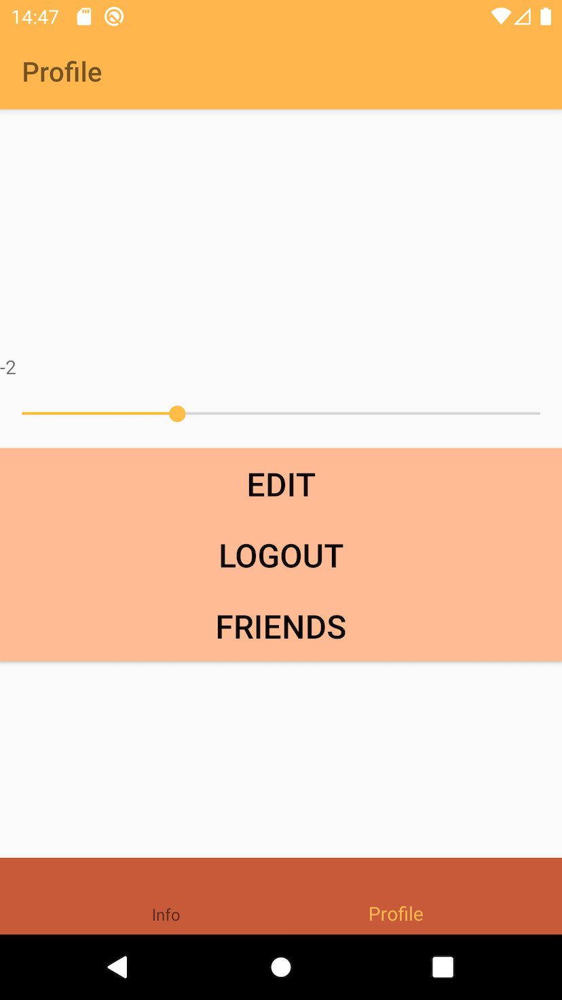

summary: MOKO Widgets #8 - создание виджета
id: moko-widgets-8
categories: moko
environments: kotlin-mobile-mpp
status: published
Feedback Link: https://github.com/icerockdev/kmp-codelabs/issues
Analytics Account: UA-81805223-5
Author: Aleksey Mikhailov <am@icerock.dev>

# MOKO Widgets #8 - create new widget
## Вводная
Duration: 5

Урок является продолжением [MOKO Widgets #7 - lists on widgets](https://codelabs.kmp.icerock.dev/codelabs/moko-widgets-7/). Для выполнения данного урока нужно иметь проект, полученный в результате выполнения предыдущего урока.

Результатом прошлого урока было приложение с навигацией, стилизацией экранов, различными действиями на экранах, кастомными фабриками, платформенным экраном и списком друзей.

На этом уроке мы реализуем новый виджет - слайдер (для выбора значения в заданном диапазоне).

## Создание класса виджета
Duration: 10

Любой виджет состоит из 2 частей - описание виджета в общем коде (наследник от `Widget`) и фабрика виджета с реализацией на каждой платформе (наследник от `ViewFactory`).

Начинается создание нового виджета с создания наследника от `Widget`:
`mpp-library/src/commonMain/kotlin/org/example/mpp/SliderWidget.kt`:
```kotlin
class SliderWidget<WS : WidgetSize>(
    override val size: WS
) : Widget<WS>()
```

Каждый виджет должен реализовывать метод сборки виджета, но для реализации требуется фабрика виджета. Добавим это:
`mpp-library/src/commonMain/kotlin/org/example/mpp/SliderWidget.kt`:
```kotlin
class SliderWidget<WS : WidgetSize>(
    ...
    private val factory: ViewFactory<SliderWidget<out WidgetSize>>
) : ... {
    override fun buildView(viewFactoryContext: ViewFactoryContext): ViewBundle<WS> {
        return factory.build(this, size, viewFactoryContext)
    }
}
```

Так же у всех виджетов должен быть аргумент `id` и интерфейс либо `RequiredId` (обязательно требуется указывать id - для интерактивных элементов, чтобы android мог сохранить состояние экрана), либо `OptionalId`.
`mpp-library/src/commonMain/kotlin/org/example/mpp/SliderWidget.kt`:
```kotlin
class SliderWidget<WS : WidgetSize>(
    ...
    override val id: Id
) : Widget<WS>(), RequireId<SliderWidget.Id> {
    ...

    interface Id : Theme.Id<SliderWidget<out WidgetSize>>
}
```

Positive
: `Id` это интерфейс наследующийся от специального интерфейса `Theme.Id`. За счет строгой типизации компилятор проверяет корректные ли операции применяются по id или нет.

Базовые свойства виджета уже добавлены, теперь нужно добавить данные этого виджета - то, что не касается визуального оформления элемента. Эти данные будут считываться фабрикой виджета и применяться к ui элементу.
`mpp-library/src/commonMain/kotlin/org/example/mpp/SliderWidget.kt`:
```kotlin
class SliderWidget<WS : WidgetSize>(
    ...
    val minValue: Int,
    val maxValue: Int,
    val value: MutableLiveData<Int>
) : ... {
    ...
}
```

Данная конфигурация виджета позволяет создавать виджет следующим образом:
```kotlin
SliderWidget(
    size = WidgetSize.WrapContent,
    factory = MyFactory(),
    id = Ids.Slider,
    minValue = -5,
    maxValue = 5,
    value = MutableLiveData(initialValue = 0)
)
```

То есть фабрику нам нужно самостоятельно где-то получить и передать в виджет. Если же мы хотим использовать возможности `Theme` с подстановкой фабрики и создавать виджет следующим образом:
```kotlin
theme.slider(
    size = WidgetSize.WrapContent,
    id = Ids.Slider,
    minValue = -5,
    maxValue = 5,
    value = MutableLiveData(initialValue = 0)
)
```
то нам требуется подключить специальный gradle plugin `dev.icerock.mobile.multiplatform-widgets-generator`:
`mpp-library/build.gradle.kts`:
```kotlin
plugins {
    ...
    id("dev.icerock.mobile.multiplatform-widgets-generator")
}
```

И добавить аннотацию, а так-же категорию (для системы категорий в `Theme`)
`mpp-library/src/commonMain/kotlin/org/example/mpp/SliderWidget.kt`:
```kotlin
@WidgetDef(SliderViewFactory::class)
class SliderWidget<WS : WidgetSize>(
    ...
) : ... {
    ...

    interface Category : Theme.Category<SliderWidget<out WidgetSize>>

    object DefaultCategory : Category
}
```

В аннотации `WidgetDef` аргументом указывается класс фабрики по-умолчанию для виджета (то есть та фабрика, которая будет использоваться даже если в `Theme` не делалось никаких настроек). Мы указали `SliderViewFactory`, остается только создать эту фабрику.

## Создание фабрики виджета
Duration: 10

Аналогично уроку [MOKO Widgets #5 - custom ViewFactory](https://codelabs.kmp.icerock.dev/codelabs/moko-widgets-5/) нужно создать новую фабрику, но для нашего виджета. Для простоты не будем давать никакой параметризации.

### Common code
`mpp-library/src/commonMain/kotlin/org/example/mpp/SliderViewFactory.kt`:
```kotlin
expect class SliderViewFactory() : ViewFactory<SliderWidget<out WidgetSize>>
```

### Android code
Для создания UI элемента на android используем [SeekBar](https://developer.android.com/reference/android/widget/SeekBar).

`mpp-library/src/androidMain/kotlin/org/example/mpp/SliderViewFactory.kt`:
```kotlin
actual class SliderViewFactory : ViewFactory<SliderWidget<out WidgetSize>> {
    override fun <WS : WidgetSize> build(
        widget: SliderWidget<out WidgetSize>,
        size: WS,
        viewFactoryContext: ViewFactoryContext
    ): ViewBundle<WS> {
        val context = viewFactoryContext.androidContext
        val lifecycleOwner = viewFactoryContext.lifecycleOwner

        val slider = SeekBar(context).apply {
            max = widget.maxValue - widget.minValue
        }

        widget.value.bindNotNull(lifecycleOwner) { slider.progress = it - widget.minValue }

        slider.setOnSeekBarChangeListener(object : SeekBar.OnSeekBarChangeListener {
            override fun onProgressChanged(seekBar: SeekBar?, progress: Int, fromUser: Boolean) {
                val fixedProgress = progress + widget.minValue
                if (widget.value.value == fixedProgress) return

                widget.value.value = fixedProgress
            }

            override fun onStartTrackingTouch(seekBar: SeekBar?) {}

            override fun onStopTrackingTouch(seekBar: SeekBar?) {}
        })

        return ViewBundle(
            view = slider,
            size = size,
            margins = null
        )
    }
}
```

### iOS code
Для создания UI элемента на iOS используем [UISlider](https://developer.apple.com/documentation/uikit/uislider).

`mpp-library/src/iosX64Main/kotlin/org/example/mpp/SliderViewFactory.kt`:
```kotlin
actual class SliderViewFactory : ViewFactory<SliderWidget<out WidgetSize>> {
    override fun <WS : WidgetSize> build(
        widget: SliderWidget<out WidgetSize>,
        size: WS,
        viewFactoryContext: ViewFactoryContext
    ): ViewBundle<WS> {
        val slider = UISlider(frame = CGRectZero.readValue()).apply {
            translatesAutoresizingMaskIntoConstraints = false

            minimumValue = widget.minValue.toFloat()
            maximumValue = widget.maxValue.toFloat()
        }

        widget.value.bind { slider.value = it.toFloat() }
        slider.setEventHandler(UIControlEventValueChanged) {
            val value = slider.value.toInt()
            slider.value = value.toFloat()
            
            if (widget.value.value == value) return@setEventHandler

            widget.value.value = value
        }

        return ViewBundle(
            view = slider,
            size = size,
            margins = null
        )
    }
}
```

## Тестирование
Duration: 10

Для проверки результата добавим на экран профиля слайдер и текст, в котором выведем текущее выбранное в слайдере значение.

`mpp-library/src/commonMain/kotlin/org/example/mpp/profile/ProfileScreen.kt`:
```kotlin
class ProfileScreen(
    ...
) : ... {
    ...

    override fun createContentWidget() = with(theme) {
        val sliderValue = MutableLiveData<Int>(initialValue = 0)

        constraint(size = WidgetSize.AsParent) {
            ...

            val slider = +slider(
                size = WidgetSize.WidthAsParentHeightWrapContent,
                id = Ids.Slider,
                minValue = -5,
                maxValue = 5,
                value = sliderValue
            )

            val valueText = +text(
                size = WidgetSize.WidthAsParentHeightWrapContent,
                text = sliderValue.map { it.toString().desc() as StringDesc }
            )

            constraints {
                ...

                slider bottomToTop editButton offset 16
                slider leftRightToLeftRight root

                valueText bottomToTop slider offset 16
                valueText leftRightToLeftRight root
            }
        }
    }

    object Ids {
        object Slider : SliderWidget.Id
    }
}
```

В результате получаем:

|android app|ios app|
|---|---|
|||