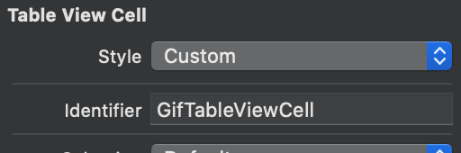
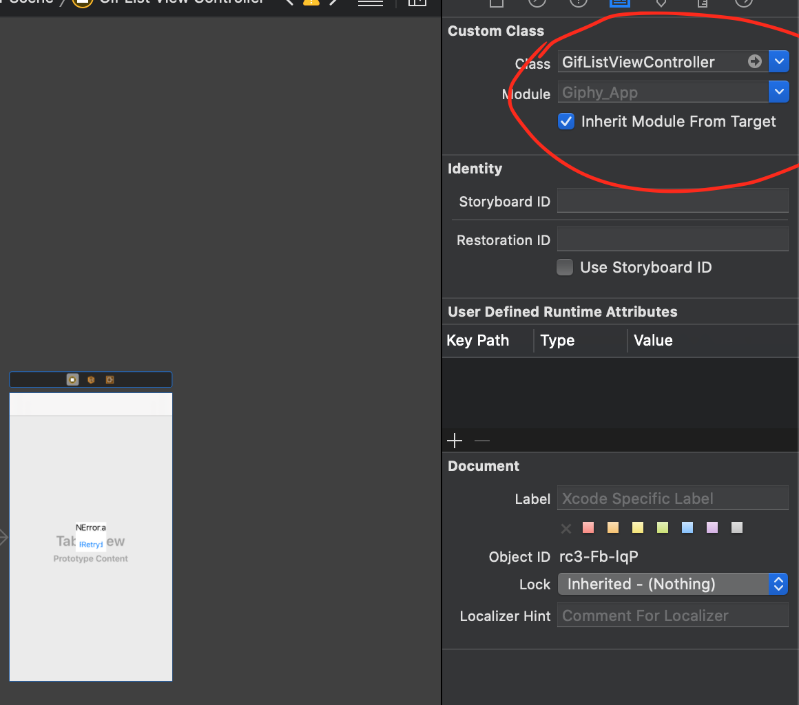

summary: Реализация списка Gif
id: giphy-app-2-ru
categories: lang-ru,moko,moko-template
environments: moko-template
status: published
Feedback Link: https://github.com/icerockdev/kmp-codelabs/issues
Analytics Account: UA-81805223-5
Author: Aleksey Mikhailov <am@icerock.dev>

# GiphyApp #2 - Реализация списка Gif
## Вводная

Данное руководство является продолжением в серии GiphyApp, перед началом требуется выполнить [GiphyApp #1](https://codelabs.kmp.icerock.dev/codelabs/giphy-app-1).

Готовый код проекта доступен на [github](https://github.com/Alex009/giphy-mobile).

## Создание логики списка Gif в общей библиотеке
Duration: 30

Нужно чтобы приложение получало список Gif с сервиса GIPHY. В шаблоне сделан пример получения списка новостей с newsapi, реализовано это с использованием [moko-network](https://github.com/icerockdev/moko-network), который генерирует сетевые сущности и API классы из OpenAPI спецификации.

Имея OpenAPI спецификацию от GIPHY взятую с [apis.guru](https://apis.guru/browse-apis/) можно заменить получение новостей на получение Gif. 

Positive
: Фича списка уже присутствует в шаблоне, поэтому логику не придется реализовывать. Для большего понимания как устроена фича следует ознакомиться с [схемой модуля](https://github.com/icerockdev/moko-template#list-module-scheme) и посмотреть код в `mpp-library:feature:list`.

### Замена OpenAPI спецификации
Заменим содержимое файла `mpp-library/domain/src/openapi.yml` содержимым из [OpenAPI спецификации сервиса GIPHY](/giphy/files/giphy-openapi.yml). После этого можно вызвать `Gradle Sync` и по завершению мы увидим что появились ошибки в коде, который работал с `newsapi`. Нужно обновить этот код под новую API.

Positive
: Сгенерированные файлы находятся по пути `mpp-library/domain/build/generate-remain/src/main/kotlin`

### Замена новостей на гифки в domain модуле
После замены OpenAPI спецификации в `domain` модуле требуется обновить следующие классы:
- `News` – он должен быть заменен на `Gif`;
- `NewsRepository` – поправить под `GifRepository`;
- `DomainFactory` – добавить `gifRepository` и предоставить ему нужные зависимости.

#### News -> Gif
`News` преобразуем в следующий класс:
```kotlin
@Parcelize
data class Gif(
    val id: Int,
    val previewUrl: String,
    val sourceUrl: String
) : Parcelable
```
Наша доменная сущность содержит `id` гифки, нужный для корректного определения элемента в списке и корректных анимаций на UI, а также два варианта URL - полноразмерный вариант и превью.

К классу `Gif` добавим преобразование из сетевой сущности `dev.icerock.moko.network.generated.models.Gif` в доменную. Для этого добавим дополнительный конструктор:
```kotlin
@Parcelize
data class Gif(
    ...
) : Parcelable {

    internal constructor(entity: dev.icerock.moko.network.generated.models.Gif) : this(
        id = entity.url.hashCode(),
        previewUrl = requireNotNull(entity.images?.downsizedMedium?.url) { "api can't respond without preview image" },
        gifUrl = requireNotNull(entity.images?.original?.url) { "api can't respond without original image" }
    )
}
```
В конструкторе происходит маппинг полей из сетевой сущности в доменную, что позволяет уменьшить количество необходимых изменений при изменении API. Само приложение становится независимым от деталей реализации API.

#### NewsRepository -> GifRepository
`NewsRepository` превратим в `GifRepository` с следующим контентом:
```kotlin
class GifRepository internal constructor(
    private val gifsApi: GifsApi
) {
    suspend fun getGifList(query: String): List<Gif> {
        return gifsApi.searchGifs(
            q = query,
            limit = null,
            offset = null,
            rating = null,
            lang = null
        ).data?.map { Gif(entity = it) }.orEmpty()
    }
}
```
В данном репозитории нам достаточно получить `GifsApi` (генерируется `moko-network`) и вызвать метод API `searchGifs`, где на данный момент используем только поисковой запрос, остальные аргументы оставив по умолчанию.
Сетевые сущности сразу преобразуем в доменные, которые можем выдать наружу модуля (сетевые сущности генерируются с модификатором `internal`).

#### DomainFactory
В `DomainFactory` нужно заменить создание `newsApi` и `newsRepository`, заменим их на следующий код:
```kotlin
private val gifsApi: GifsApi by lazy {
    GifsApi(
        basePath = baseUrl,
        httpClient = httpClient,
        json = json
    )
}

val gifRepository: GifRepository by lazy {
    GifRepository(
        gifsApi = gifsApi
    )
}
```
`GifsApi` это сгенерированный класс, для создания требуется `baseUrl` (адрес сервера с которым работаем, передается он через фабрику с нативного уровня, для возможности конфигурирования разных окружений сборки на обеих платформах), `httpClient` (клиент для работы с сервером, от библиотеки [ktor-client](https://github.com/ktorio/ktor/)), `json` (сериализатор Json от библиотеки [kotlinx.serialization](https://github.com/Kotlin/kotlinx.serialization)).  API доступно только внутри модуля, предоставляется как зависимость в репозитории.

`GifRepository` доступен вне модуля, для создания требуется только `gifsApi`.

Инициализация делается `lazy`, это означает что и API и репозиторий являются синглтонами (объекты живы пока жива фабрика, а ее держит `SharedFactory`, которая жива на все время жизни приложения).

Также для работы с GIPHY API требуется передавать Api Key. Для этого можем использовать `TokenFeature` для `ktor`. Она уже подключена, ее нужно только переконфигурировать в следующее:
```kotlin
install(TokenFeature) {
    tokenHeaderName = "api_key"
    tokenProvider = object : TokenFeature.TokenProvider {
        override fun getToken(): String? = "o5tAxORWRXRxxgIvRthxWnsjEbA3vkjV"
    }
}
```
В данной реализации к каждому запросу, который посылается через `httpClient` будет добавлен хидер `api_key: o5tAxORWRXRxxgIvRthxWnsjEbA3vkjV` (сам ключ от тестового приложения, если у вас он уперся в лимиты - можете создать свой в [разделе управления GIPHY](https://developers.giphy.com/dashboard/)).

### Обновление связи domain и feature:list в SharedFactory
В `SharedFactory` требуется изменить интерфейс создания элементов списка - `NewsUnitsFactory`, а также заменить синглтон `newsFactory` на `gifsFactory` с конфигурацией под `Gif`.

#### NewsUnitsFactory -> GifsUnitsFactory
Интерфейс создания элементов списка должен быть заменен на:
```kotlin
interface GifsUnitsFactory {
    fun createGifTile(
        id: Long,
        gifUrl: String
    ): UnitItem
}
```
То есть из общей логики будет выдаваться `id` для корректного определения diff'а списка с анимированием обновления и `gifUrl` в котором будет url для вывода анимации на UI.

#### newsFactory -> gifsFactory
Фабрика для фичи списка заменяется на следующую:
```kotlin
val gifsFactory: ListFactory<Gif> = ListFactory(
    listSource = object : ListSource<Gif> {
        override suspend fun getList(): List<Gif> {
            return domainFactory.gifRepository.getGifList("test")
        }
    },
    strings = object : ListViewModel.Strings {
        override val unknownError: StringResource = MR.strings.unknown_error
    },
    unitsFactory = object : ListViewModel.UnitsFactory<Gif> {
        override fun createTile(data: Gif): UnitItem {
            return gifsUnitsFactory.createGifTile(
                id = data.id.toLong(),
                gifUrl = data.previewUrl
            )
        }
    }
)
```
В фабрике указывается источник данных - `listSource` в котором мы вызываем `gifRepository` из модуля `domain`. Пока что `query` зафиксирован в значении `test`, что будет изменено в будущих уроках. Также указывается `strings` - строки локализации, которые внедряются в модуль `feature:list` (данному модулю требуется только строка "неизвестная ошибка"). Последнее что требуется модулю - `unitsFactory`, но сам модуль работает с фабрикой имеющей 1 метод - `createTile(data: Gif)`, а для нативных сторон лучше иметь более конкретный метод создания элемента списка, чтобы каждое поле влияющее на UI определялось из общей логики. Поэтому делается вызов в `gifsUnitsFactory.createGifTile`.

Последнее что нужно сделать - обновить конструктор `SharedLibrary` до следующего:
```kotlin
class SharedFactory(
    settings: Settings,
    antilog: Antilog,
    baseUrl: String,
    gifsUnitsFactory: GifsUnitsFactory
)
```
То есть нужно чтобы нативки передали реализацию `GifsUnitsFactory`.

## Реализация списка Gif на Android
Duration: 30

### Указание URL сервера 
Адрес сервера, с которым мы работаем, внедряется с уровня приложения в общую библиотеку, чтобы не тратить время на пересборку общей библиотеки когда просто сменили сервер с которым работаем.

В текущей конфигурации из шаблона проекта есть только одно окружение и url сервера один. Он задается в `android-app/build.gradle.kts` - заменим его:
```kotlin
android {
    ...
    defaultConfig {
        ...

        val url = "https://api.giphy.com/v1/"
        buildConfigField("String", "BASE_URL", "\"$url\"")
    }
}
```

### Подключение нужных зависимостей
Для реализации отображения gif нам потребуется библиотека [glide](https://github.com/bumptech/glide) и для выставления соотношения сторон элементов списка 2:1 [constraintLayout](https://developer.android.com/training/constraint-layout).

`constraintLayout` уже объявлен в зависимостях шаблона, нужно только подключить его к `android-app`, для этого добавим в `android-app/build.gradle.kts`:
```kotlin
dependencies {
    ...
    implementation(Deps.Libs.Android.constraintLayout.name)
}
```

А `glide` требуется добавить в объявление зависимостей. Для этого в `buildSrc/src/main/kotlin/Versions.kt`  добавляем:
```kotlin
object Versions {
    ...
    object Libs {
        ...
        object Android {
            ...
            const val glide = "4.10.0"
        }
    }
}
```
А в `buildSrc/src/main/kotlin/Deps.kt`:
```kotlin
object Deps {
    ...
    object Libs {
        ...
        object Android {
            ...
            val glide = AndroidLibrary(
                name = "com.github.bumptech.glide:glide:${Versions.Libs.Android.glide}"
            )
        }
```

После этого можно добавить в `android-app/build.gradle.kts` подключение зависимости:
```kotlin
dependencies {
    ...
    implementation(Deps.Libs.Android.glide.name)
}
```

### Инициализация SharedFactory
Для создания `SharedFactory` теперь требуется `gifsUnitsFactory` вместо `newsUnitsFactory`. Чтобы предоставить эту зависимость преобразуем класс `NewsUnitsFactory` в следующий:
```kotlin
class GifListUnitsFactory : SharedFactory.GifsUnitsFactory {
    override fun createGifTile(id: Long, gifUrl: String): UnitItem {
        TODO()
    }
}
```
А в `SharedFactory` будем передавать его:
```kotlin
AppComponent.factory = SharedFactory(
    baseUrl = BuildConfig.BASE_URL,
    settings = AndroidSettings(getSharedPreferences("app", Context.MODE_PRIVATE)),
    antilog = DebugAntilog(),
    gifsUnitsFactory = GifListUnitsFactory()
)
```

### Реализация GifListUnitsFactory
Интерфейс `SharedFactory.GifsUnitsFactory` требует, чтобы мы создали `UnitItem` из `id` и `gifUrl`. Сам интерфейс `UnitItem` относится к библиотеке [moko-units](https://github.com/icerockdev/moko-units) и реализации можно генерировать из DataBinding layout'ов. 

Создадим `android-app/src/main/res/layout/tile_gif.xml` с содержимым:
```xml
<?xml version="1.0" encoding="utf-8"?>
<layout xmlns:android="http://schemas.android.com/apk/res/android"
    xmlns:app="http://schemas.android.com/apk/res-auto"
    xmlns:tools="http://schemas.android.com/tools">

    <data>

        <variable
            name="gifUrl"
            type="String" />
    </data>

    <androidx.constraintlayout.widget.ConstraintLayout
        android:layout_width="match_parent"
        android:layout_height="wrap_content"
        android:padding="8dp">

        <ImageView
            android:layout_width="match_parent"
            android:layout_height="0dp"
            app:gifUrl="@{gifUrl}"
            app:layout_constraintBottom_toBottomOf="parent"
            app:layout_constraintDimensionRatio="2:1"
            app:layout_constraintLeft_toLeftOf="parent"
            app:layout_constraintRight_toRightOf="parent"
            app:layout_constraintTop_toTopOf="parent"
            tools:ignore="ContentDescription" />
    </androidx.constraintlayout.widget.ConstraintLayout>
</layout>
```
И после этого запустим `Gradle Sync` – после этого автоматически будет сгенерирован класс `TileGif`, который мы и используем в `GifListUnitsFactory`:
```kotlin
class GifListUnitsFactory : SharedFactory.GifsUnitsFactory {
    override fun createGifTile(id: Long, gifUrl: String): UnitItem {
        return TileGif().apply {
            itemId = id
            this.gifUrl = gifUrl
        }
    }
}
```

В самом layout'е мы использовали нестандартный Binding Adapter - `app:gifUrl`. Нужно его реализовать, для этого создадим файл `android-app/src/main/java/org/example/app/BindingAdapters.kt` с содержимым:
```kotlin
package org.example.app

import android.widget.ImageView
import androidx.databinding.BindingAdapter
import androidx.swiperefreshlayout.widget.CircularProgressDrawable
import com.bumptech.glide.Glide

@BindingAdapter("gifUrl")
fun ImageView.bindGif(gifUrl: String?) {
    if (gifUrl == null) {
        this.setImageDrawable(null)
        return
    }

    val circularProgressDrawable = CircularProgressDrawable(context).apply {
        strokeWidth = 5f
        centerRadius = 30f
        start()
    }

    Glide.with(this)
        .load(gifUrl)
        .placeholder(circularProgressDrawable)
        .error(android.R.drawable.stat_notify_error)
        .into(this)
}
```
Это добавит нам возможность задавать `gifUrl` для `ImageView` из layout'а. Причем на время загрузки будет отображаться прогресс бар, а при ошибке отобразится иконка ошибки.

### Создание экрана списка Gif
Остается только создать экран, который будет отображать данные из нашей общей логики.
Создадим `android-app/src/main/res/layout/activity_gif_list.xml` с содержимым:
```xml
<?xml version="1.0" encoding="utf-8"?>
<layout xmlns:android="http://schemas.android.com/apk/res/android"
    xmlns:app="http://schemas.android.com/apk/res-auto">

    <data>
        <import type="org.example.library.domain.entity.Gif"/>
        <import type="org.example.library.feature.list.presentation.ListViewModel" />

        <variable
            name="viewModel"
            type="ListViewModel&lt;Gif&gt;" />
    </data>

    <FrameLayout
        android:layout_width="match_parent"
        android:layout_height="match_parent">

        <androidx.swiperefreshlayout.widget.SwipeRefreshLayout
            android:id="@+id/refresh_layout"
            android:layout_width="match_parent"
            android:layout_height="match_parent"
            app:visibleOrGone="@{viewModel.state.ld.isSuccess}">

            <androidx.recyclerview.widget.RecyclerView
                android:layout_width="match_parent"
                android:layout_height="match_parent"
                app:adapter="@{`dev.icerock.moko.units.adapter.UnitsRecyclerViewAdapter`}"
                app:bindValue="@{viewModel.state.ld.dataValue}"
                app:layoutManager="androidx.recyclerview.widget.LinearLayoutManager" />

        </androidx.swiperefreshlayout.widget.SwipeRefreshLayout>

        <ProgressBar
            android:layout_width="wrap_content"
            android:layout_height="wrap_content"
            android:layout_gravity="center"
            app:visibleOrGone="@{viewModel.state.ld.isLoading}" />

        <TextView
            android:layout_width="match_parent"
            android:layout_height="wrap_content"
            android:layout_gravity="center"
            android:gravity="center"
            android:text="@string/no_data"
            app:visibleOrGone="@{viewModel.state.ld.isEmpty}" />

        <LinearLayout
            android:layout_width="match_parent"
            android:layout_height="wrap_content"
            android:layout_gravity="center"
            android:padding="16dp"
            android:orientation="vertical"
            app:visibleOrGone="@{viewModel.state.ld.isError}">

            <TextView
                android:layout_width="match_parent"
                android:layout_height="wrap_content"
                android:gravity="center"
                android:text="@{viewModel.state.ld.errorValue}" />

            <Button
                android:layout_width="wrap_content"
                android:layout_height="wrap_content"
                android:layout_gravity="center_horizontal"
                android:onClick="@{() -> viewModel.onRetryPressed()}"
                android:text="@string/retry_btn" />
        </LinearLayout>
    </FrameLayout>
</layout>
```
Layout использует Data Binding и отображает одно из 4 состояний полученное от `ListViewModel`. В состоянии данных отображается `SwipeRefreshLayout` с `RecyclerView` внутри, а `RecyclerView` использует `LinearLayoutManager` и `UnitsRecyclerViewAdapter` для отрисовки `UnitItem`'ов полученных из `UnitsFactory`.

Теперь создадим `android-app/src/main/java/org/example/app/view/GifListActivity.kt` с содержимым:
```kotlin
class GifListActivity : MvvmActivity<ActivityGifListBinding, ListViewModel<Gif>>() {
    override val layoutId: Int = R.layout.activity_gif_list
    override val viewModelClass = ListViewModel::class.java as Class<ListViewModel<Gif>>
    override val viewModelVariableId: Int = BR.viewModel

    override fun viewModelFactory(): ViewModelProvider.Factory = createViewModelFactory {
        AppComponent.factory.gifsFactory.createListViewModel()
    }

    override fun onCreate(savedInstanceState: Bundle?) {
        super.onCreate(savedInstanceState)

        with(binding.refreshLayout) {
            setOnRefreshListener {
                viewModel.onRefresh { isRefreshing = false }
            }
        }
    }
}
```
Мы получаем из фабрики `gifsFactory` нашу `ListViewModel<Gif>` и она будет выставлена в поле `viewModel` в layout'е `activity_gif_list`. 

Также для корректной работы `SwipeRefreshLayout` кодом задаем `setOnRefreshListener` и вызываем `viewModel.onRefresh`, который сообщит в лямбду что обновление завершено и мы сможем выключить анимацию обновления.

### Замена стартового экрана
Сделаем чтобы запускалось приложение сразу с `GifListActivity`. Для этого в `android-app/src/main/AndroidManifest.xml` добавим `GifListActivity`, а другие уберем (они нам не нужны):
```xml
<application ...>

    <activity android:name=".view.GifListActivity" >
        <intent-filter>
            <action android:name="android.intent.action.MAIN" />
            <category android:name="android.intent.category.LAUNCHER" />
        </intent-filter>
    </activity>
</application>
```

### Удаление лишних классов
Теперь можно удалить все лишние файлы из примера:
- `android-app/src/main/java/org/example/app/view/ConfigActivity.kt`
- `android-app/src/main/java/org/example/app/view/NewsActivity.kt`
- `android-app/src/main/res/layout/activity_news.xml`
- `android-app/src/main/res/layout/tile_news.xml`

### Запуск
Теперь можно запустить приложение на Android и увидеть список Gif.

## Реализация списка Gif на iOS
Duration: 30

### Указание URL сервера
Так же как и на android, адрес сервера, с которым работаем, внедряется с уровня приложения в общую библиотеку, чтобы не тратить время на пересборку общей библиотеки когда просто сменили сервер с которым работаем. Настройка на iOS делается в `ios-app/src/AppDelegate.swift`:
```swift
AppComponent.factory = SharedFactory(
    ...
    baseUrl: "https://api.giphy.com/v1/",
    ...
)
```

### Подключение зависимостей
Для отображения gif нам потребуется [SwiftyGif](https://github.com/kirualex/SwiftyGif), для его подключения нужно добавить в `ios-app/Podfile` зависимость:
```ruby
target 'ios-app' do
  ...
  pod 'SwiftyGif', '5.1.1'
end
```
и после этого выполнить команду `pod install` в директории `ios-app`.

### Инициализация SharedFactory
Для создания `SharedFactory` теперь требуется `gifsUnitsFactory` вместо `newsUnitsFactory`. Чтобы предоставить эту зависимость преобразуем класс `NewsUnitsFactory` в следующий:
```swift
class GifsListUnitsFactory: SharedFactoryGifsUnitsFactory {
    func createGifTile(id: Int64, gifUrl: String) -> UnitItem {
        // TODO
    }
}
```
А в `SharedFactory` будем передавать его:
```swift
AppComponent.factory = SharedFactory(
    settings: AppleSettings(delegate: UserDefaults.standard),
    antilog: DebugAntilog(defaultTag: "MPP"),
    baseUrl: "https://api.giphy.com/v1/",
    gifsUnitsFactory: GifsListUnitsFactory()
)
```

### Реализация GifListUnitsFactory
Интерфейс `SharedFactoryGifsUnitsFactory` требует, чтобы мы создали `UnitItem` из `id` и `gifUrl`. Сам интерфейс `UnitItem` относится к библиотеке [moko-units](https://github.com/icerockdev/moko-units) и реализация требует создания xib с интерфейсом ячейки и специального класса ячейки.

Создадим `ios-app/src/units/GifTableViewCell.swift` с содержимым:
```swift
import MultiPlatformLibraryUnits
import SwiftyGif

class GifTableViewCell: UITableViewCell, Fillable {
    typealias DataType = CellModel
    
    struct CellModel {
        let id: Int64
        let gifUrl: String
    }
    
    @IBOutlet private var gifImageView: UIImageView!
    
    private var gifDownloadTask: URLSessionDataTask?
    
    override func prepareForReuse() {
        super.prepareForReuse()
        
        gifDownloadTask?.cancel()
        gifImageView.clear()
    }
    
    func fill(_ data: GifTableViewCell.CellModel) {
        gifDownloadTask = gifImageView.setGifFromURL(URL(string: data.gifUrl)!)
    }
    
    func update(_ data: GifTableViewCell.CellModel) {
        
    }
}

extension GifTableViewCell: Reusable {
    static func reusableIdentifier() -> String {
        return "GifTableViewCell"
    }
    
    static func xibName() -> String {
        return "GifTableViewCell"
    }
    
    static func bundle() -> Bundle {
        return Bundle.main
    }
}
```
И нужно создать `ios-app/src/units/GifTableViewCell.xib` с версткой ячейки.
Итоговый результат выглядит так:

У самой `UITableViewCell` нужно указать класс `GifTableViewCell`:

А так же указать идентификатор для переиспользования:


Теперь в `GifListUnitsFactory` можно написать реализацию создания `UnitItem`:
```swift
class GifsListUnitsFactory: SharedFactoryGifsUnitsFactory {
    func createGifTile(id: Int64, gifUrl: String) -> UnitItem {
        return UITableViewCellUnit<GifTableViewCell>(
            data: GifTableViewCell.CellModel(
                id: id,
                gifUrl: gifUrl
            ),
            configurator: nil
        )
    }
}
```

### Создание экрана списка Gif
Остается только создать экран, который будет отображать данные из нашей общей логики.

Создадим `ios-app/src/view/GifListViewController.swift` с содержимым:
```swift
import MultiPlatformLibraryMvvm
import MultiPlatformLibraryUnits

class GifListViewController: UIViewController {
    @IBOutlet private var tableView: UITableView!
    @IBOutlet private var activityIndicator: UIActivityIndicatorView!
    @IBOutlet private var emptyView: UIView!
    @IBOutlet private var errorView: UIView!
    @IBOutlet private var errorLabel: UILabel!
    
    private var viewModel: ListViewModel<Gif>!
    private var dataSource: FlatUnitTableViewDataSource!
    private var refreshControl: UIRefreshControl!
    
    override func viewDidLoad() {
        super.viewDidLoad()
        
        viewModel = AppComponent.factory.gifsFactory.createListViewModel()

        // binding methods from https://github.com/icerockdev/moko-mvvm
        activityIndicator.bindVisibility(liveData: viewModel.state.isLoadingState())
        tableView.bindVisibility(liveData: viewModel.state.isSuccessState())
        emptyView.bindVisibility(liveData: viewModel.state.isEmptyState())
        errorView.bindVisibility(liveData: viewModel.state.isErrorState())

        // in/out generics of Kotlin removed in swift, so we should map to valid class
        let errorText: LiveData<StringDesc> = viewModel.state.error().map { $0 as? StringDesc } as! LiveData<StringDesc>
        errorLabel.bindText(liveData: errorText)

        // datasource from https://github.com/icerockdev/moko-units
        dataSource = FlatUnitTableViewDataSource()
        dataSource.setup(for: tableView)

        // manual bind to livedata, see https://github.com/icerockdev/moko-mvvm
        viewModel.state.data().addObserver { [weak self] itemsObject in
            guard let items = itemsObject as? [UITableViewCellUnitProtocol] else { return }
            
            self?.dataSource.units = items
            self?.tableView.reloadData()
        }
        
        refreshControl = UIRefreshControl()
        tableView.refreshControl = refreshControl
        refreshControl.addTarget(self, action: #selector(onRefresh), for: .valueChanged)
    }
    
    @IBAction func onRetryPressed() {
        viewModel.onRetryPressed()
    }
    
    @objc func onRefresh() {
        viewModel.onRefresh { [weak self] in
            self?.refreshControl.endRefreshing()
        }
    }
}
```
И перепривяжем в `MainStoryboard` `NewsViewController` к `GifListViewController`:


### Замена стартового экрана
Чтобы приложение запускалось сразу с экрана гифок, нужно указать у `Navigation Controller` `rootViewController` связь с `GifListViewController`:


### Удаление лишних файлов
Теперь можно удалить все лишнее:
- `ios-app/src/units/NewsTableViewCell.swift`
- `ios-app/src/units/NewsTableViewCell.xib`
- `ios-app/src/view/ConfigViewController.swift`
- `ios-app/src/view/NewsViewController.swift`

### Запуск
Теперь можно запустить приложение на iOS и увидеть список Gif.
