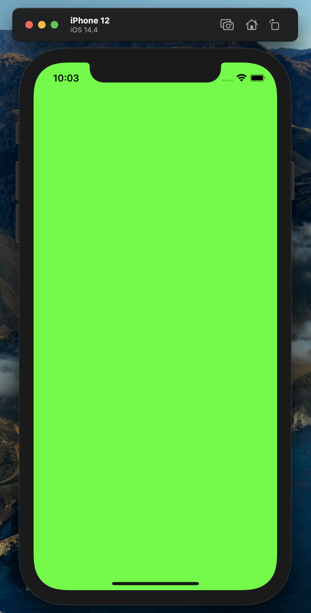

summary: IceRock KMM onboarding #1
id: kmm-icerock-onboarding-1-ru
categories: lang-ru,kmm-icerock-onboarding,moko
status: published
authors: Andrey Kovalev, Aleksey Lobynya, Aleksey Mikhailov
tags: onboarding,kmm,ios,android,moko
feedback link: https://github.com/icerockdev/kmp-codelabs/issues

# IceRock KMM onboarding #1

## Вводная

Duration: 5

Привет! Если ты это читаешь, значит ты начинаешь погружаться в процессы мультиплатформенной
разработки в IceRock.

Мы активно применяем и продвигаем этот подход с 2017-2018 годов. Основная его ценность для нас - это
возможность объединения бизнес-логики приложения в одном месте для обеих платформ. Вместо того,
чтобы отлаживать и реализовывать логику отдельно для iOS и Android мы пишем общий код, который
используют обе платформы. Один и тот же код. Соответственно, баги, связанные с некорректной логикой,
не будут плавать с платформы на платформу. И не потребуется отвлекать разных разработчиков -
проблемы в логике могут быть исправлены одним человеком, в одном месте и починить сразу и iOS, и
Android. Круто же)

При этом взаимодействие с пользователем остаётся 100% нативным. Доступен полный набор всех средств,
которые предоставляют нативные SDK. Юзер использует привычные элементы и приложение ведёт себя так,
как привыкли пользователи каждой платформы.

Обратная сторона медали - сложности на первых порах, при вхождении в такой подход и метод
разработки. Для андроид-разработчиков особо ничего не меняется - они могут использовать всё тот же
Kotlin, модульность, Gradle, корутины и прочие незнакомые большинству iOS-ников вещи. А
iOS-разработчик, в свою очередь, попадая впервые на мультиплатформенный проект, едет кукухой от
того, что в проект подцепляется какой-то мультиплатформенный под-чёрный-ящик, в котором какая-то
куча вьюмоделей, реализующих внутри магию с логикой, кругом какие-то диспатчеры, юниты, экран со
сложной вёрсткой в контроллере состоит из таблицы и нескольких строчек биндинга,не понятно откуда
что берётся и вопросов больше, чем ответов.

На самом же деле всё довольно просто и логично. Сгруппировано, разбито и структурировано. Но
вникнуть в эту концепцию придя на уже живущий проект, находящийся в активной разработке сложно из-за
большого объёма информации и логики.

Поэтому данный гайд призван помочь пройтись по шагам по основным практически моментам, ежедневно
встречающимся в нашей повседневной разработке. В нём ты сможешь по очереди выполнять задания,
наращивать функционал тестового проекта и изучать устройство проекта изнутри.

Здесь не будет детального разбора теоретической части, т.к. по ней уже имеется большое количество
статей и документации, к которым можно обращаться в процессе. Здесь ты именно закрепляешь на
практике теоретические знания из статей. Так что наливай чаёк-кофеёк и поехали)

Материалы для ознакомления перед началом:

- [Портал Kotlin Multiplatform Mobile](https://kotlinlang.org/lp/mobile/)
- [Документация по Kotlin Multiplatform Mobile](https://kotlinlang.org/docs/mobile/home.html)
- [Видео для начинающих от JetBrains](https://www.youtube.com/playlist?list=PLlFc5cFwUnmy_oVc9YQzjasSNoAk4hk_C)

## Подготовительные шаги

Duration: 5

Для начала нужно подготовить окружение для работы с Kotlin Multiplatform. Подробная инструкция
доступна на нашем сайте
[kmm.icerock.dev - настройка окружения](https://kmm.icerock.dev/pages/2-setup/).

Основные два рабочих инструмента - Android Studio и Xcode.

В качестве отправной точки мы будем использовать наш шаблоный проект - **mobile-moko-boilerplate**.
Он используется на всех новых проектах для быстрого развёртывания и старта разработки. Там уже
подключены все минимально необходимые зависимости, имеется нужная структура папок и базовая
настройка проекта. Так что заходим на GitLab в репозиторий
[https://gitlab.icerockdev.com/scl/boilerplate/mobile-moko-boilerplate](https://gitlab.icerockdev.com/scl/boilerplate/mobile-moko-boilerplate)
и делаем форк себе в профиль, клонируем.

После клонирования открываем проект в Android Studio. Для этого запускаем студию, File -> Open -> И
выбираем папку, в которую склонировали репозиторий. При первом открытии должно появиться
следующее:  

По-умолчанию студия парсит каталоги и строит отображение как для Android-проекта. Но мы здесь будем
работать не только с андроидом, но и с мультиплатформой. Поэтому переключаем отображение. Для этого
слева нажимаем на выпадашку Android и выбираем вместо него Project:  

После этого структура папок немного изменится:  

Далее соберём iOS проект. Как именно это сделать можно прочитать тут же в Readme открытого проекта.
Но чтобы было нагляднее - пройдём эти незамысловатые шаги для ios-проекта.

Сначала ставим CocoaPods - `pod install` (в директории `ios-app`).

Positive  
: Лайфхак от студии  
:  
: Чтобы не переключаться между IDE и терминалом - можно пользоваться терминалом прямо из студии.  
: Просто жмем снизу на панеле вкладку Terminal  

После этого в Android Studio справа разворачиваем панель Gradle. Внутри Tasks/cocoapods находим
нужную нам таску - `syncMultiPlatformLibraryDebugFrameworkIosX64`:

и запускаем её двойным кликом. Тут придётся немного подождать. А чтобы лучше понять, что сейчас
произошло, как эти таски появились и что это за Gradle и слон со стрелкой - идём читать статейку про
[Gradle для айосников на kmm.icerock.dev](https://kmm.icerock.dev/pages/4.1.1-kmm-ios-gradle/).

После успешного завершения билда необходимо ещё раз выполнить установку подов. И далее можно
запускать Xcode и открывать проект, который лежит по пути `ios-app/ios-app.xcworkspace`.

Выбираем любой симулятор, жмём Run - проект собирается и запускается.

И это успех) Мы выкачали и собрали мультиплатформенный проект с нуля. Аналогичным образом происходит
работа со всеми другими MPP-проектами в компании. Поэтому когда ты попадёшь на боевой проект, то уже
точно будешь знать, как его выкачать из репозитория, собрать и запустить у себя. Наиболее частая
причина ошибок на этом шаге - неправильная последовательность действий. Если вдруг что-то пошло не
так, то проверь, что ты установил поды, выполнил синк, а после этого снова установил поды.

А мы переходим к следующей части и разберёмся, как работать с этим дальше.
