id: kmm-icerock-onboarding-1-en
categories: lang-en,kmm-icerock-onboarding,moko
status: published
authors: Andrey Kovalev, Aleksey Lobynya, Aleksey Mikhailov
tags: onboarding,kmm,ios,android,moko
feedback link: https://github.com/icerockdev/kmp-codelabs/issues

# IceRock KMM onboarding # 1 – deployment of the project

## Introductory

Duration: 5

Hey! If you are reading this, then you are starting the process of diving into Multiplatform development at IceRock.

We have been actively using and promoting this approach since the summer of 2018. For us it’s main value is the ability to combine the business logic of the application in one place for both platforms. Instead of debuging and implementing logic for iOS and Android  separately , we write a common code. The same code for both platforms. Accordingly, bugs related to incorrect logic will not be transmitted from platform to platform. And there is no need to bother both iOS and Android developers, since problems in logic can be fixed by one person in one place and for iOS as well as Android. Isn’t that cool?

At the same time, user interaction remains 100% native. A full set of all the tools providing native SDKs is available. All the elements are familiar for the user and the application on each platform behaves in the way the users are used to.

The flip side of the coin is the difficulties at the beginning of entering such an approach and method of development. Nothing really changes for Android developers, since they can use the same Kotlin, modularity, Gradle, coroutines and other things unfamiliar to most iOS-guys. Therefore, iOS developer, getting into his first multi-platform project, goes crazy with the fact that there is a kind of Multiplatform black-box with a bunch of view models implementing some magic with logic, also some dispatchers, units, a screen with complex layout in the controller, which consists of a table and several lines of binding, and it is obviously not clear where all this stuff comes from, and there are more questions than answers.

In fact, everything is quite simple and logical, and at the same time it is grouped, divided and structured. However, it is difficult to get a sense of this concept when you come to a project that is in a stage of active development due to a large amount of information and logic.

For this reason we made a set of Codelabs, which are designed to help you walk step by step through the main points of day-to-day development. In them you can perform tasks in turn, increase the functionality of the test project and study the structure of the project from the inside.

## Setting up the working environment

Duration: 30

Positive
: To be able to work fully-fledged with KMM, you will need macOS, since the iOS application (and the iOS version of Kotlin shared library) can only be compiled on macOS - this is a limitation from Apple (requires Xcode only available on macOS). On other platforms only compilation for Android will be available. The code of a common part can be written and debugged, however you will lack the ability to test its work on iOS.

### Git (Android, iOS)

For all developers at the company, git is required by default. If it is not installed, you will need to install it (we will not describe it in detail).

### Xcode (iOS)

To compile an iOS application, as well as Kotlin library for iOS, you need Xcode. It can be
installed from AppStore - [Xcode] (https://apps.apple.com/ru/app/xcode/id497799835?mt=12).

For installation you will need an Apple account. If you already have your own Apple ID, you can use it. Otherwise, you can register it to your corporate mail. In the process of registering there is a requirement of a link to a bank card, which cannot be bypassed, so you may link any card (even a salary one) - if you do not make purchases in the AppStore, then there will be no payments (Xcode is free).

After installing Xcode, it is also important to install `Xcode Command Line Tools` - they are required to compile Kotlin / Native.

```bash
xcode-select --install
```
You can make sure everything is successfully installed by running Xcode and getting in Preferences -> Locations.


A version of the tools should be indicated in the selection of `Command Line Tools` (if the installation is not completed, it will be indicated that there are no tools).

### Java Development Kit (Android, iOS)
To work with Kotlin Multiplatform you will need to install Java Development Kit (JDK) version 11. This requirement is due to the  fact that Kotlin compiler and Gradle build system run on Java Virtual Machine and Java development kit.

Version of the JDK by Oracle is the most stable in terms of working with Kotlin Multiplatform. To download it, you need to log in (or register). For registration you can use either a corporate or personal email, as the account itself is not required for anything other than downloading of the JDK.

[Download Oracle JDK 11](https://www.oracle.com/java/technologies/javase-jdk11-downloads.html)

After installing the JDK, it is required to specify the environment variable `JAVA_HOME` so that all tools work with the installed version of Java.

Initially we get the exact path to the newly installed JDK, as all versions are in the directory `/Library/Java/JavaVirtualMachines`, so enter in `Terminal`:

```bash
open /Library/Java/JavaVirtualMachines
```
After that, in the window that opens, we can find our JDK (it is recommended in order to understand exactly which versions of Java are installed and where we can search for the JDK if required).

The final path to the JDK will look like this:
`/Library/Java/JavaVirtualMachines/jdk-11.0.10.jdk/Contents/Home`
You may have another minor version, but the major version should be 11. The base JDK directory is located in `Contents/Home`.

One last thing is saving the path to the JDK in environment variables. This can be done by file changing `~/.zshenv` (this example is based on `zsh`, since this is the default shell for macOS).

```bash
nano ~/.zshenv
```
or (who use Visual Studio Code)

```bash
code  ~/.zshenv
```

well, or you can open the file in the Finder (it is located in your user's folder) : 
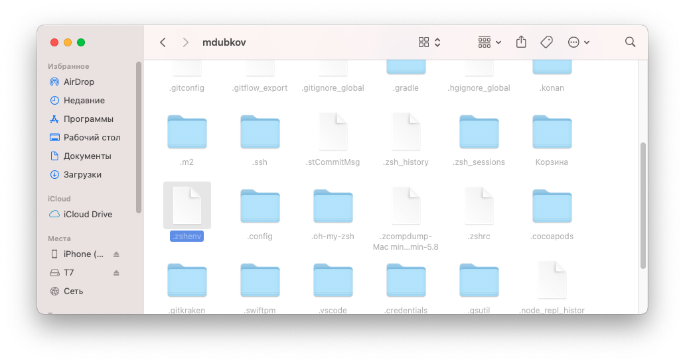

and in the editor that opens, add the line:

```bash
export JAVA_HOME=/Library/Java/JavaVirtualMachines/jdk-VERSION.jdk/Contents/Home
```
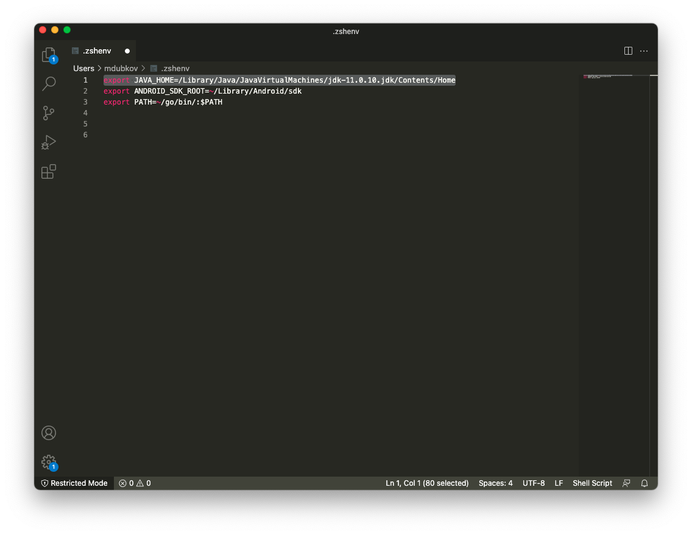

If you use bash, then you need to change `~/.bash-profile`.

Negative
: Be careful with copy-paste, since the minor version of the JDK you have installed may differ from the given above!

### Android Studio (Android, iOS)

To work with Kotlin code you need an IDE by JetBrains - IDEA or Android Studio. Kotlin Multiplatform Mobile is currently the main IDE [as it is recognised by Android Studio (https://kotlinlang.org/lp/mobile/ecosystem/), so it is required to be installed.

In this regard we recommend using [JetBrains Toolbox] (https://www.jetbrains.com/toolbox-app/), this application will independently monitor the current version of an IDE used and facilitate the process of installation / updating all IDEs by JetBrains.


For installation just click Install which is opposite to `Android Studio`.

On first launch the initial setup will be performed. Settings can be made at your discretion, but
it is important to install the latest version of Android SDK.

The IDE installation needs a bit of customization. First, it is required to fix the JDK you are using. For this end you go into Android Studio.


Starting with Android Studio Arctic Fox 2020.3.0 the location of the JDK is specified for a specific project after it's opened.

After opening the project, go to `Android Studio -> Preferences -> Build, Execution, Deployment -> Build Tools -> Gradle` and specify `Gradle JDK` there.


Positive
: Due to this choice, compilation of the projects through Android Studio will be done with the same version of JDK that Xcode will use. This will allow you to use one Gradle Daemon to compile one project, using resources more efficiently. If Android Studio and Xcode use different JDKs, then when compiling the project in Android Studio and Xcode you will get two independent java processes, each of which will consume many resources (gigabytes of memory).

After installation of Android Studio, it is worth specifying the environment variable `ANDROID_SDK_ROOT` for convenience, so that there is no need to open the project through Android Studio before launching it in Xcode.


If you do not specify an environment variable, then while trying to compile Kotlin code, Gradle will try to read the path to the Android SDK from the `local.properties` file in the project root. And if this file does not exist, an error will occur. Android Studio automatically creates this file with the correct path to the Android SDK if you open a project through Android Studio, but if you want to avoid dependency on the fact "whether the project was opened through Android Studio before" you should specify the environment variable `ANDROID_SDK_ROOT`.

We take the path to the Android SDK, which we could see earlier in `Welcome Screen` ->` Configure` -> `Default Project Structure` and add it to` ~ / .zshenv` (or to `~/.bash-profile`). We proceed by analogy with the variable `JAVA_HOME`.

```bash
export ANDROID_SDK_ROOT=~/Library/android-sdk
```

After that, even in the absence of `local.properties` file, the SDK will be found successfully.

Negative
: Starting from Android Studio 4.2, immediately after installation, you must disable the flag in `Preferences - > Experimental - > Do not build Gradle task during Gradle sync` (with the flag enabled, tasks for building modules will not appear in the `Gradle ' tab)

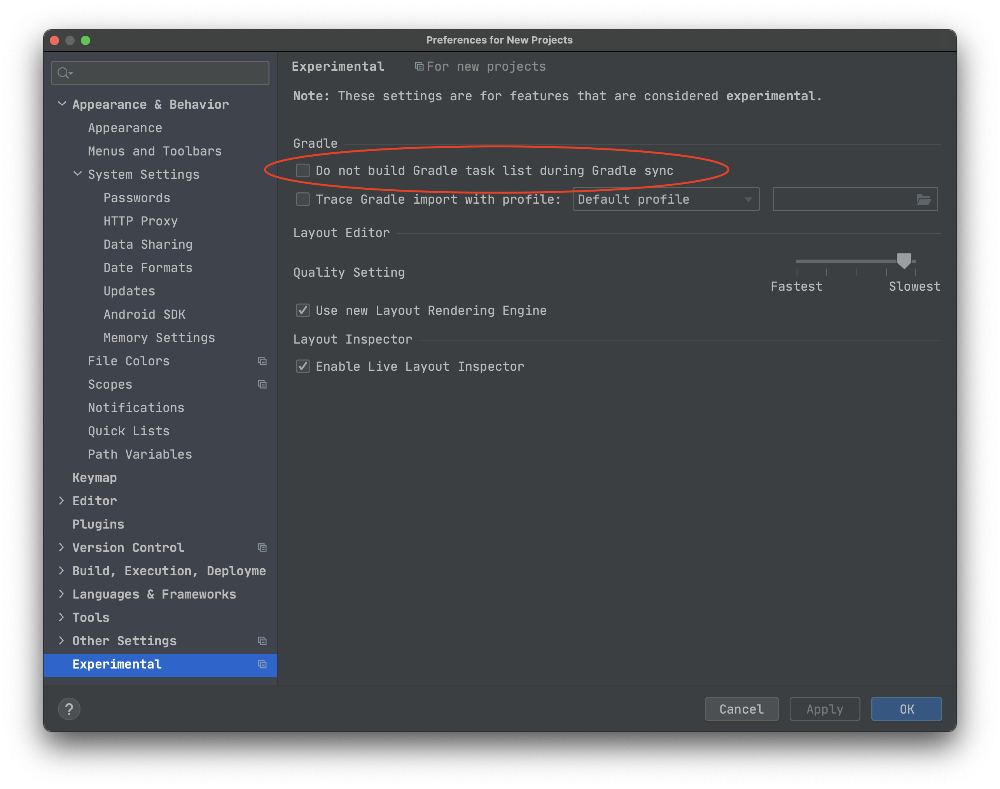

*Note*
: When specifying all paths in Andoid Studio, don't use the `~` character.
With it, the path is determined incorrectly and the builds fail.

### CocoaPods (iOS)

To work with dependencies on iOS we use CocoaPods, and also Kotlin module is connected to
Xcode project via CocoaPods integration. Therefore, you need to install the current version of CocoaPods.

Detailed documentation for installation [available on the official website](https://cocoapods.org/#install).

For HomeBrew users, installation information is [available here](https://formulae.brew.sh/formula/cocoapods)

### Kotlin Multiplatform Mobile plugin (iOS)

[Special IDE plugin called Kotlin Multiplatform Mobile](https://plugins.jetbrains.com/plugin/14936-kotlin-multiplatform-mobile) is provided for Android Studio by JetBrains, in which:

- Templates for KMM project / KMM module creation
- iOS application launching from Android Studio
- iOS applications debugging from Android Studio (you can put breakpoints in common code on Kotlin and iOS application will stop at this point when running)

This plugin is available only on macOS (since launching and debugging iOS application is possible only on macOS).

To install this plugin, go to `Preferences -> Plugins -> Marketplace` and find `Kotlin Multiplatform Mobile`, then just click `Install` and wait for the download to finish.

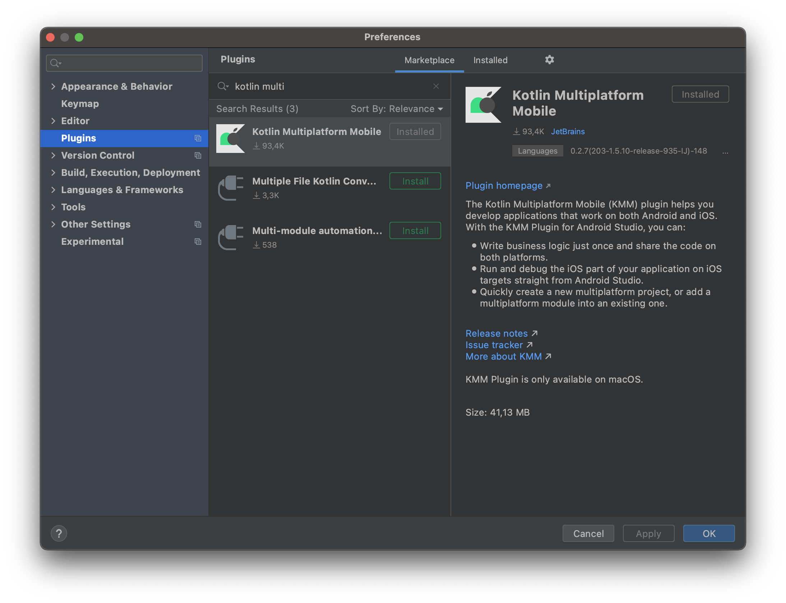

Positive
: It is important to understand that this plugin is not a compulsory requirement to work with Kotlin Multiplatform Mobile. Naming can be misleading. You can develop KMM applications without this plugin, it may only be needed for more convenient iOS part development - the ability to debug Kotlin from Android Studio is available exclusively through this plugin.

Negative
: During Kotlin updates plugin may break the work of the IDE (for example, the IDE cannot complete Gradle Sync). In such cases you should turn off this plugin and work without it.

### Xcode Kotlin plugin (iOS)

As an alternative to Kotlin Multiplatform Mobile plugin for Android Studio, you can use
[Xcode Kotlin plugin for Xcode](https://github.com/touchlab/xcode-kotlin).

It provides the ability to set breakpoints in Kotlin code from Xcode:
 

To install you should just download [current version from master] (https://github.com/touchlab/xcode-kotlin/archive/refs/heads/main.zip), unzip and run

```bash
./setup.sh
```

Then open Xcode and give permission to use Kotlin plugin (there will be a window when launching)

- `Load Bundle`.

Positive
: After every Xcode update, you need to do a re-installation by downloading the updated version of the plugin from GitHub.
After that, in projects where directories with Kotlin code are added via folder-reference, you can open Kotlin files and set breakpoints, and the Xcode debugger will successfully stop at them.
We will consider setting breakpoints in more detail a little later in the debugging section.

###  Сhecking 


To make sure that you have configured everything correctly, you can use the [moko-doctor](https://github.com/icerockdev/moko-doctor) utility.

```bash
./doctor.sh
```

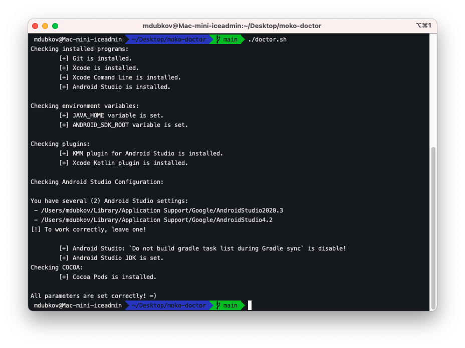

*Attention*
: New environment variables will appear only after restarting the terminal session.

### Gradle Build Environment

By opening the file `gradle.properties`, which is located in the root folder of the project, you can see the project build parameters.

- Param `org.gradle.parallel` is responsible for the parallel execution of tasks (if the tasks do not depend on each other)
- Param `org.gradle.jvmargs` is responsible for starting the Java machine and allocating memory to it. When setting this parameter, you should take into account the amount of RAM on your device and leave a couple of backup GB. For example, on a device with 16 GB of RAM, you can put `org.gradle.jvmargs=-Xmx8g`, the remaining 8 GB is quite enough to use the browser, etc., while waiting for the build to complete.
- Param `org.gradle.workers.max` is responsible for the number of parallel "Workers" or processes (by default, the number of cores of your CPU). In a similar way, you should leave a couple of backup cores for comfortable work until the build is completed. For example, on a computer with 8 cores, you can completely leave 6 workers: `org.gradle.workers.max=6`
- The other parameters can be [found here](https://docs.gradle.org/current/userguide/build_environment.html).

For a comfortable work, you can change the Gradle parameters not only for this project, but for all projects on your computer.
To do this, hust go to user's forlder and open `.gradle` folder:

```bash
cd ./gradle
```

We need the file `gradle.properties`

If it's missing:
```bash
touch gradle.properties
```

Open it
```bash
nano gradle.properties
```
or (who use Visual Studio Code)
```bash
code gradle.properties
```

You can alse use the Finder: 


You can declare any settings in this file that will take priority over the settings of any of the running projects. For example: 
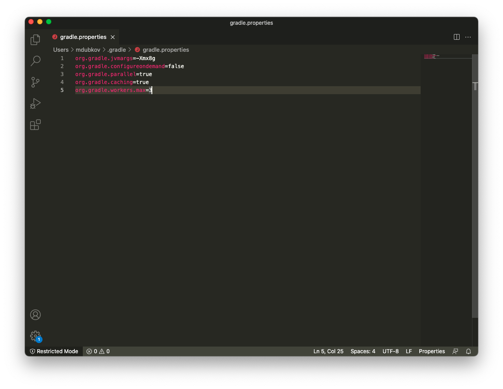


## Create a project

Duration: 10

Our template project - **mobile-moko-boilerplate** will serve as a starting point.
It is used in all new projects for quick deployment and development start. 
All the minimum required dependencies are connected there already, and there is the necessary folder structure and basic project setup. Therefore, go to GitLab repository
https://gitlab.icerockdev.com/scl/boilerplate/mobile-moko-boilerplate and fork into our profile, clone it.

After cloning, open the project in Android Studio. To do this start the studio, File -> Open -> and select the folder where you cloned the repository. The first time you open it, the following should appear:
 

Gradle Sync should also start, but if this did not happen, then run it yourself.

*Note*
: Gradle Sync is a gradle task that looks through all your dependencies listed in the `build.gradle` file, analyzes the structure of the project. All this is necessary for the IDE to work correctly.

By default, the studio parses directories and shows structure as for Android project. However, here we will work not only with android, but also with Multiplatform. Therefore, we switch the structure render. To do this, click on the Android dropdown on the left and select Project instead:


After that, the folder structure will change slightly:


We are waiting for the successful execution of Gradle Sync so that the necessary Tasks appear in our project. If Gradle Sync has failed, then we read an error.


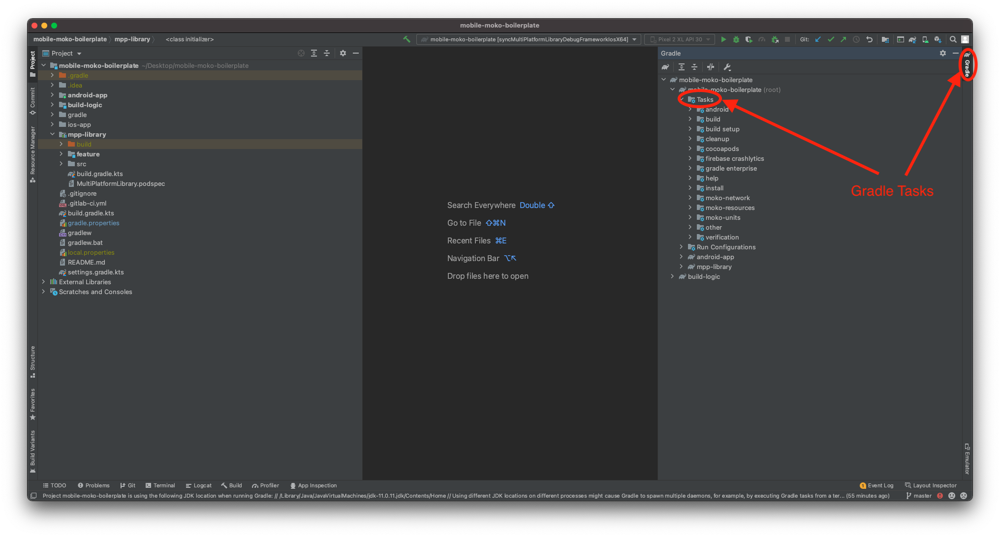


Positive
: In the next CodeLab we will get acquainted in more detail with the structure of the project, and in this part we will understand how to run and debug code on both platforms with the installed toolkit.

Negative
: It is necessary that the path `$HOME/bin` and `usr/local/bin` are added to the `PATH`environment variable

## Building Android

Duration: 5

Launching an Android application is quite simple - you just need to launch the button Run in Android Studio. As easy as normal Android app development.


As a result, Android version of the shared library (mpp-library) and an Android application will be built, and application will run on the selected device / emulator.


If you need just to build an Android application, then you can use corresponding Gradle tasks.


All tasks starting with `assemble` are responsible for compiling the project. The task `assembleDevDebug` is most often required to compile the debug assembly for the dev environment. Debug types of tasks are executed much faster than Release versions, since they do not have a lot of build optimizations and checks. Debug versions should be used for development.

### Сhoosing an emulator

By default, `Pixel_3a_API_30_x86` is selected for launching.
To select another device, you need to go to `AVD Manager -> Create Virtual Device...` and create the emulator you need.


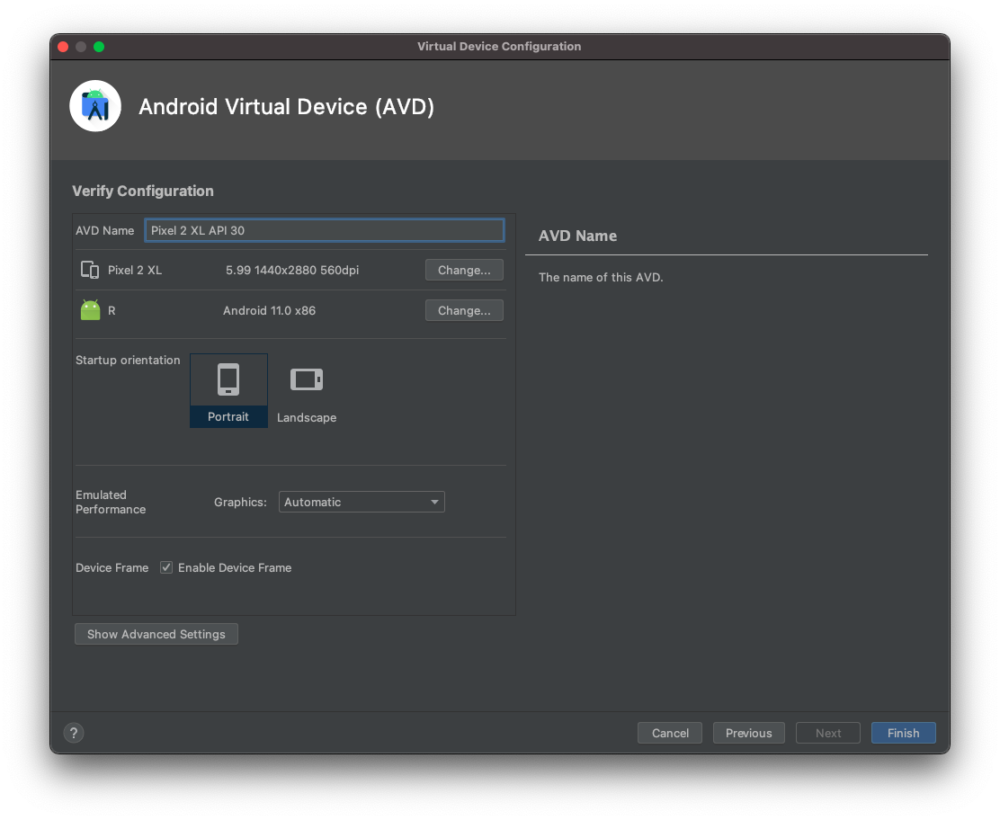

After that, you can use the created simulator to launch the project.


## Debugging Android

Duration: 5

Positive
: Debugging of the Android application and the general code is completely the same as in normal Android development.

To debug Android application / shared code on Android, just put a breakpoint and start android via Debug mode (bug icon).


When a stop occurs at a breakpoint, it will be possible to view the call stack and all the contents of the frames in the stack.

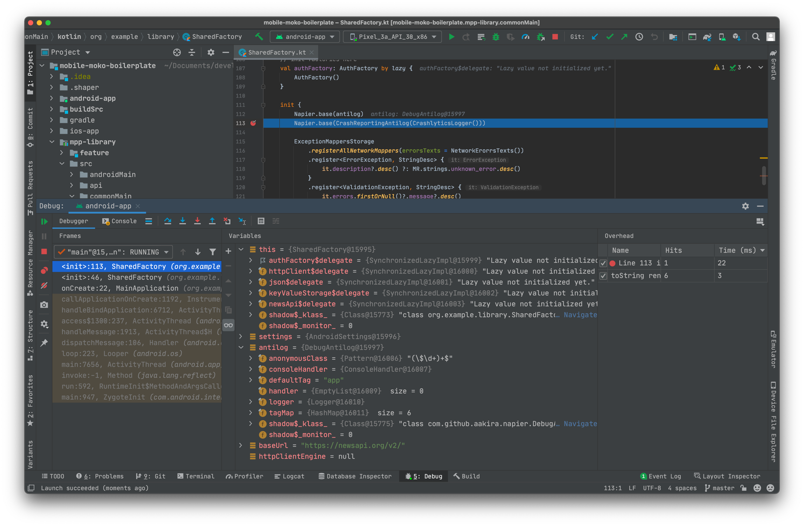

## Building iOS

Duration: 15

### Installing CocoaPods dependencies

Before the first compilation of iOS it is required to install the dependencies (they are managed via CocoaPods) - go to the `ios-app` directory and do` pod install`:

```bash
(cd ios-app && pod install)
```
Positive
: In order to avoid switching between IDE and terminal, you can use terminal directly from the studio. Just click the Terminal tab at the bottom of the panel.


The initial installation of CocoaPods is required for compilation of the Kotlin module, since our project depends on native CocoaPod modules (more detailed in the next part).

### Compilation of MultiPlatformLibrary.framework (Kotlin module for iOS)

After we have iOS dependencies installed, we can compile the Kotlin module for iOS. To do this, we need to run the Gradle task  `syncMultiPlatformLibraryDebugFrameworkIosX64`.
We can do this in several ways:

1. Run `./gradlew syncMultiPlatformLibraryDebugFrameworkIosX64` command in Terminal
2. Run `syncMultiPlatformLibraryDebugFrameworkIosX64` task through Android Studio


It is worth trying both options to find the one that suits you best.

Compilation will take some time, since Kotlin/Native (Kotlin compiler for native platforms) is not optimized enough for performance. While the compilation is in progress, it is worth reading the article [Gradle for iOS Developers at kmm.icerock.dev](https://kmm.icerock.dev/docs/for-ios-devs/gradle/)
...

### Installing CocoaPods dependencies along with MultiPlatformLibrary

After successful completion of the framework building, you need to re-install CocoaPods:

```bash
(cd ios-app && pod install)
```
This is necessary because when you first installed CocoaPods there was no MutliPlatformLibrary.framework file (since it’s compilation requires other CocoaPods dependencies) and therefore CocoaPods did not fully configure the integration of our project with the framework. More precisely, we did not add a framework file and a linking command to the xcode project. Therefore, after successful compilation of the framework, we rerun the installation of CocoaPods dependencies and after that we get a full-fledged integration.

You can check if the integration of the Kotlin module into iOS project was successful through Xcode:


If the framework is visible in `Pods/Development Pods/MultiPlatformLibrary/Frameworks`, then the integration is successful. If this framework is not visible, then make sure that you run the CocoaPods installation after you have compiled `MultiPlatformLibrary` task
`syncMultiPlatformLibraryDebugFrameworkIosX64`.

Positive
: if you have compilation errors of iOS application related to the absence of MultiPlatformLibrary, then check if the integration is successful (by checking the framework from the screenshot above). And also check for the presence of the framework along the path from where the CocoaPods integration takes it

- `mpp-library/build/cocoapods/framework/MultiPlatformLibrary.framework`.

### Launching iOS application

After successful installation of the CocoaPods dependencies (including MultiPlatformLibrary), you can open the Xcode workspace:

```bash
open ios-app/ios-app.xcworkspace
```

#### Launcing in simulator

We select any simulator and run the project by clicking on the Run button.


As a result, we will see the running application:


#### Launcing in real device

When running on a real device, you will get an error:


To solve this problem, go to `ios-app.xcodeproj -> Targets -> Signing & Capabilities` and point `Team` and `Bundle Identifier`.

After that, you need to replace the `Bundle Identifier` in the name of the Firebase synchronization file and the `BUNDLE_ID` inside the file itself.
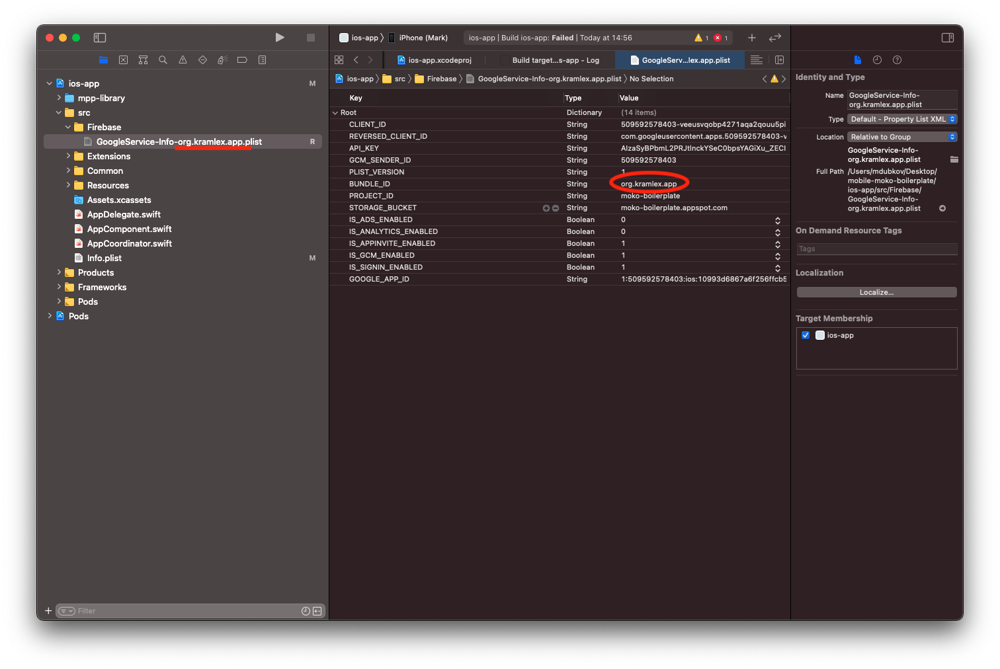

After these actions, we try to launch the application on the device and see this:


We managed to launch the application on a real device.

### Building directly from Android Studio

When using Kotlin Multiplatform Mobile plugin, you may run an iOS application directly from Android Studio.

This method does not cancel all work with CocoaPods, it can only be an alternative for launching an iOS application through Xcode.

To get started, you need to set the launch configuration. Select the item `Edit Configurations` in Android Studio:


And in the window that opens select `ios-app`. In the configuration settings select:

* `Xcode project scheme` =` mokoApp`
* `Execution target` = desired simulator / device


After the settings made click `Apply` to save, then select ` ios-app` configuration and launch the application.


### Write-Compile-Debug cycle

The development cycle "write code" -> "compile" -> "run" requires fewer steps than described above.
After the initial installation of the dependencies, to check the changes in the code you have to press `Run` in Xcode / Android Studio. The integration via CocoaPods will automatically compile Kotlin module, so changes in the code of the shared library and in the iOS code of the project will be taken into account in the new build. Running `pod install` may need to be repeated in cases where new native CocoaPods dependencies are added to ` Podfile`.

### What JDK does Xcode use?

As we have already found out, when you click on the `Run` button in Xcode, the same `Compile Kotlin/Native` process is started as in Android Studio with, for example, `syncMultiPlatformLibraryDebugFrameworkIosX64`.
This is specified in `Pods.xcodeproj -> Build Stages`

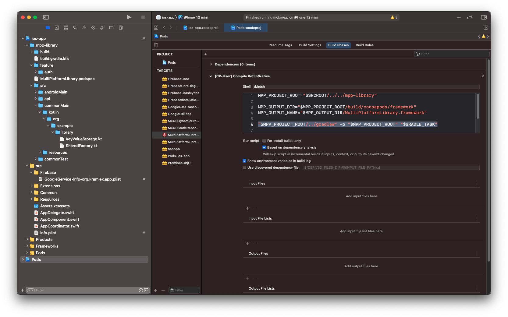


Here you can check which JDK uses Xcode when starting the Gradle process.

- You can open `System Monitoring` and find all java processes. If there are several such processes, then when compiling from Xcode and Android Studio, different Grale Daemon's are launched, each of which eats a considerable part of your RAM.
You need to get rid of such duplication of processes.


First, you can check which versions of the JDK are installed on your computer. To do this, just enter the command in the terminal:
```bash
/usr/libexec/java_home -V
```

You will see something like this:
```bash
Matching Java Virtual Machines (3):
    12 (x86_64) "Oracle Corporation" - "Java SE 12" /Library/Java/JavaVirtualMachines/jdk-12.jdk/Contents/Home
    11.0.12 (x86_64) "Oracle Corporation" - "Java SE 11.0.12" /Library/Java/JavaVirtualMachines/jdk-11.0.12.jdk/Contents/Home
    1.8.0_201 (x86_64) "Oracle Corporation" - "Java SE 8" /Library/Java/JavaVirtualMachines/jdk1.8.0_201.jdk/Contents/Home
/Library/Java/JavaVirtualMachines/jdk-12.jdk/Contents/Home
```

In order for Xcode to run Gradle Daemon from the JDK we need, and not from a random one, it is enough to go to `/Library/Java/JavaVirtualMachines/` and delete all the JDKs, except the one that you specified in the `JAVA_HOME` variable.

After all these actions, only one java process with the version we need will hang in the `System Monitoring`. This means that the build process in Android Studio and Xcode use the same Gradle Daemon.

You can read more about Gradle Daemon [here](https://kmm.icerock.dev/docs/for-ios-devs/gradle).


Another way to avoid this problem is to use the [moko-doctor](https://github.com/icerockdev/moko-doctor) utility again.

```bash
./setup_xcode_environment.sh
```

After that, Xcode will see the variables `JAVA_HOME` and `ANDROID_SDK_ROOT` declared in your environment during the project build. Thanks to this, we exclude the launch of the Gradle Daemon on different JVMs.

## Debugging iOS

Duration: 10

### Debugging using Xcode

Due to the installed plugin [xcode-kotlin] (https://github.com/touchlab/xcode-kotlin) we can specify a breakpoint in Kotlin code directly from Xcode. To do this, you need to add Kotlin code files to the Xcode project through folder-reference. There is a link in our project to the `mpp-library` directory, in which all multiplatform modules are located.

To get an example of working with breakpoints, open the file
`mpp library/src/commonMain/kotlin/org/example/library/SharedFactory.kt` in Xcode and set a breakpoint (by clicking on the line number) on the line in the class constructor with initialization of the` Napier` logger.

```kotlin
Napier.base(CrashReportingAntilog(CrashlyticsLogger()))
```


Next, we launch the application and immediately upon launch we will get a stop at this breakpoint.


In the debugger you can see the stack trace with a clear call stack (kotlin functions start with `kfun:`), and also see that the data available in the current frame is partially visible for analysis:

- you can see the properties of the current object in `_this`
- you can see the constructor arguments `settings`,` antilog`, `baseUrl`,` httpClientEngine`

The debugger is still not stable with Kotlin code, so step-by-step operations may lead to unexpected results, and lldb commands like `po` may give crashes, but this will also be improved in the future.


You can read about Advanced Debugging with Xcode [here](https://medium.com/headout-engineering/advanced-debugging-with-xcode-9eba2845232a).


### Debugging using Android Studio

Using Kotlin Multiplatform Mobile plugin you can debug kotlin code in iOS from Android Studio. To do this you should set the breakpoint (by clicking to the right of the line number) to the desired line:


and after that we can launch the application using the Debug button (bug):


After starting debugging, a breakpoint will stop and we will see the stack trace and data from the current frame - just like in Xcode.


### Debugging via Xcode vs Android Studio

When debugging through Xcode, we can see the frame data of not only the Kotlin part but also Swift, we can switch along the stack trace in Swift code and see what was passed to Kotlin when called. When debugging through Android Studio, Swift code will be inaccessible, only Kotlin part will be available to analysis. But at the same time, all navigation and analysis of Kotlin code is available through Android Studio, which are not available when debugging through Xcode. Everyone can choose the most suitable tool for their current needs.

## Running tests

Duration: 5

Tests written in Kotlin module are run in both Android and iOS environments, that allows you to find platform-specific problems.

Tests are run through gradle tasks:

* `build` - compile all platforms (even those binaries that are not needed for
   tests) and run all checks (the longest option)
* `test` - run all tests (and compile the binaries needed to run the tests)
* `iosX64Test` - run all tests on the iOS platform
* `testDebugUnitTest` - run all tests on Android platform

Try running tests through `test`:


Besides running tasks through gradle, you can run tests pointwise:

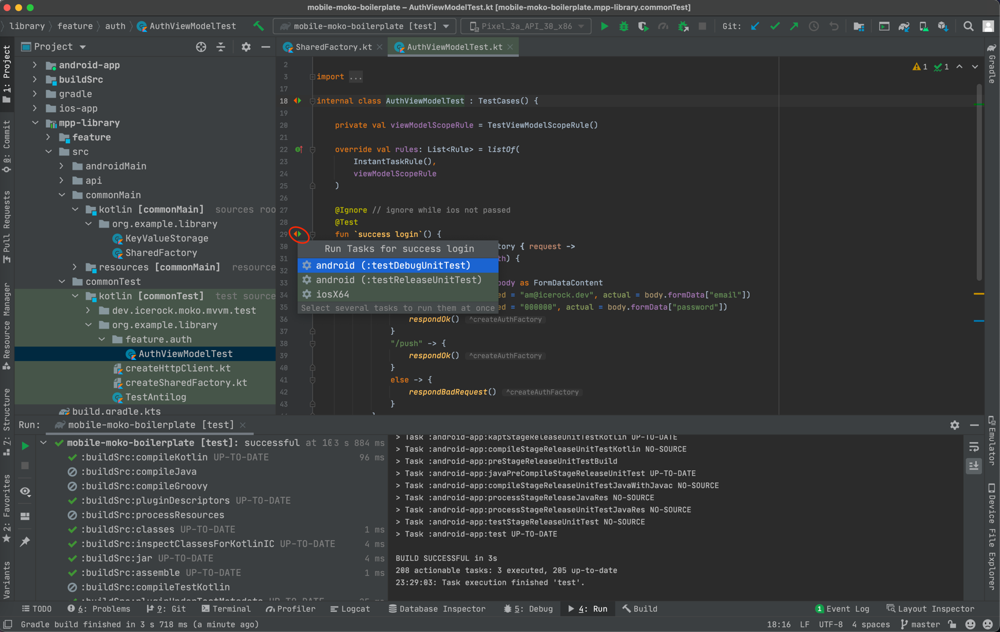

Writing tests will be dealt with in more detail in future CodeLabs.

## Results

Duration: 5

And this is our success! We downloaded and assembled Multiplatform project from scratch. All the work with other MPP projects in the company is carried out in a similar way. Therefore, when you get to a production project, you will already know exactly how to download it from the repository, build it and run it.
