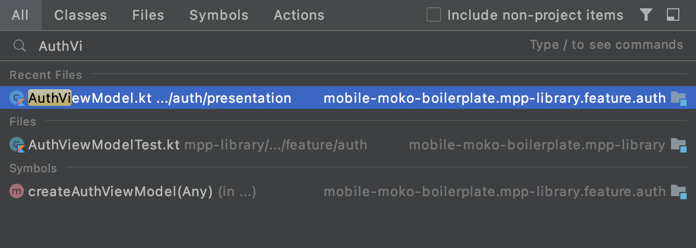
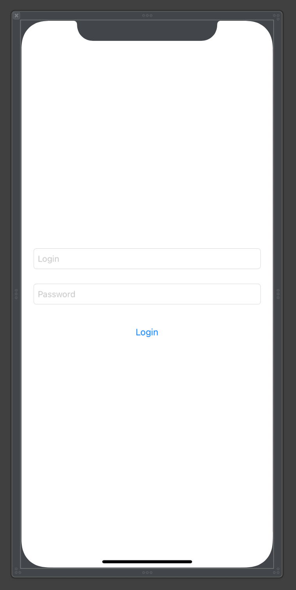
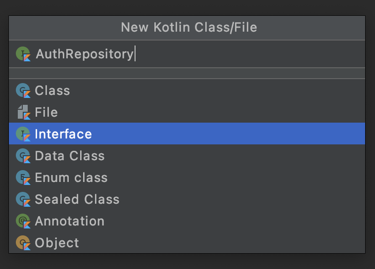
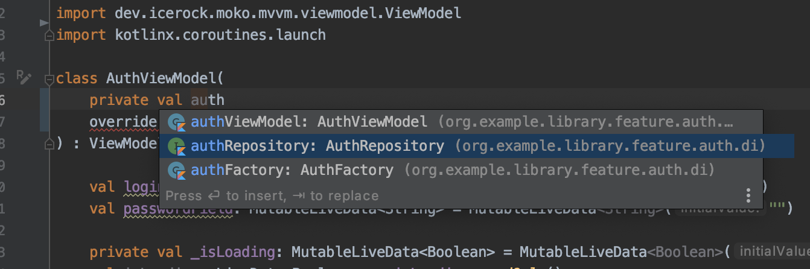
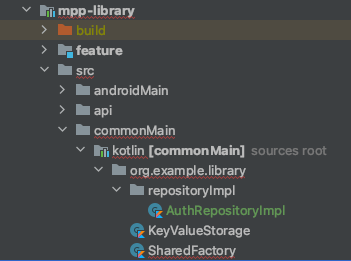
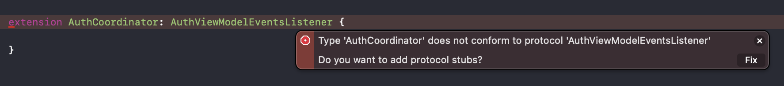
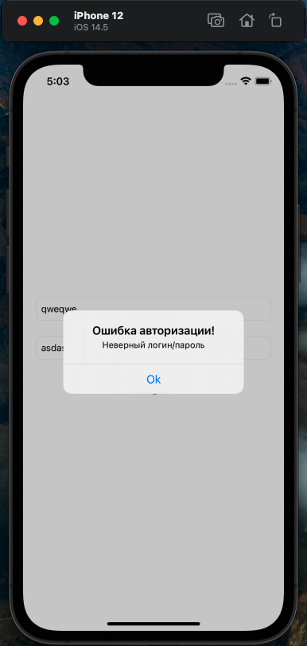

id: kmm-icerock-onboarding-2-ru categories: lang-ru,kmm-icerock-onboarding,moko status: published authors: Andrey
Kovalev, Aleksey Lobynya, Aleksey Mikhailov tags: onboarding,kmm,ios,android,moko feedback
link: https://github.com/icerockdev/kmp-codelabs/issues

# IceRock KMM onboarding #2 - реализация фичи авторизации

## Создаём ViewModel

Duration: 10

Теперь перейдем к написанию нашей первой фичи. Начинать мы будем с очень распространённой задачи — реализации
авторизации в приложении. Экран у нас будет несложный: два поля ввода — для логина и пароля, а также кнопка логина. Для
отображения состояния загрузки нам понадобится лоадер, который мы будем показывать при отправлении запроса на сервер и
сообщение об ошибке, на случай если что-то пойдет не так. Лоадер и показ диалога ошибки мы будем реализовывать
стандартными нативными средствами.

### Расположение ViewModel

Так как ViewModel реализует общую логику, которая является одинаковой для iOS и Android, то она находится в общем коде
приложения. Для каждой фичи в mpp-library создается отдельный одноимённый модуль, значит наша ViewModel авторизации
будет находиться в модуле:

feature/auth

Сразу из коробки в boilerplate проекте уже можно увидеть заготовку для нашей ViewModel авторизации.

Positive
: Чтобы быстро найти нужный файл можно воспользоваться хоткеем для поиска по файлам в Android Studio. Для этого
используем либо двойное нажатие на Shift, либо сочетание Cmd + Shift + O. Это полезный инструмент, т.к. довольно часто
бывает необходимость быстро найти конкретный файл и быстро перейти в него.

Найдём нашу ViewModel в поиске:



Перейдём в найденный файл и увидим там заготовку под ViewModel авторизации:

```kotlin
class AuthViewModel(
        override val eventsDispatcher: EventsDispatcher<EventsListener>,
) : ViewModel(), EventsDispatcherOwner<AuthViewModel.EventsListener> {

    interface EventsListener
}
```

Как можем видеть - в ней практически ничего нет, кроме одного параметра в конструкторе - eventsDispatcher'а.

// TODO: Добавить акцент, что он для одноразовых событий. Чтобы не было путаницы с тем, что его можно для обновления текстов использовать.
сделать Positive/Negative примеры

Что такое eventsDispatcher и для чего он нужен? Это инструмент, который служит для связи ViewModel и нативной стороны.
Если в ViewModel произошло событие и об этом необходимо сообщить на сторону нативного приложения (например, для
отображения сообщения, вызова перехода, обновления экрана, либо некоторой нативной обработки) мы уведомляем об этом
нативную часть через eventsDispatcher.

Набор событий которые можно вызывать со стороны общего кода определяется интерфейсом EventsListener. Чуть дальше мы как
раз добавим сюда новые методы.

Все что нам осталось это написать саму логику авторизации :)

## Добавляем поля ввода

Duration: 15

### Используем MutableLiveData для ввода данных

Начнем с полей ввода: нам нужно две мутабельные лайвдаты для ввода логина и пароля.

Для начала добавим в блок импортов следующую строку:

```kotlin
import dev.icerock.moko.mvvm.livedata.MutableLiveData
```

После этого добавляем наши поля в класс вьюмодели:

```kotlin
val loginField: MutableLiveData<String> = MutableLiveData<String>("")
val passwordField: MutableLiveData<String> = MutableLiveData<String>("")
```

Positive
: Если не добавлять импорт, а сразу вставить поля, то MutableLiveData будет светиться красным, т.к. в рамках ViewModel
этот класс неизвестен. При этом если Android Studio видит, что это за класс и нужен только импорт, то можно сделать это
хоткеем — достаточно нажать на красное название неимпортированного класса и нажать alt + Enter. Тогда данный импорт
пропишется автоматически в блоке импортов.

// TODO: Переделать формулировку, указывать явно только тогда, когда справа тип непонятен. Уточнить, что надо аккуратнее с публичными свойствами, т.к. андроид
сразу это подсветит, а на ios без пересбоки не увидим и можно сломать.

Эти поля должны быть публичными. Их мы будем использовать для передачи вводимых пользователем данных с нативной части в
общую. Также обращаем внимание, что необходимо явно указать их тип - MutableLiveData<String>. Это хороший тон, который
увеличивает читаемость кода и обеспечивает дополнительный контроль публичных типов данных.

По итогу после всех этих действий ViewModel должна иметь следующий вид и никаких ошибок быть не должно:

```kotlin
package org.example.library.feature.auth.presentation

import dev.icerock.moko.mvvm.dispatcher.EventsDispatcher
import dev.icerock.moko.mvvm.dispatcher.EventsDispatcherOwner
import dev.icerock.moko.mvvm.livedata.MutableLiveData
import dev.icerock.moko.mvvm.viewmodel.ViewModel

class AuthViewModel(
        override val eventsDispatcher: EventsDispatcher<EventsListener>,
) : ViewModel(), EventsDispatcherOwner<AuthViewModel.EventsListener> {

    val loginField: MutableLiveData<String> = MutableLiveData<String>("")
    val passwordField: MutableLiveData<String> = MutableLiveData<String>("")

    interface EventsListener
}
```

Далее перейдём к обработке действий пользователя.

## Логика обработки действий

Duration: 10

### Обработка нажатия кнопки входа

После того как пользователь ввел свои логин и пароль, нам потребуется обработать нажатие кнопки логина. Для этого
напишем функцию onLoginTap. При нажатии кнопки логина, мы должны отправить на сервер запрос с необходимыми данными. Пока
для простоты мы добавим печать сообщения о нажатии кнопки. Получим простой публичный метод у ViewModel:

```kotlin
fun onLoginTap() {
    println("Button tapped!")
}
```

### Отображение прогресса загрузки

При этом нам нужно показать пользователю прогресс бар чтобы он не заскучал в ожидании ответа. Ранее мы касались важности
разделения использования MutableLiveData и LiveData. Если у нас есть LiveData, которую мы должны изменять в общем коде,
чтобы нативная сторона могла отслеживать эти изменения и применять соответствующую логику (например, изменять UI или
как-либо ещё реагировать на обновление LiveData, в соответствии с бизнес-логикой приложения), то необходимо использовать
следующий подход:

Сначала добавляем приватную MutableLiveData<Boolean>. Со значением по-умолчанию false:

```kotlin
private val _isLoading: MutableLiveData<Boolean> = MutableLiveData<Boolean>(false)
```

А затем такую же, но публичную LiveData, значение которой будет повторять созданную выше MutableLiveData, но только для
чтения:

```kotlin
private val _isLoading: MutableLiveData<Boolean> = MutableLiveData<Boolean>(false)
val isLoading: LiveData<Boolean> = _isLoading.readOnly()
```

Для readOnly и немутабельной LiveData понадобится импорт:

```kotlin
import dev.icerock.moko.mvvm.livedata.LiveData
import dev.icerock.moko.mvvm.livedata.readOnly
```

Positive
: В случаях, когда нужно сделать пару полей, одно из которых — приватное изменяемое, а другое — его публичный
неизменяемый аналог, используются одинаковые имена, а перед приватным добавляется нижнее подчёркивание

Готово! К этому публичному полю isLoading теперь можно прибиндиться с натива для отслеживания необходимости
показать/скрыть лоадер.

## Добавляем метод авторизации и его вызов

Duration: 15

### Создадим сам метод

Для начала, чтобы не усложнять и идти поэтапно, разберём сам подход к выполнению запросов к серверу и асинхронных
операций. Здесь нам на помощь придёт замечательный инструмент котлина - Coroutines. В рамках текущей кодлабы мы не будем
глубоко в них уходить, чтобы не отходить от темы. Подробнее можно почитать тут

Nagative
: Вставить ссылки на статьи и видео по корутинам

Для выполнения запроса нам нужна асинхронная функция, которая будет выполняться в рамках своего CoroutineScope. Такие
функции называются suspend-функции. Именно её нам и нужно добавить. Так как со стороны натива мы не должны знать о
деталях всяческих запросов и логики, а только лишь сообщать о нажатии кнопки, то это будет приватная функция, которая
нам просто напечатает, с какими данными мы пробуем авторизоваться:

```kotlin
private suspend fun sendAuthRequest() {
    println("Try to auth with login: ${loginField.value} password: ${passwordField.value}")
}
```

И добавим вызов этой функции в методе обработки нажатия кнопки:

```kotlin
fun onLoginTap() {
    println("Button tapped!")
    sendAuthRequest()
}
```

И мы получим ошибку от IDE:

Negative
: Suspend function 'sendAuthRequest' should be called only from a coroutine or another suspend function

Студия подсказывает нам, что мы пытаемся вызвать suspend-функцию вне корутин и вне другой suspend-функции.

### Добавляем вызов метода правильно

Но там ведь даже запроса никакого нет и ничего асинхронного, просто печать в лог? Почему ошибка? - Потому что мы
указали, что это suspend-функция. Это хороший вспомогательный механизм, помогающий себя контролировать и отличать
простые синхронные методы от асинхронных. Даже несмотря на то, что пока тут никакого асинхронного кода нет внутри, мы
знаем, что эта функция должна быть асинхронной. Поэтому сразу помечаем её как suspend, и тут нам IDE c компилятором
подскажут, что так с ней работать нельзя.

Где же взять этот пресловутый скоуп? А он у нас уже есть. Просто находится для удобства в базовом классе ViewModel. Если
посмотрим внимательно на наш класс, то увидим, что AuthViewModel наследуется от ViewModel:

```kotlin
class AuthViewModel(
        override val eventsDispatcher: EventsDispatcher<EventsListener>,
) : ViewModel()
```

А в нём как раз и лежит нужный нам скоуп:

```kotlin
protected actual val viewModelScope: CoroutineScope = createViewModelScope()
```

Возвращаемся к нашей обработке кнопки и переделаем вызов метода авторизации, поместив его на viewModelScope:

```kotlin
    fun onLoginTap() {
    println("Button tapped!")
    viewModelScope.launch {
        sendAuthRequest()
    }
}
```

Больше ошибки нет. Можем запустить syncMultiPlatformLibraryDebugFrameworkIosX64 и убедиться, что всё собирается успешно.
Пора теперь перейти на нативную сторону, создать экран и проверить, что поля заполняются и методы отрабатывают.

## iOS: Создание экрана авторизации

Duration: 30

### Создание контроллера авторизации и вёрстка

Duration: 20

Как правило, фичи в нативном проекте соответствуют аналогичным фичам в мультиплатформенном проекте. Сначала наметим
структуру папок в нашем проекте. Внутри src создадим папку Features, а в ней - Auth. Для авторизации нам понадобится
контроллер и координатор. Чтобы всё не смешивалось в кучу (а в боевых проектах в фиче сильно больше файлов будет) сразу
научимся группировать по папкам содержимое фичи. Заведём директории под контроллеры, координаторы и файлы для самих
классов. Получится следующая структура:


Вёрстку мы ведём через xib-файлы. Обработчики действий и связи настраиваются через IBActions и IBOutlets. Кастомизация
UI-элементов стилями конкретного проекта уже происходит кодом. Здесь мы не будем уходить глубоко в кастомизацию, поэтому
контроллер у нас будет довольно простой — пара полей для ввода логина и пароля и кнопка входа.

На вкус и цвет фломастеры бывают разные, можно сверстать экран по-своему. Основные требования — два UITextField и одна
кнопка UIButton. Что-то типа такого:



И класс у неё также пока очень простой:

```swift
import UIKit

class AuthViewController: UIViewController {

    // MARK:** - Outlets**

    @IBOutlet private var loginTextField: UITextField!
    @IBOutlet private var passwordTextField: UITextField!
    @IBOutlet private var loginButton: UIButton!

    // MARK:** - Actions**

    @IBAction func onLoginButtonAction(_ sender: UIButton) {
        // On button Action
    }
}
```

После вёрстки не забываем привязать IBOutlet-ы и IBAction к соответствующим элементам xib, а также привязать view.

Прежде чем продолжить, затронем основы построения навигации в наших iOS приложениях.

### Навигация

В основе навигации лежат координаторы. Каждый координатор покрывает логически связанный блок функционала, который чаще
всего состоит из нескольких экранов. При этом между собой они независимы и отвечают только за цепочку переходов только
внутри себя. Также имеют возможность получать настройку действия, которое должно быть выполнено после завершения блока
ответственности координатора.

Например.

В рамках этих кодлаб мы сделаем приложение, в котором будет авторизация, просмотр списка новостей, с возможностью
перехода к детальному виду каждой новости. А со списка новостей можно попасть в раздел настроек для конфигурации
отображения новостей. Это разобьётся на 4 координатора:

1. AppCoordinator - он уже создан и лежит в src/AppCoordinator.swift.

- Стартовый координатор.
- Всегда является первой входной точкой, определяет, куда должен выполниться дальнейший переход при запуске приложения
- Если юзер не авторизован — запустит координатор авторизации и в качестве completionHandler-а укажет ему переход на
  новости в случае успешной авторизации
- Если юзер уже авторизован — запустит координатор просмотра новостей

2. AuthCoordinator

- Запустит процесс авторизации
- Будет совершать переходы по всем требуемым шагам — например ввод логина/пароля, смс-кода, установки никнейма и т.п.
- По итогу успешной авторизации вызовет переданный ему на вход completionHandler.

3. NewsCoordinator

- Отвечает за показ списка новостей
- Реализовывает переход в детали конкретной новости внутри этого же координатора
- При переходе в настройки создаёт координатор настроек, в качестве completionHandler-а может передать ему логику
  обновления своего списка новостей. Если в настройках изменились параметры
- обновляет список

4. SettingsCoordinator

- Отвечает за работу с экраном настроек
- При завершении работы и применении настроек вызывает completion, чтобы новости обновились

Именно координаторы реализуют интерфейс EventListener-ов вьюмоделей, о которых будет чуть ниже. Так как вызов переходов
завязан на бизнес-логику приложения, то инициатором этих переходов являются именно вьюмодели. Поэтому координаторы
выполняют связующую роль между тем, что происходит в логике приложений и тем, как это должно отражаться пользователю.

Чтобы работать с координаторами было проще, используется базовый класс, от которого наследуются остальные. Он называется
BaseCoordinator и лежит в директории ios-app/src/Common/Coordinator. Требование к координатору — это реализация
протокола Coordinator, который лежит рядом в той же директории:

```swift
protocol Coordinator: class {
    var completionHandler: (()->())? { get }
    func start()
    func clear()
}
```

completionHandler - коллбэк, который вызывается при завершении работы координатора (например закончили флоу авторизации)
start - метод старта координатора. Внутри него координатор должен определить, какой экран у него должен быть стартовым,
создать его и отобразить clear - метод очистки координатора. В нём необходимо очистить дочерние координаторы.

Всё это есть в базовом координаторе. Даже больше. Пройдёмся по основным важным моментам BaseCoordinator-а.

Для инициализации ему требуется передать UIWindow и SharedFactory. UIWindow требуется для отображения контроллеров,
диалогов, а SharedFactory позволит создавать вьюмодели для контроллеров.

В поле childCoordinators хранится массив дочерних координаторов. Они нужны для того, чтобы иметь возможность при
завершении работы координатора корректно очистить их и избежать утечек памяти.

Также имеются два коллбэка - completionHandler и clearHandler. Первый нужен для того, чтобы указать необходимую
дополнительную логику, которая должна выполниться, когда координатор сообщит о том, что он выполнил свою часть логики. А
второй необходим для обработки события о том, что координатор очищен.

Чтобы избежать ошибок в построении связей и переходах в базовом координаторе заведены следующие публичные методы:

- addDependency - этот метод используется для того, чтобы добавить текущему координатору в зависимость новый
  координатор. Он проверит есть ли уже координатор такого типа в зависимостях, а при отсутствии — выполнит добавление и
  подстрахует с добавлением вызова удаления зависимости.
- beginInNewNavigation - принимает UIViewController, создаёт с ним новый UINavigationController и запускает новую
  цепочку навигации, устанавливая этот контроллер навигации как рутовый в UIWindow.
- beginInExistNavigation - принимает UIViewController, запоминает в качестве предыдущего контроллера тот, который сейчас
  последний в текущем UINavigationController. Это нужно для того, чтобы при очистке координатора выполнить переход к
  тому контроллеру, с которого мы пришли на этот координатор.
- currentViewController - возвращает текущий контроллер координатора

### Добавляем координатор авторизации

Далее создадим сам класс координатора авторизации. Для этого добавим в созданный ранее AuthCoordinator.swift :

```swift
class AuthCoordinator: BaseCoordinator {

    // MARK:** - Overrides**

    override func start() {
        let vc = AuthViewController()
        self.navigationController = UINavigationController(rootViewController: vc)
        self.navigationController?.navigationBar.isHidden = true

        self.window.rootViewController = self.navigationController
    }
}
```

И импортируем UIKit для работы с UINavigationController:

```swift
import UIKit
```

Он также несложный. Состоит пока из одного метода start, который создаёт UINavigationController, добавляет в него наш созданный AuthViewController, делает
navigationBar скрытым и помещает этот NavigationController на window.

И чтобы это всё работало изменяем координатор приложения AppCoordinator. Тут нам нужно убрать тестовый зелёный экран и
запустить флоу координатора авторизации. :

```swift

class AppCoordinator: BaseCoordinator {
    override func start() {
        routeToAuth()
    }

    private func routeToAuth() {
        // 1. Создаём координатор авторизации. Получаем его как результат вызова добавления зависимости, 
        // в который передаём объект созданного координатора. Внутри addDependency проставятся все необходимые добавления и удаления зависимостей для
        // корректной работы с памятью и очистки контроллеров и координаторов
        let authCoordinator = addDependency(AuthCoordinator(window: self.window, factory: factory))

        // 2. Вызываем у него старт
        authCoordinator.start()
    }
}

```

Собираем, запускаем и видим уже не тот недохромакей, а контроллер авторизации, который только что сверстали.
Комментариями к коду подписаны основные шаги в создании нового координатора.

Окей. Мы создали контроллер, создали координатор. Даже перешли на экран авторизации. Но как будет реализовываться
логика? Где брать вьюмодель? Как она узнает, что юзер что-то ввёл? Как координатор поймёт, что ему нужно вызывать
дальнейший переход, ведь контроллер, который мы создали, даже не знает о том, что какой-то там координатор существует?

Чтобы понять, как это работает переходим к созданию экземпляра вьюмодели, передаче её контроллеру для привязки.

## iOS: Привязка к ViewModel

### Биндинг для ViewController-а

Контроллер отвечает за обработку действий пользователя — ввод данных, нажатие кнопки. Чтобы это реализовать, нам
необходимо связать получившийся ViewController и ViewModel. Так как операция эта довольно частая, то для её упрощения
был создан специальный базовый класс для ViewController-ов, которые должны работать на базе ViewModel. Называется он
MVVMController и лежит в папке src/Common. Главной его особенностью для нас является то, что он может работать с любым
типом ViewModel, передающейся через Generic. При этом он сохраняет свой экземпляр ViewModel и корректно очищает в нужный
момент. А также у него уже есть основной метод для привязки - bindViewModel. Именно его мы будем переопределять для
привязки конкретной нужной ViewModel.

Positive
: Рядом с этим классом также лежит BaseViewController - это чуть более расширенная версия MVVMController-а, т.к. в неё
добавлены заготовки под обработку клавиатуры и лоадеров. Конкретная реализация зависит от проекта. При использовании на
проекте удобно использовать базовый контроллер, донастроить его под нужды проекта и экономить на этом время разработки,
добавляя, к тому же, единообразия в реализации разных экранов.

Перейдём к нашему контроллеру авторизации и унаследуем его от MVVM-контроллера, работающего на базе AuthViewModel.

Для этого добавим импорт библиотеки мультиплатформы, т.к. нам нужна AuthViewModel:

```swift
import MultiPlatformLibrary
```

и заменим базовый тип с обычного UIViewController на MVVMController с AuthViewModel:

```swift
class AuthViewController: MVVMController<AuthViewModel>
```

Отлично, теперь можно приступать к привязке ViewModel. Нам необходимо:

1. Привязать текстовые поля к соответствующим полям ViewModel
2. По нажатию на кнопку вызывать метод onLoginTap у ViewModel

Добавляем переопределение метода биндинга:

```swift
// MARK:** - MVVM

    override func bindViewModel(_ viewModel: AuthViewModel) {
        super.bindViewModel(viewModel) // 1. Обязательно вызываем реализацию родителя. Там происходит загрузка view и сохранение viewModel

        // 2. для каждой LiveData выполняем привяку строки к текстовому полю
        viewModel.loginField.bindStringTwoWayToTextFieldText(textField: loginTextField)
        viewModel.passwordField.bindStringTwoWayToTextFieldText(textField: passwordTextField)
    }
```

Здесь используется двухсторонний биндинг — TwoWay. Это означает, что он будет работать в обе стороны. Если пользователь
изменяет данные в полях — информация об этом будет прилетать во ViewModel. Также если и в рамках логики внутри ViewModel
потребуется изменить значения в полях (например сбросить пароль при неудачной авторизации)
и данные в лайвдатах будут изменены — они также изменятся и на UI в нативе.

С кнопкой всё проще — так как MVVMController умеет хранить ссылку на ViewModel, то достаточно просто вызвать нужный
метод внутри IBAction обработчика кнопки:

```swift
@IBAction func onLoginButtonAction(_ sender: UIButton) {
    viewModel?.onLoginTap()
}
```

Теперь осталось лишь создать экземпляр ViewModel авторизации и передать её в этот биндинг.

### Создание ViewModel

Как мы помним — переходами у нас управляют координаторы. Они же знают про SharedFactory, которая умеет создавать
вьюмодели. Воспользуемся этими знаниями и создадим AuthViewModel при переходе на экран авторизации.

Возвращаемся в AuthCoordinator.

Сперва добавим импорт MultiplatformLibrary:

```swift
import MultiPlatformLibrary
```

А затем перейдём к созданию AuthViewModel. Сам координатор знает про общую фабрику - SharedFactory. Внутри неё
содержатся отдельные фабрики разных фичей, чтобы зависимости у фичей были разделены, и фабрика конкретной фичи знала
только про методы создания, относящиеся именно к ней. У нас же пока только одна фабрика — фабрика авторизации. Обратимся
к ней и запросим создание нужной ViewModel:

```swift

override func start() {
    let authViewModel = factory.authFactory.createAuthViewModel(
        eventsDispatcher: EventsDispatcher.init(listener: self)
    )

    let vc = AuthViewController()
    self.navigationController = UINavigationController(rootViewController: vc)
    self.navigationController?.navigationBar.isHidden = true
    
    vc.bindViewModel(authViewModel)
    self.window.rootViewController = self.navigationController
}
```

С нативной стороны эта ViewModel требует для инициализации всего один параметр - EventsDispatcher, реализующий протокол
AuthViewModelEventsListener. Это необходимо для передачи действий и событий от ViewModel к нативной стороне. У нас пока
нет каких-либо событий и этот протокол пустой. Но всё же реализовать его мы обязаны, чтобы соблюдалось соответствие
типов. Добавим к координатору extension, реализующий AuthViewModelEventsListener:

```swift
extension AuthCoordinator: AuthViewModelEventsListener {

}
```

После этого нам останется лишь вызвать метод биндинга у созданного контроллера и передать туда созданную ViewModel. В
конечном итоге метод старта будет выглядеть так:

```swift
override func start() {
    let authViewModel = factory.authFactory.createAuthViewModel(
        eventsDispatcher: EventsDispatcher.init(listener: self)
    )

    let vc = AuthViewController()
    self.navigationController = UINavigationController(rootViewController: vc)
    self.navigationController?.navigationBar.isHidden = true

    vc.bindViewModel(authViewModel)
    self.window.rootViewController = self.navigationController
}
```

Вот и всё. Можно запускать приложение и проверить, как работает экран авторизации. Введём в поля данные и нажмём на
кнопку авторизации:


Получим сообщение в лог в Xcode:


Positive
: На примере последних двух шагов мы как раз увидели, какой объём работы требуется исключительно с нативной стороны при
типовых кейсах реализации фичей. Основные моменты — это создание перехода/координатора для нового экрана, создать
контроллер, описать привязки UI-элементов, добавить необходимые вызовы публичных методов и создать ViewModel, которую
пробросить в биндинг. При этом сама ViewModel может делаться другим разработчиком. Как мы видим — не обязательно знать
деталей её реализации и внутренней логики. Со стороны натива достаточно будет только публичного интерфейса.

## Android: Создание экрана авторизации

Duration: 20

Negative
: Нужна помощь со стороны андроида по заполнению этих разделов и актуализации. Основные моменты:

- не хватает указания файлов/папок в которых происходят изменения, не хватает импортов, на первом этапе надо убрать
  валидации полей

### Создание нативного экрана авторизации

Пришло время написать нативную реализацию экрана.

Сам экран представляет из себя фрагмент, который мы прибиндим к нашей AuthViewModel, для верстки нам понадобится два
поля ввода и сообщения об ошибках под ними

```xml

<com.google.android.material.textfield.TextInputEditText
        android:id="@+id/login"
        android:layout_width="0dp"
        android:layout_height="wrap_content"
        app:layout_constraintEnd_toEndOf="parent"
        android:layout_marginHorizontal="16dp"
        android:layout_marginTop="160dp"
        app:layout_constraintStart_toStartOf="parent"
        app:layout_constraintTop_toTopOf="parent"/>

<androidx.appcompat.widget.AppCompatTextView
android:id="@+id/loginValidation"
android:layout_width="0dp"
android:layout_height="wrap_content"
android:textAppearance="?textAppearanceBody2"
android:textColor="?colorAccent"
app:layout_constraintTop_toBottomOf="@id/login"
app:layout_constraintStart_toStartOf="@id/login"
app:layout_constraintEnd_toEndOf="@id/login"/>

<com.google.android.material.textfield.TextInputEditText
android:id="@+id/password"
android:layout_marginHorizontal="16dp"
android:layout_width="0dp"
android:layout_height="wrap_content"
android:layout_marginTop="16dp"
app:layout_constraintEnd_toEndOf="parent"
app:layout_constraintStart_toStartOf="parent"
app:layout_constraintTop_toBottomOf="@id/login"/>

<androidx.appcompat.widget.AppCompatTextView
android:id="@+id/passwordValidation"
android:layout_width="0dp"
android:layout_height="wrap_content"
android:textAppearance="?textAppearanceBody2"
android:textColor="?colorAccent"
app:layout_constraintTop_toBottomOf="@id/password"
app:layout_constraintStart_toStartOf="@id/password"
app:layout_constraintEnd_toEndOf="@id/password"/>
```

кнопка для логина

```xml

<androidx.appcompat.widget.AppCompatButton
        android:id="@+id/button_login"
        android:layout_width="match_parent"
        android:layout_height="wrap_content"
        android:layout_margin="40dp"
        android:text="@string/auth_button_enter"
        app:layout_constraintBottom_toBottomOf="parent"
        app:layout_constraintEnd_toEndOf="parent"
        app:layout_constraintStart_toStartOf="parent"
        tools:text="Войти"/>
```

и прогресс бар на время загрузки

```xml

<ProgressBar
        android:id="@+id/loading"
        android:layout_width="wrap_content"
        android:layout_height="wrap_content"
        app:layout_constraintBottom_toBottomOf="parent"
        app:layout_constraintEnd_toEndOf="parent"
        app:layout_constraintStart_toStartOf="parent"
        app:layout_constraintTop_toTopOf="parent"/>
```

Теперь перейдем к созданию самого фрагмента

```kotlin
class AuthFragment :
        MvvmEventsFragment<FragmentAuthBinding, AuthViewModel, AuthViewModel.EventsListener>(),
        AuthViewModel.EventsListener {
```

Класс AuthFragment наследуется от MvvmEventsFragment из dev.icerock.moko:mvvm-viewbinding в дженерике мы указываем ему
сгенерированный класс верстки, класс вьюмодели, и класс лстенера для eventDispatcher MvvmEventsFragment сам подпишется
на eventDispatcher вьюмодели, в отличие от MvvmFragment При наследовании от MvvmEventsFragment нам нужно реализовать

- viewModelClass указать класс используемой viewModel
- viewBindingInflate создать экземпляр сгенерированного из верстки класса FragmentAuthBinding
- viewModelFactory реализовать фэктори для создания необходимой ViewModel

```kotlin
    override val viewModelClass: Class<AuthViewModel> = AuthViewModel::class.java

override fun viewBindingInflate(
        inflater: LayoutInflater,
        container: ViewGroup?
): FragmentAuthBinding {
    return FragmentAuthBinding.inflate(layoutInflater, container, false)
}

override fun viewModelFactory(): ViewModelProvider.Factory = ViewModelFactory {
    AppComponent.factory.authFactory.createAuthViewModel(eventsDispatcherOnMain())
}
```

Помимо этого нужно реализовать функции интерфейса AuthViewModel.EventsListener от которого мы отнаследовались, что-бы
фрагмент мог реагировать на события которые будет отправлять viewModel Так как никаких других фрагментов для навигации
нет просто покажем тост который покажет нам, что ивент получен

```kotlin
    override fun showError(error: StringDesc) {
    context?.let { context ->
        AlertDialog.Builder(context)
                .setMessage(error.toString(context))
                .setCancelable(true)
                .show()
    }
}

override fun routeToMain() {
    Toast.makeText(requireContext(), "Успех!", Toast.LENGTH_SHORT).show()
}
```

## Android: Привязка ViewModel

Duration: 10

### Байндинг фрагмента к ViewModel

Теперь нам нужно связать наши поля и кнопки с AuthViewModel. Для этого в методе onViewCreated мы можем использовать уже
заранее написанные методы bind

Привязываем мутабл лайвдаты логина и пароля к view

```kotlin
    viewModel.loginField.bindTwoWayToEditTextText(viewLifecycleOwner, binding.login)
viewModel.passwordField.bindTwoWayToEditTextText(viewLifecycleOwner, binding.login)
```

и осталось привязать видимость прогресс бара

```kotlin
    viewModel.isLoading.bindToViewVisibleOrGone(viewLifecycleOwner, binding.loading)
viewModel.isButtonEnabled.bindToViewEnabled(viewLifecycleOwner, binding.buttonLogin)
```

Теперь наш фрагмент может отображать данные из viewModel, и передавать ей то что введено в поля ввода. Осталось добавить
листенер для кнопки логина

```kotlin
    binding.buttonLogin.setOnClickListener {
    viewModel.onLoginTap()
}
```

## Репозиторий авторизации

### Немного о фабриках и архитектуре

Следующим шагом мы разберёмся с тем, как правильно вызвать запрос авторизации на сервере из нашей AuthViewModel. Но для
этого нужно будет немного разобраться с подходом разделения ответственности и проброса необходимых зависимостей в
проектах.

Мы стараемся делать фичи максимально независящими от контекста проекта. Иными словами — фича должна знать ровно тот
набор информации, который ей нужен для корректной работы в рамках самой себя. При этом важно сократить до минимума её
зависимости от каких либо других модулей. Наиболее критично такое сказывается на времени компиляции под iOS, когда
проект уже разросся. Например, если 3 разных модуля (разные фичи), имеют зависимость на какой-то один общий
вспомогательный модуль, назовём его shared, то при любом изменении shared мы получим полную пересборку всех этих трёх
модулей при сборке под iOS, в то время как на андроиде такого не будет.

Возникает логичный вопрос - а как быть тогда с моделями, общими для всего проекта? С работой с сервером, ведь она же
должна быть общей для разных фичей? С какими-то вспомогательными расширениями, которые нужно использовать в разных
фичах? Сейчас проясним этот момент.

### Как было раньше и какие возникали проблемы

На первых стадиях архитектуры у нас были такие модули как domain и shared, а также фабрики DomainFactory и
SharedFactory.

Модуль domain включал в себя описания доменных сущностей, описание классов для работы с сервером, логику преобразования
серверных ответов в те самые доменные сущности, с которыми могло работать приложение. Также в нём содержалась и доменная
фабрика DomainFactory, которая создавала классы для работы с сетью, репозитории, управляющие данными и производила
настройку http-клиента. А также именно расширениями к DomainFactory реализовывались создания всех остальных фабрик для
фичей.

Модуль shared содержал большое количество полезных расширений, вспомогательных методов, упрощений и прочих
переиспользуемых между модулями вещей.

А внутри модуля mpp-library располагалась и SharedFactory (либо просто Factory, на разных старых проектах навание может
быть разным). Её предназначение было получить с натива все данные, необходимые для реализации DomainFactory и,
соответственно, DomainFactory на основе этих же данных могла реализовывать свои внутренние компоненты. Плюс mpp-library
служила прослойкой для маппинга всех доменных сущностей в сущности фичей. Например модель юзера могла быть и в модуле
авторизации и в модуле профилей. Но auth:User и profile:User - это были разные модели и преобразование от доменной
сущности domain:User (который мы получали после преобразования ответа сервера) требовалось для каждой из них.

И чтобы в фичах мы могли спокойно кидать запросы, использовать модели данных и применять вспомогательные методы из
shared, приходилось добавлять практически во всех фичах зависимости на shared.

По началу всё шло неплохо. Производительность не сильно страдала. Проблемы начались тогда, когда мы имеем уже объёмный
проект, состоящий из 10-15 модулей с фичами. И в какой-то момент нам для одной из фичей надо в shared добавить небольшой
код или поправить реализацию уже имеющегося. Это приводило к тому, что на iOS начинают пересобираться абсолютно все
зависящие на shared модули, а разработчик, поменявший одну строчку, мог ждать сборки iOS по 10 с лишним минут.

И вторая большая проблема заключалась в том, что мы вынуждены были плодить множество сущностей. На примере всё того же
юзера у нас была сетевая сущность юзера, которую присылал бэк, доменная сущность юзера, в которую мы преобразовывали
сетевую, а далее для фичей авторизации и профиля — ещё по одной сущности, которые относятся уже к самим фичам, а они, в
свою очередь, должны преобразовываться из доменных. Самый банальный пример — если на сервере добавляют новое поле в
сущности, которое нам нужно использовать, то его приходилось пробрасывать через все эти круги ада и тратить время.

Особенно больно это делало при отладке багов, когда вносится фикс и его проверка занимает в 2, 3 или 4 раза больше
времени, чем сам фикс. Потому что мы либо добавляем много пробросов кода, либо долго ждём пересборку.

### Изменения в архитектуре

Поэтому от данного подхода было принято отказываться в сторону более нового - с учётом независимости фичи и проброса в
неё внешних зависимостей.

Negative
: Если в рамках работы над проектом вам встречается модуль domain, shared или DomainFactory, то это проект, построенный
на старом варианте архитектуры. Данный подход уже не актуален. В рамках поддержки существующих фичей, при невозможности
изменения добавления зависимости от модуля на проброс зависимостей через интерфейсы, придётся использовать старый
способ. При создании новых фичей, даже с учётом старой архитектуры в этом проекте, новые нужно реализовывать именно так,
как будет описано ниже.

На текущий момент наиболее актуальным архитектурным подходом является тот, что представлен в рамках boilerplate-проекта,
с которого мы начали разработку.

Ключевые отличия следующие:

- Модуль domain упразднён. Сущность и модели у каждой фичи свои в рамках модуля этой фичи. И они содержат достаточный
  набор данных для её работы. Но в случаях, когда одни и те же сущности должны использоваться между несколькими фичами,
  для того, чтобы избежать дублирования, такие сущности выносятся в отдельный модуль и в зависимость добавляется именно
  он.
- DomainFactory упразднена. Её роль забирает SharedFactory, которая доступна с натива и находится в mpp-library. Через
  неё же можно с нативной стороны достучаться до всех необходимых фабрик фичей. Фабрики фичей всё также реализовываются
  как расширения, но уже к SharedFactory, а не к DomainFactory. Инициализация классов работы с API также происходит в
  SharedFactory.

- Модуль shared упразднён. Подобные общие компоненты реализовываются внутри модуля mpp-library.

- Для реализации логики работы с данными, либо с сервером используются репозитории. Каждая ViewModel описывает у себя
  интерфейс репозитория, покрывающий её нужды. Либо бывают случаи общего интерфейса репозитория на несколько ViewModel,
  но в рамках одной фичи. Реализация этого репозитория должна передаваться при создании ViewModel. Сами реализации
  создаются в модуле mpp-library, а он, как мы знаем, имеет информацию и о вьюмоделях (т.к. mpp-library знает о других
  модулях) и о сетевом слое. Соответственно в его рамках без проблем можно описать реализации этих интерфейсов и
  пробросить их в фабрику фичи, которая, в свою очередь, передаст реализацию во ViewModel. Это же помогает избежать
  пачки мапперов из сетевой сущности в доменную, из доменной в фичёвую.

После этого длиннотекста нужен небольшой перерыв :)

### Роль репозитория

Чтобы лучше понять, как устроены зависимости между разными частями проекта — нужно начать добавлять их! Сейчас этим и
займёмся.

Начнём мы с репозитория для авторизации. Именно репозитории отвечают за предоставление данных для ViewModel и за
реализацию логики изменения этих данных. А также взаимодействуют с сервером и преобразовывают данные, полученные от
сервера (либо другого источника данных, например, БД), в сущности, требующиеся для ViewModel, и наоборот — полученные от
ViewModel данные преобразовывает в тот вид, в котором их ожидает запрос на сервер. (или, к примеру, компонент,
работающий с базой данных, выполняющий запись в неё)

Это позволяет ViewModel не заботиться о том, какая реализация будет у репозитория. Она не знает, что на другой стороне —
сервер, база данных, локальные моки, магия, костыльные заглушки и т.п. Для ViewModel важно только то, что есть
реализация интерфейса репозитория, покрывающая ещё нужды.

Сейчас увидим, как это выглядит на практике.

### Создаём интерфейс репозитория

Так как основная задача репозитория — обеспечить необходимым функционалом ViewModel, то отталкиваться будет от неё. Наша
ViewModel простенькая и ей пока нужен всего один метод — авторизоваться по логину и паролю. Создадим и опишем такой
репозиторий.

Переходим в наш проект в AndroidStudio и отправляемся в папку фичи нашей авторизации. В ней мы можем увидеть папку di,
которая предназначена для всего, что связано с передачей зависимостей извне. Именно в ней нам и нужно добавить интерфейс
репозитория авторизации.

В AndroidStudio может сразу при создании выбрать нужный тип создаваемого файла, чтобы сгенерировалось первоначальное
состояние. Для этого в меню папки di выберем New/Kotlin Class/File:


А затем выберем тип Interface и введём название:



И получим наш созданный файл интерфейса, который отличается зелёным значком с буквой I:


и уже содержит заготовку интерфейса внутри себя:

```kotlin
package org.example.library.feature.auth.di

interface AuthRepository {

}
```

Теперь нужно добавить метод для авторизации. Какие у нас по нему требования? Он асинхронный, а на вход принимает логин и
пароль. Значит это suspend функция с двумя параметрами:

```kotlin
interface AuthRepository {
    suspend fun auth(login: String, password: String)
}
```

Negative
: Тут может возникнуть вопрос "Почему нет результата? Как узнать, успешная ли была авторизация?". На самом деле ошибки
тут нет - в случае получения ошибки её выбросит сама корутина и мы сможем её обработать. Дойдём до этого чуть позже на
шаге обработки ошибок

### Добавляем репозиторий к AuthViewModel

Мы создали интерфейс репозитория — теперь пора его добавить в AuthViewModel и обновить её немного.

Начнём с того, что добавим репозиторий ещё одним параметром в конструктор AuthViewModel. Сама AndroidStudio при начале
ввода имени подскажет варианты для названия с учётом типа. Это удобно, потому что при выборе из списка автомаически
добавляется и необходимый импорт. Если мы начнём вводить имя "auth...", то студия подскажет:



нажмём Enter и у нас автоматически добавится и импорт, и дозаполнится название с типом:

```kotlin

import org.example.library.feature.auth.di.AuthRepository

class AuthViewModel(
        private val authRepository: AuthRepository,
        override val eventsDispatcher: EventsDispatcher<EventsListener>
) : ViewModel(), EventsDispatcherOwner<AuthViewModel.EventsListener>

```

Теперь у ViewModel при создании должна будет приходить реализация интерфейса AuthRepository. Значит мы можем вместо
вызова печати в лог вызвать метод авторизации у репозитория. Заменим текущую реализацию `sendAuthRequest`:

```kotlin
private suspend fun sendAuthRequest() {
    authRepository.auth(login = loginField.value, password = passwordField.value)
}
```

Теперь вместо лога ViewModel вызывает метод авторизации у репозитория.

Positive
: Важный момент. Мы знаем, что никакой реализации этого репозитория ещё не существует. Но в рамках ViewModel никаких
ошибок нет. Для неё всё хорошо. Тут наглядно можно увидеть, что ей абсолютно нет никакого дела до факической реализации
интерфейса репозитория. Это очень удобно со многих сторон. Например, два разработчика могут согласовать интерфейс
репозитория, а дальше независимо друг от друга делать его реализацию и саму ViewModel. Или при необходимости изменить
источник данных мы можем не опасаться за работоспособность ViewModel - изменится только реализация интерфейса, но она
всё также будет покрывать весь необходимый функционал. И один из наиболее частых полезных моментов, который мы применим
ниже, это когда методы на сервере могут быть просто ещё не готовы. И чтобы не блокироваться по разработке мы можем
спокойно сделать моки на уровне репозитория. Тогда будет возможность полностью закончить ViewModel, а когда методы
появятся — просто заменить моки на вызов реальных запросов.

Если попробовать собрать проект, то мы получим ошибку, т.к. не передали в фабрике авторизации никакой реализации для
репозитория для вьюмодели. Надо это исправить. Перейдём в AuthFactory.kt.

Чтобы фабрика могла передать во ViewModel реализацию репозитория, она сама должна её где-то взять. И эта реализация ей
тоже будет приходить параметром. Поэтому добавим в конструктор фабрики такой же параметр, как добавляли в AuthViewModel
и пробросим его дальше:

```kotlin
class AuthFactory(
        private val authRepository: AuthRepository // 1. Получаем репозиторий при создании фабрики 
) {
    fun createAuthViewModel(
            eventsDispatcher: EventsDispatcher<AuthViewModel.EventsListener>
    ) = AuthViewModel(
            eventsDispatcher = eventsDispatcher,
            authRepository = authRepository // 2. Передаём его в создание ViewModel
    )
}
```

И как уже можно было догадаться — теперь надо передать реализацию AuthRepository при создании AuthFactory. Делается это
в SharedFactory.kt. Но прежде чем мы его передадим, надо создать саму реализацию.

### Реализовываем AuthRepository

Реализация репозитория требует как знания о сетевых сущностях и api-классах, там и о требеумом интерфейсе внутри фичи.
Следовательно хранятся они в mpp-library. Для них мы заведём отдельную папку - repositoryImpl по пути
mpp-library/src/commonMain/kotlin/org/example/library и создадим в ней класс AuthRepositoryImpl:



Далее нам нужно указать, что наш созданный класс реализует интерфейс AuthRepository, который описан в фиче авторизации.
Если начнём вводить его название, студия нам подскажет варианты импортов, где будет нужный нам интерфейс:


Выбераем его и студия подставит нужный импорт сама:

```kotlin
import org.example.library.feature.auth.di.AuthRepository

class AuthRepositoryImpl : AuthRepository {

}
```

Теперь мы получаем ошибку о том, что наш класс не реализует интерфейс AuthRepository, т.к. не переопределён метод
логина. Реализуем его. Можно сделать это двумя способами:

1. Самому написать переопределение метода, добавив в класс

```kotlin
override suspend fun auth(login: String, password: String) {

}
```

2. Либо упростить себе задачу, выделив название класса, которое светится ошибкой, и воспользоваться предложением IDE для
   решения ошибки, которое вызывается через Alt (option) + Enter. Тогда студия сама подскажет, какие методы нужно
   реализовать:


Выбираем вариант Implement members и получаем список.


У нас тут всего один метод, но если бы их было 10, то выбрать в списке все разом и нажать ОК — сильно быстрее, чем
добавлять отдельно. Выбираем наш auth, жмём ОК и получаем реализацию нашего метода:

```kotlin
class AuthRepositoryImpl : AuthRepository {
    override suspend fun auth(login: String, password: String) {
        TODO("Not yet implemented")
    }
}
```

Вот мы и получили реализацию репозитория. Вернёмся в SharedFactory и передадим её фабрике.

Импортируем нужный класс:

```kotlin
import org.example.library.repositoryImpl.AuthRepositoryImpl
```

Создаём экземпляр и передаём параметром в фабрику:

```kotlin
val authFactory: AuthFactory by lazy {
    AuthFactory(
        authRepository = AuthRepositoryImpl()
    )
}
```

Проверим, как ведёт себя сейчас авторизация. Собираем проект, больше ошибок никаких нет. Введём данные в поля, нажмём кнопку и... Получим падение приложения.

В логе увидим сообщение:

```
Caused by: kotlin.NotImplementedError: An operation is not implemented: Not yet implemented
```

`Not yet implemented` - как раз тот текст, который был указан в TODO реализации метода auth. Функция TODO будет выбрасывать исключение NotImplementedError с
указанием текстовой причины. Такой подход имеет свои плюсы, но требует внимательности и осторожности.

Функцией TODO (именно функцией, не путать с комментарием // TODO) стоит пользоваться в случаях, когда имеем дело с функционалом, обязательно требующим реализации
на текущем этапе разработки. Например — как у нас сейчас. Мы реализовываем фичу авторизации, поэтому без рабочего метода она бессмысленна, а явное падение
приложения поможет нам понять, что реализация была забыта. Но есть и другие ситуации. Допустим, есть некий экран с 5ю вариантами действий, но в текущем
этапе мы должны реализовать и передать заказчику только сам экран и всего 2 из 5 рабочих действия. Тогда при реализации мы сразу опишем интерфейс для всех пяти,
реализуем только два, но если мы в оставшихся трёх оставим TODO(), то заказчик или QA при нажатии будут получать падения приложения. Да, формально этот
функционал и не должен работать, но отсутствие действия в таком случае будет восприниматься сильно мягче, чем жёсткий краш приложения.

Добавим далее реализацию метода авторизации.

### Делаем мок реализации успеха/ошибки

Мы находимся в ситуации, когда у нас сервер ещё не готов, но проверять успешную и ошибочную работу метода мы можем и без него — сами добавим эту тестовую логику.

Будем считать, что правильным логином/паролем у нас является связка hellompp / kotlin. В этом случае ответ будет успешен, мы получим от сервера токен,
сохраним его и продолжим работу.

В ином случае — нужно вернуть ошибку.

Перейдём в реализацию метода auth в AuthRepositoryImpl и добавим в него это нехитрое условие:

```kotlin
override suspend fun auth(login: String, password: String) {
    if (login == "hellompp" && password == "kotlin") {

    } else { 

    }
}
```

Теперь определим, что должно происходить по условию успеха или ошибки. С успехом всё просто - пока добавим вывод успешного сообщения в лог. А вот для
ошибки нам нужно выбросить исключение. Работу с разными типами исключений мы будем рассматривать более детально в отдельном уроке. Пока нам хватит обычного
Exception с указанием ему сообщения ошибки:

```kotlin
override suspend fun auth(login: String, password: String) {
    if (login == "hellompp" && password == "kotlin") {
        println("login successfull")
    } else { 
        throw Exception(message = "Неверный логин/пароль")
    }
}
```

Мы сделали так, что при успешной авторизации мы получим сообщение в лог, а при ошибке корутина выбросит исключение. Чтобы это не уронило приложение, а
пользователь знал, что происходит, нужно добавить обработку этих ситуаций в AuthViewModel.

## Обработка результата авторизации

Для начала необходимо спасти приложение от падения и обернуть вызов авторизации в try-catch, так как нам может произойти Exception.

Теперь наш обработчик кнопки станет следующим:

```kotlin
    fun onLoginTap() {
        println("Button tapped!")
        viewModelScope.launch {
            try {
                sendAuthRequest()
            } catch (exception: Exception) {
                
            }
        }
    }
```

Но сейчас пользователь никак не узнает о том, что же произошло, потому что мы никак не сообщаем на натив результат его действия. Как раз здесь нам и
нужен будет EventsDispatcher. Как мы помним — он нужен для уведомлений натива о разовых событиях, происходящих в общей логике. В результате логина у нас
будет либо переход на следующий экран, либо показ ошибки, а это отличные примеры для использования диспатчера.

### Обновляем интерфейс EventsListener

Чтобы этим воспользоваться, добавим нужные методы в его интерфейс. Назовём экран, на который будем попадать, "Главным". А метод перехода, соответственно,
routeToMain. С ним всё просто — никаких параметров не нужно, натив сам разберётся, как сделать переход и что ему нужно: 

```kotlin
interface EventsListener {
  fun routeToMain()
}
```

А вот с показом ошибки нам не обойтись без текста самой ошибки. Натив не должен забирать на себя никакую логику по обработке ошибок и вытаскивания 
из них текстов для пользователя. Готовый локализованный текст должен приходить из общей логики.

Для работы с локализованными ресурсами мы используем нашу библиотеку moko-resources. Чтобы передать на натив локализованную строку нужно использовать
тип StringDesc. Детально тут останавливаться на нём не будем подробнее можно почитать в readme в [репозитории MOKO-Resources](https://github.com/icerockdev/moko-resources).

Поэтому импортируем StringDesc:

```kotlin
import dev.icerock.moko.resources.desc.StringDesc
```

и затем добавляем в интерфейс метод showError с передачей текста ошибки. В итоге он будет выглядеть у нас вот так:

```kotlin
interface EventsListener {
  fun routeToMain()
  fun showError(errorText: StringDesc)
}
```

### Добавляем вызов событий через EventsDispatcher

Остаётся лишь в нужный момент передать диспатчеру соответствующий метод.

Сам диспатчер у нас передаётся в конструкторе ViewModel, вот он:

```kotlin
override val eventsDispatcher: EventsDispatcher<EventsListener>
```

Для вызова методов из интерфейса EventsListener у него есть метод dispatchEvent, который принимает лямбду. В ней мы и осуществляем вызов. Добавим соответствующие
вызовы для успеха и ошибки в блоке try-catch. 

Negative
: Так как поле message в Exception опциональное, добавим через elvis-оператор его получение со значением по-умолчанию. Такой вариант мы используем просто
для понимания общего принципа, и чтобы не перегружать этот урок данными. Такое получение ошибки мы уже не используем, обработку и преобразование исключения забирает на
себя [MOKO-Errors](https://github.com/icerockdev/moko-errors). Позже мы научимся работать и с ним, а пока нам будет достаточно такой реализации.

В итоге метод обработки кнопки примет вид:

```kotlin
fun onLoginTap() {
  println("Button tapped!")
  viewModelScope.launch {
    try {
      sendAuthRequest()
      eventsDispatcher.dispatchEvent {
        routeToMain()
      }
    } catch (exception: Exception) {
      eventsDispatcher.dispatchEvent {
        val errorMessage = exception.message ?: "Ошибка авторизации"
        showError(errorText = errorMessage.desc())
      }
    }
  }
}
```

Попробуем выполнить Gradle-таску `syncMultiPlatformLibraryDebugFrameworkIosX64`, чтобы проверить, всё ли у нас правильно. Как результат - ошибок нет.
Значит можно переходить к проверке. Собираем нативный проект и... тут будет ошибка. Причём на обеих платформах. Почему так? Мы же ничего не меняли в 
нативном коде с момента предыдущего запуска? Это действительно так. Но мы изменили содержимое интерфейса EventsListener-а, а его реализуют обе платформы.

Negative
: Это довольно важный момент. Нам не обязательно лезть в нативный код, чтобы сломать сборку проекта. Достаточно изменить уже реализуемый нативом интерфейс
или изменить какие-нибудь публичные методы, поля. Например, если мы переименуем поле ввода логина во ViewModel, то тоже сломаем сборку. Необходимо понимать,
что при внесении изменений в общем коде, если затрагивается общая часть, то недостаточно просто поправить сборку на своей платформе. Обязательно нужно помнить,
что также ломается и соседняя. В этом случае необходимо либо в реквесте при завершении задачи явно указать, что требуются правки, либо внести их самостоятельно,
отметив это в комментарии к реквесту. Например, если iOS-разработчик в процессе работы внёс новые методы в EventsListener и не может реализовать их на
андроиде самостоятельно, то при открытии реквеста он укажет в описании "Требуется на андроиде реализовать методы 1,2,3 для AuthViewModel.EventsListener".

Поправим нативную сторону и проверим, наконец, работу авторизации.

### Реализация новых методов на iOS

Перейдём в Xcode. Он явно даёт понять, где именно требуется реализация недостающих методов:


Аналогично тому, как мы реализовывали интерфейс в AndroidStudio, можно либо самому написать методы, либо нажать на точку в строке ошибки и IDE предложит
дозаполнить всё необходимое:



Для решения ошибки добавятся методы:

```swift
extension AuthCoordinator: AuthViewModelEventsListener {
    func routeToMain() {

    }

    func showError(errorText: StringDesc) {

    }
}
```

У базового координатора есть полезный метод показа стандартного алерта - `showDefaultAlertDialog` из расширения src/Extensions/BaseCoordinator+Extensions.swift. 
Воспользуемся им для вывода результата. В случае успеха напишем, что авторизация пройдена, а в случае ошибки отобразим тот текст, 
который приходит в параметре. Нужно только его немного доработать.

Так как отображение диалогов меняется от проекта к проекту и может кастомизироваться, это расширение каждый проект определяет под себя. Воспользуемся нативным
алертом. У нас на вход будут передаваться заголовок, текст и массив доступных вариантов действий UIAction. И сделаем массив действий с пустым значением по-умолчанию,
в таком случае будем добавлять только кнопку "Ok":

```swift
extension BaseCoordinator {
    func showDefaultAlertDialog(title: String?, message: String?, actions: [UIAlertAction] = []) {
        let alert = UIAlertController(title: title,
                                      message: message,
                                      preferredStyle: .alert)

        if actions.count == 0 {
            alert.addAction(UIAlertAction(
                            title: "Ok",
                            style: .default,
                            handler: nil)
            )
        } else {
            actions.forEach({ (alertAction) in
                alert.addAction(alertAction)
            })
        }

        navigationController?.present(alert, animated: true)
    }
}
```

Остатётся лишь добавить вызов показа диалогов в реализации EventsListener в AuthCoordinator: 

```swift
extension AuthCoordinator: AuthViewModelEventsListener {
    func routeToMain() {
        showDefaultAlertDialog(title: "Авторизация пройдена!", message: "Переходим к Главному экрану приложения")
    }

    func showError(errorText: StringDesc) {
        showDefaultAlertDialog(title: "Ошибка авторизации!", message: errorText.localized())
    }
}
```

Positive
: Для того, чтобы преобразовать StringDesc в обычную строку с учётом локализации используется метод `.localized()`

Собираем и запускаем проект. Попробуем ввести любые данные и получим ошибку:



Введём корректные hellompp / kotlin:


### Реализация новых методов на Android


## Заключение


## Принцип связи общей и нативной частей

Negative
: Уточнить у Лёши М, это может всё уже быть в статье, которая была 2й кодлабой

В наших проектах используется следующий принцип:

- Вся общая логика разбита на фичи и находится в mpp-library/feature
- Нативная часть андроида приложения находится в app, внутри не бьется нв модули но фичи разбиты по разным пакетам,
  аналогично разбиению в mpp-library
- Нативная часть ios приложения находится в ios-app
- Важную часть в связи нативного и общего кода играет SharedFactory, она расположена в mpp-library/src/commonMain и
  содержит в себе фабрики отдельных фичей, репозитории
- Реализаций фабрик фичей и репозиториев необходимых для их работы также расположены в mpp-library/src/commonMain,
  каждая фабрика фичи умеет создавать все необходимые ViewModel для своей фичи

На андроид проекте мы помещаем SharedFactory в AppComponent

```kotlin
object AppComponent {
    lateinit var factory: SharedFactory
}
```

и инициализируем в методе onCreate нашей Application, после этого обращаемся к ней тогда, когда нам нужно создать
какую-либо ViewModel

На iOS также SharedFactory помещается в AppComponent. Для этого в классе AppComponent есть статическое поле factory:

```swift
class AppComponent {
    static var factory: SharedFactory!
}
```

В AppDelegate в методе didFinishLaunchingWithOptions создаём SharedFactory с передачей необходимых параметров и кладём
её в поле factory у AppComponent.

```swift
  AppComponent.factory = SharedFactory(
      settings: AppleSettings(delegate: UserDefaults.standard),
      antilog: DebugAntilog(defaultTag: "MPP"),
      baseUrl: "https://newsapi.org/v2/"
  )
```

### Навигация

#### Android

Для навигации в андроид приложении мы используем NavController.

Есть одна RootActivity. А все экраны приложения представляют собой фрагменты, навигация между которыми реализована через
NavController

Для реализации в gradle андроид app нужно добавить

```
    implementation(Deps.Libs.Android.navigatonFragment)
    implementation(Deps.Libs.Android.navigatonUI)
```

Реализуем простую RootActivity

```kotlin
class RootActivity : AppCompatActivity() {

    private lateinit var navController: NavController
    private lateinit var binding: ActivityRootBinding

    override fun onCreate(savedInstanceState: Bundle?) {
        super.onCreate(savedInstanceState)
        binding = ActivityRootBinding.inflate(LayoutInflater.from(this))
        setContentView(binding.root)
        initNavController()
    }

    private fun initNavController() {
        val host =
                supportFragmentManager.findFragmentById(R.id.nav_host_fragment) as NavHostFragment
        navController = host.navController
    }
}

```

и простую верстку в которой помещаем NavHostFragment в контейнер экрана

```xml

<FrameLayout xmlns:android="http://schemas.android.com/apk/res/android"
             xmlns:app="http://schemas.android.com/apk/res-auto"
             android:id="@+id/root_container"
             android:layout_width="match_parent"
             android:layout_height="match_parent">

    <fragment
            android:id="@+id/nav_host_fragment"
            android:name="androidx.navigation.fragment.NavHostFragment"
            android:layout_width="match_parent"
            android:layout_height="match_parent"
            app:defaultNavHost="true"
            app:navGraph="@navigation/root_navigation"/>
</FrameLayout>
```

После чего нам остается описать навигацию в root_navigation.xml, в данный момент она будет состоять из одного фрагмента,
который и является стартовым

```xml
<?xml version="1.0" encoding="utf-8"?>
<navigation xmlns:android="http://schemas.android.com/apk/res/android"
            xmlns:app="http://schemas.android.com/apk/res-auto"
            android:id="@+id/root_navigation"
            app:startDestination="@id/auth">

    <fragment
            android:id="@+id/auth"
            android:name="org.example.app.features.auth.AuthFragment"/>
</navigation>
```

Далее для переходов между фрагментами будем использовать сгенерированый класс Directions и navController фрагмента.
Например

```kotlin
   val dir = AuthFragmentDirections.actionAuthToRequestResetPassword()
navController?.navigate(dir)
```

### Реализация логики и передача событий и команд от общей части к нативной

// Дополняем EventListener для VM авторизации, в ней роут на новости и showError

ПОКАЗАТЬ ЧТО СБОРКА ЛОМАЕТСЯ, объяснить, как влияют правки общие на соседнюю платформу. Замокать без репозитория на
уровне VM проверку логина/пароля.

### Локализация и ресурсы

// Рассказать про моко-ресурсы, завести табличку, добавить строк, добавить интерфейс строк в VM, пробросить при
реализации, изменить текста ошибок на StringDesc локализованный.

### Сохранение в локальное хранилище.

// Добавить логику запоминания токена в локальном хранилище. Показать, как с сеттингсами работать.

### Построение экранов

// Раздел для описания разных подходов к вёрстке экранов

#### Нативная вёрстка

// Сослаться на авторизацию, объяснить про вёрстку на чистом нативе с биндингами

## Реализация типовых вещей с использованием MOKO-библиотек

Duration: 5

### FormFields для ввода данных и валидации

// Меняем лайвдаты на филды

### MokoErrors для работы с ошибками

// моко-еррорс, подключить, показать, как использовать

## ЧЕРНОВИК НА БУДУЩЕЕ

### Валидация вводимых значений

Для этих полей ввода нам также потребуется валидация, ее мы пробросим через конструктор ViewModel, так как она может
переиспользоваться на разных экранах.

Валидация — это некое правило, которое принимает на вход значение (в нашем случае - String, т.к. вводим данные в
строках), выполняет его проверку на соответствие требованиям. По итогу либо возвращается nil, если никаких ошибок нет,
либо возвращается StringDesc, который и содержит локализованное описание ошибки.

Positive
: Детально тут останавливаться на типе StringDesc не будем. Это специальный класс, использующийся для
мультиплатформенной локализации строк через MOKO-Resources. Описание и readme можно посмотреть
в [репозитории MOKO-Resources](https://github.com/icerockdev/moko-resources)

Добавим в конструктор две лямбды, по одной на каждое поле. На вход они будут принимать строку, а возвращать опциональный
StringDesc:

```kotlin
class AuthViewModel(
        override val eventsDispatcher: EventsDispatcher<EventsListener>,
        private val loginValidation: (String) -> StringDesc?,
        private val passwordValidation: (String) -> StringDesc?
)
```

IDE подскажет, что не хватает импорта для StringDesc - добавляем и его:

```kotlin
import dev.icerock.moko.resources.desc.StringDesc
```

Отлично, теперь наша ViewModel умеет принимать правила для валидации своих полей. Как же передавать их пользователю?
Добавим публичные LiveData<StringDesc?>
для этого. Также две, для каждого поля. Они будут завязаны на уже имеющиеся у нас мутабельные поля. На каждое изменение
значения в логине или пароле нам необходимо вызывать соответствующую валидацию. Для этого мы используем маппинг значений
от MutableLiveData:

```kotlin
    val loginValidationError: LiveData<StringDesc?> = loginField.map { login ->
    loginValidation(login)
}
val passwordValidationError: LiveData<StringDesc?> = passwordField.map { password ->
    passwordValidation(password)
}
```

Для работы маппинга и возможности использования LiveData нужно также добавить их в импорт:

```kotlin
import dev.icerock.moko.mvvm.livedata.LiveData
import dev.icerock.moko.mvvm.livedata.map
```

Positive
: Разница в использовании MutableLiveData и LiveData. Значения в первой можно изменять напрямую. У второй — только
подписаться на изменение. Необходимо обращать внимание, что среди публичных лайвдат наружу не торчат те, которые нельзя
изменять с нативной стороны.

Получим следующее состояние ViewModel:

```kotlin
package org.example.library.feature.auth.presentation

import dev.icerock.moko.mvvm.dispatcher.EventsDispatcher
import dev.icerock.moko.mvvm.dispatcher.EventsDispatcherOwner
import dev.icerock.moko.mvvm.livedata.MutableLiveData
import dev.icerock.moko.mvvm.livedata.LiveData
import dev.icerock.moko.mvvm.livedata.map
import dev.icerock.moko.mvvm.viewmodel.ViewModel
import dev.icerock.moko.resources.desc.StringDesc

class AuthViewModel(
        override val eventsDispatcher: EventsDispatcher<EventsListener>,
        private val loginValidation: (String) -> StringDesc?,
        private val passwordValidation: (String) -> StringDesc?
) : ViewModel(), EventsDispatcherOwner<AuthViewModel.EventsListener> {

    val loginField: MutableLiveData<String> = MutableLiveData<String>("")
    val passwordField: MutableLiveData<String> = MutableLiveData<String>("")

    val loginValidationError: LiveData<StringDesc?> = loginField.map { login ->
        loginValidation(login)
    }
    val passwordValidationError: LiveData<StringDesc?> = passwordField.map { password ->
        passwordValidation(password)
    }

    interface EventsListener
}
```

И чтобы пользователь зря не отправлял запрос, когда поля заполнены невалидными данными, добавим ещё одно поле -
LiveData<Boolean>, которое будет отвечать за состояние доступности кнопки. Разрешим нажатие кнопки только в том случае,
если:

1. Поле логина заполнено валидными данными
2. Поле пароля заполнено валидными данными
3. Сейчас не идёт загрузка

Для этого объединим три отдельные LiveData, отвечающие за эти условия в одну общую LiveData. Нам потребуется импорт для
метода all, который может объединять несколько LiveData:

```kotlin
import dev.icerock.moko.mvvm.livedata.all
```

После этого можно добавлять нашу LiveData для доступности кнопки

```kotlin
val isButtonEnabled: LiveData<Boolean> = listOf(
        loginValidationError.map { it == null },
        passwordValidationError.map { it == null },
        isLoading.map { it.not() }
).all(true)
```
