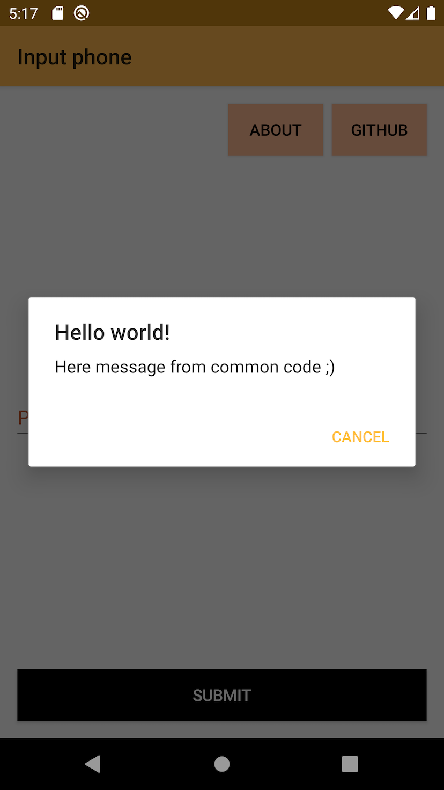

summary: MOKO Widgets #4 - действия на экранах
id: moko-widgets-4
categories: moko
environments: kotlin-mobile-mpp
status: published
Feedback Link: https://github.com/icerockdev/kmp-codelabs/issues
Analytics Account: UA-81805223-5
Author: Aleksey Mikhailov <am@icerock.dev>

# MOKO Widgets #4 - screen actions
## Вводная
Duration: 5

Урок является продолжением [MOKO Widgets #3 - styles](https://codelabs.kmp.icerock.dev/codelabs/moko-widgets-3/). Для выполнения данного урока нужно иметь проект, полученный в результате выполнения предыдущего урока.

Результатом прошлого урока было приложение с навигацией и стилизацией экранов.

На этом уроке мы добавим различные действия, происходящие на экране:
- Открытие ссылки в браузере;
- Показ сообщения;
- Показ диалога с обработкой ответа пользователя;
- Открытие системного экрана с обработкой результата.

## Показать toast
Duration: 5

Предположим что мы хотим при нажатии на кнопку Submit с пустым полем ввода выводить toast (всплывающее сообщение), вместо error label у поля.

### Реализация логики
Добавим проверку на пустоту в `InputPhoneViewModel`.

`mpp-library/src/commonMain/kotlin/org/example/mpp/auth/InputPhoneScreen.kt`:
```kotlin
class InputPhoneViewModel(
    ...
) : ... {
    ...

    fun onSubmitPressed() {
        val phone = phoneField.data.value
        if(phone.isBlank()) {
            eventsDispatcher.dispatchEvent { showError("it's cant be blank!".desc()) }
            return
        }
        val token = "token:$phone"
        eventsDispatcher.dispatchEvent { routeInputCode(token) }
    }

    interface EventsListener {
        fun routeInputCode(token: String)
        fun showError(error: StringDesc)
    }
}
```
Во первых мы добавили новый метод в `EventsListener`, а значит экран должен его поддерживать. А в обработчике нажатия на кнопку проверяем текст на пустоту, если он пустой - вызываем показ ошибки.

### Реализациия экрана
Метод показа `toast` встроен в moko-widgets начиная с релиза [0.1.0-dev-8](https://github.com/icerockdev/moko-widgets/releases/tag/release%2F0.1.0-dev-8).

`mpp-library/src/commonMain/kotlin/org/example/mpp/auth/InputPhoneScreen.kt`:
```kotlin
class InputPhoneScreen(
    ...
) : ... {
    ...

    override fun showError(error: StringDesc) {
        showToast(error)
    }
}
```

### Тестирование
Теперь можно запустить приложение (как Android так и iOS) и убедиться что toast успешно показывается.

## Открытие ссылки
Duration: 15

Для примера добавим на экран ввода телефона кнопку `GitHub`, по нажатию на которую должен открыться гитхаб `moko-widgets`. 

### Добавление кнопки
Чтобы это реализовать сначала добавим кнопку на экран:

`mpp-library/src/commonMain/kotlin/org/example/mpp/auth/InputPhoneScreen.kt`:
```kotlin
class InputPhoneScreen(
    ...
) : ... {
    ...

    override fun createContentWidget() = with(theme) {
        ...

        constraint(size = WidgetSize.AsParent) {
            ...

            val githubButton = +button(
                size = WidgetSize.WrapContent,
                content = ButtonWidget.Content.Text(Value.data("GitHub".desc())),
                onTap = ::onGitHubPressed
            )

            constraints {
                ...

                githubButton centerXToCenterX root
                githubButton topToTop root.safeArea offset 16
            }
        }
    }

    private fun onGitHubPressed() {
        TODO()
    }

    ...
}
```

### Реализация обработчика кнопки
Теперь остается добавить реакцию на нажатие кнопки. Нам нужно открыть url в браузере.
На android для открытия URL нам нужен context (любой экран приложения по сути), а на iOS можем из любого места приложения вызвать нужный код. Чтобы действие было доступно из общего кода реализуем специальную `expect` экстеншен функцию к классу `Screen` (это даст нам  доступ до context на android).

`mpp-library/src/commonMain/kotlin/org/example/mpp/ScreenExt.kt`:
```kotlin
expect fun Screen<*>.openUrl(url: String)
```

Android - `mpp-library/src/androidMain/kotlin/org/example/mpp/ScreenExt.kt`:
```kotlin
actual fun Screen<*>.openUrl(url: String) {
    val context = requireContext()
    val openIntent = Intent(Intent.ACTION_VIEW, Uri.parse(url))
    if (openIntent.resolveActivity(context.packageManager) != null) {
        context.startActivity(openIntent)
    }
}
```

Positive
: так как `Screen` это `Fragment` на android, то `this` в этой функции имеет все возможности `Fragment` - включая и `requireContext()`.

iOS - `mpp-library/src/iosMain/kotlin/org/example/mpp/ScreenExt.kt`:
```kotlin
actual fun Screen<*>.openUrl(url: String) {
    UIApplication.sharedApplication.openURL(NSURL.URLWithString(url)!!)
}
```

Positive
: для добавления `iosMain` в данном шаблоне доступно использование symlinks, подробнее было указано в [codelab](https://codelabs.kmp.icerock.dev/codelabs/kmp-mobile-from-zero/index.html?index=..%2F..index#4).

Остается в обработчике кнопки вызвать наш новый метод:

`mpp-library/src/commonMain/kotlin/org/example/mpp/auth/InputPhoneScreen.kt`:
```kotlin
class InputPhoneScreen(
    ...
) : ... {
    ...

    private fun onGitHubPressed() {
        openUrl("https://github.com/icerockdev/moko-widgets")
    }

    ...
}
```

### Тестирование
Теперь можно запустить приложение (как Android так и iOS) и убедиться что открытие ссылки полностью работает.


## Показ сообщения
Duration: 15

Для примера сделаем кнопку `About`, при нажатии на которую будет открываться диалог с информацией о приложении, с кнопкой `Close`.

### Добавление кнопки
Чтобы это реализовать сначала добавим кнопку на экран:

`mpp-library/src/commonMain/kotlin/org/example/mpp/auth/InputPhoneScreen.kt`:
```kotlin
class InputPhoneScreen(
    ...
) : ... {
    ...

    override fun createContentWidget() = with(theme) {
        ...

        constraint(size = WidgetSize.AsParent) {
            ...

            val aboutButton = +button(
                size = WidgetSize.WrapContent,
                content = ButtonWidget.Content.Text(Value.data("About".desc())),
                onTap = ::onAboutPressed
            )

            constraints {
                ...

                githubButton rightToRight root offset 16 // изменим положение кнопки, чтобы вместить новую кнопку рядом
                githubButton topToTop root.safeArea offset 16

                aboutButton rightToLeft githubButton offset 8
                aboutButton topToTop githubButton
            }
        }
    }

    private fun onAboutPressed() {
        TODO()
    }

    ...
}
```

### Реализация обработчика кнопки
Теперь остается добавить реакцию на нажатие кнопки. Нам нужно открыть [AlertDialog](https://developer.android.com/reference/android/app/AlertDialog.html) на android и [UIAlertController](https://developer.apple.com/documentation/uikit/uialertcontroller) на iOS.
На android нам нужен `Context` (любой экран приложения по сути), а на iOS для отображения нужен `UIViewController`. Чтобы действие было доступно из общего кода реализуем специальную `expect` экстеншен функцию к классу `Screen` (это даст нам  доступ до `Context` на android и до `UIViewController`).

`mpp-library/src/commonMain/kotlin/org/example/mpp/ScreenExt.kt`:
```kotlin
expect fun Screen<*>.showMessage(title: StringDesc, message: StringDesc)
```

Android - `mpp-library/src/androidMain/kotlin/org/example/mpp/ScreenExt.kt`:
```kotlin
actual fun Screen<*>.showMessage(
    title: StringDesc,
    message: StringDesc
) {
    val context = requireContext()
    AlertDialog.Builder(context)
        .setTitle(title.toString(context))
        .setMessage(message.toString(context))
        .setPositiveButton(android.R.string.cancel) { _, _ -> }
        .setCancelable(true)
        .create()
        .show()
}
```

Negative
: В данной реализации сообщение пропадет при смене конфигурации (изменили язык в настройках телефона, или повернули экран или включили разделение экрана). В следующем примере будет разобран вариант с сохранением состояния.

iOS - `mpp-library/src/iosMain/kotlin/org/example/mpp/ScreenExt.kt`:
```kotlin
actual fun Screen<*>.showMessage(
    title: StringDesc,
    message: StringDesc
) {
    val alertController = UIAlertController.alertControllerWithTitle(
        title = title.localized(),
        message = message.localized(),
        preferredStyle = UIAlertControllerStyleAlert
    )
    alertController.addAction(
        UIAlertAction.actionWithTitle(
            title = "Cancel",
            style = UIAlertActionStyleCancel,
            handler = null
        )
    )
    viewController.presentViewController(alertController, animated = true, completion = null)
}
```

Positive
: у `Screen` в iOS доступен метод `viewController` для получения `UIViewController` созданного из `Screen` и выполнения любых операций над ним.

Остается в обработчике кнопки вызвать наш новый метод:

`mpp-library/src/commonMain/kotlin/org/example/mpp/auth/InputPhoneScreen.kt`:
```kotlin
class InputPhoneScreen(
    ...
) : ... {
    ...

    private fun onAboutPressed() {
        showMessage(
            title = "Hello world!".desc(),
            message = "Here message from common code ;)".desc()
        )
    }

    ...
}
```

### Тестирование
Теперь можно запустить приложение (как Android так и iOS) и убедиться что диалог отображается.

|android app|ios app|
|---|---|
|||

## Показ диалога с обработкой результата
Duration: 15

Усложним пример с показом сообщения - теперь нам нужно показать диалог с вопросом "Open github?" при нажатии на кнопку `GitHub`. В диалоге должны быть варианты ответа `Yes` (открывает сайт) и `No` (просто закрывает диалог).

Данная задача осложняется тем, что Android может независимо от работы приложения пересоздавать экран, а значит нужно предусмотреть восстановление диалога и привязку обработчиков нажатий.

Кнопка `GitHub` у нас уже есть, поэтому сразу переходим к реализации обработчика.

Positive
: Нужно провести обновление проекта до moko-widgets `0.1.0-dev-11`. 

### Common code
Определим интерфейс работы с диалогом:
```kotlin
expect fun Screen<*>.showDialog(
    dialogId: Int,
    title: StringDesc,
    message: StringDesc,
    positiveButton: StringDesc?,
    negativeButton: StringDesc?,
    buttonsHandler: DialogButtonsHandler
)

expect class DialogButtonsHandler

expect fun Screen<*>.registerDialogButtonsHandler(
    onPositivePressed: (dialogId: Int) -> Unit,
    onNegativePressed: (dialogId: Int) -> Unit
): ReadOnlyProperty<Screen<*>, DialogButtonsHandler>
```

### Android code
```kotlin

class AlertDialogFragment : DialogFragment() {
    var listener: Listener? = null

    override fun onCreateDialog(savedInstanceState: Bundle?): Dialog {
        val context = requireContext()
        val arg = arguments?.getParcelable<Arg>(ARG_KEY)!!

        return AlertDialog.Builder(context)
            .setTitle(arg.title)
            .setMessage(arg.message)
            .apply {
                if (arg.positiveButton != null) {
                    setPositiveButton(arg.positiveButton) { _, _ ->
                        listener?.onPositivePressed(arg.dialogId)
                    }
                }
                if (arg.negativeButton != null) {
                    setNegativeButton(arg.negativeButton) { _, _ ->
                        listener?.onNegativePressed(arg.dialogId)
                    }
                }
            }
            .setCancelable(true)
            .create()
    }

    interface Listener {
        fun onPositivePressed(dialogId: Int)
        fun onNegativePressed(dialogId: Int)
    }

    @Parcelize
    data class Arg(
        val dialogId: Int,
        val title: String,
        val message: String,
        val positiveButton: String?,
        val negativeButton: String?
    ) : Parcelable

    companion object {
        private const val ARG_KEY = "arg"

        fun instantiate(arg: Arg): AlertDialogFragment {
            return AlertDialogFragment().apply {
                arguments = Bundle().apply { putParcelable(ARG_KEY, arg) }
            }
        }
    }
}

actual fun Screen<*>.showDialog(
    dialogId: Int,
    title: StringDesc,
    message: StringDesc,
    positiveButton: StringDesc?,
    negativeButton: StringDesc?,
    buttonsHandler: DialogButtonsHandler // it's just marker
) {
    val context = requireContext()
    AlertDialogFragment
        .instantiate(
            AlertDialogFragment.Arg(
                dialogId,
                title.toString(context),
                message.toString(context),
                positiveButton?.toString(context),
                negativeButton?.toString(context)
            )
        )
        .show(childFragmentManager, null)
}

actual class DialogButtonsHandler

actual fun Screen<*>.registerDialogButtonsHandler(
    onPositivePressed: (dialogId: Int) -> Unit,
    onNegativePressed: (dialogId: Int) -> Unit
): ReadOnlyProperty<Screen<*>, DialogButtonsHandler> {
    return registerAttachFragmentHook(DialogButtonsHandler()) {
        if (it is AlertDialogFragment) {
            it.listener = object : AlertDialogFragment.Listener {
                override fun onPositivePressed(dialogId: Int) {
                    onPositivePressed(dialogId)
                }

                override fun onNegativePressed(dialogId: Int) {
                    onNegativePressed(dialogId)
                }
            }
        }
    }
}
```

### iOS code
```kotlin
actual fun Screen<*>.showDialog(
    dialogId: Int,
    title: StringDesc,
    message: StringDesc,
    positiveButton: StringDesc?,
    negativeButton: StringDesc?,
    buttonsHandler: DialogButtonsHandler
) {
    val alertController = UIAlertController.alertControllerWithTitle(
        title = title.localized(),
        message = message.localized(),
        preferredStyle = UIAlertControllerStyleAlert
    )
    if (positiveButton != null) {
        UIAlertAction.actionWithTitle(
            title = positiveButton.localized(),
            style = UIAlertActionStyleDefault,
            handler = { buttonsHandler.onPositivePressed(dialogId) }
        ).let { alertController.addAction(it) }
    }
    if (negativeButton != null) {
        UIAlertAction.actionWithTitle(
            title = negativeButton.localized(),
            style = UIAlertActionStyleDestructive,
            handler = { buttonsHandler.onNegativePressed(dialogId) }
        ).let { alertController.addAction(it) }
    }
    viewController.presentViewController(alertController, animated = true, completion = null)
}

actual class DialogButtonsHandler(
    val onPositivePressed: (dialogId: Int) -> Unit,
    val onNegativePressed: (dialogId: Int) -> Unit
)

actual fun Screen<*>.registerDialogButtonsHandler(
    onPositivePressed: (dialogId: Int) -> Unit,
    onNegativePressed: (dialogId: Int) -> Unit
): ReadOnlyProperty<Screen<*>, DialogButtonsHandler> {
    return createConstReadOnlyProperty(
        DialogButtonsHandler(
            onPositivePressed = onPositivePressed,
            onNegativePressed = onNegativePressed
        )
    )
}
```

### Sample
```kotlin
class InputPhoneScreen(
    ...
) : ... {

    ...

    private val openUrlDialogHandler by registerDialogButtonsHandler(
        onPositivePressed = {
            showToast("positive from $it".desc())
        },
        onNegativePressed = {
            showToast("negative from $it".desc())
        }
    )

    ...

    private fun onGitHubPressed() {
        showDialog(
            dialogId = 1,
            title = "Question 1".desc(),
            message = "Yes or no?".desc(),
            positiveButton = "Yes".desc(),
            negativeButton = "No".desc(),
            buttonsHandler = openUrlDialogHandler
        )
    }

    private fun onAboutPressed() {
        showDialog(
            dialogId = 2,
            title = "Question 2".desc(),
            message = "No or yes?".desc(),
            positiveButton = "No".desc(),
            negativeButton = "Yes".desc(),
            buttonsHandler = openUrlDialogHandler
        )
    }

    ...
}
```

## Открытие системного экрана
Duration: 15

При интеграции нативного функционала типа "выбрать контакт из списка контактов телефона" так же может потребоваться показ экрана с обработкой результата.

### Common code
```kotlin
expect class PhonePickerHandler

expect fun Screen<*>.registerPhonePickerHandler(
    code: Int,
    handler: (phone: String) -> Unit
): ReadOnlyProperty<Screen<*>, PhonePickerHandler>

expect fun Screen<*>.showPhonePicker(
    pickerHandler: PhonePickerHandler
)
```

### Android code
```kotlin

actual fun Screen<*>.registerPhonePickerHandler(
    code: Int,
    handler: (phone: String) -> Unit
): ReadOnlyProperty<Screen<*>, PhonePickerHandler> {
    return registerActivityResultHook(
        requestCode = code,
        value = PhonePickerHandler(code)
    ) { result, data ->
        if (result == Activity.RESULT_OK) {
            val contactUri = data?.data ?: return@registerActivityResultHook

            val contentResolver = requireContext().contentResolver
            val projection = arrayOf(ContactsContract.Contacts._ID)
            val cursor = contentResolver.query(
                contactUri, projection,
                null, null, null
            )

            if (cursor != null && cursor.moveToFirst()) {
                val idIdx = cursor.getColumnIndex(ContactsContract.Contacts._ID)
                val id = cursor.getInt(idIdx)

                val phones = contentResolver.query(
                    ContactsContract.CommonDataKinds.Phone.CONTENT_URI, null,
                    ContactsContract.CommonDataKinds.Phone.CONTACT_ID + " = " + id, null, null
                )
                if (phones?.moveToFirst() == true) {
                    val numberIdx = phones.getColumnIndex(ContactsContract.CommonDataKinds.Phone.NUMBER)
                    val number = phones.getString(numberIdx)

                    handler(number)
                }
                phones?.close()
            }
            cursor?.close()
        }
    }
}

actual class PhonePickerHandler(val requestCode: Int)

actual fun Screen<*>.showPhonePicker(pickerHandler: PhonePickerHandler) {
    val intent = Intent(Intent.ACTION_PICK, ContactsContract.Contacts.CONTENT_URI)
    startActivityForResult(intent, pickerHandler.requestCode)
}
```

### iOS code
```kotlin
actual class PhonePickerHandler(
    val onSelected: (phone: String) -> Unit
) : NSObject(), CNContactPickerDelegateProtocol {
    override fun contactPicker(picker: CNContactPickerViewController, didSelectContact: CNContact) {
        val numbers = didSelectContact.phoneNumbers as List<CNLabeledValue>
        val firstNumber = numbers.firstOrNull() ?: return
        val cnPhoneNumber = firstNumber.value as CNPhoneNumber
        onSelected(cnPhoneNumber.stringValue)
    }
}

actual fun Screen<*>.registerPhonePickerHandler(
    code: Int,
    handler: (phone: String) -> Unit
): ReadOnlyProperty<Screen<*>, PhonePickerHandler> {
    return createConstReadOnlyProperty(PhonePickerHandler(handler))
}

actual fun Screen<*>.showPhonePicker(pickerHandler: PhonePickerHandler) {
    val contactPicker = CNContactPickerViewController()
    contactPicker.delegate = pickerHandler

    viewController.presentViewController(contactPicker, animated = true, completion = null)
}
```

### Sample
```kotlin
class InputPhoneScreen(
    ...
) : ... {

    ...

    private val phonePickerHandler by registerPhonePickerHandler(9) {
        showToast("picked $it".desc())
    }

    ...

    private fun onGitHubPressed() {
        showPhonePicker(phonePickerHandler)
    }
    
    ...
}
```
