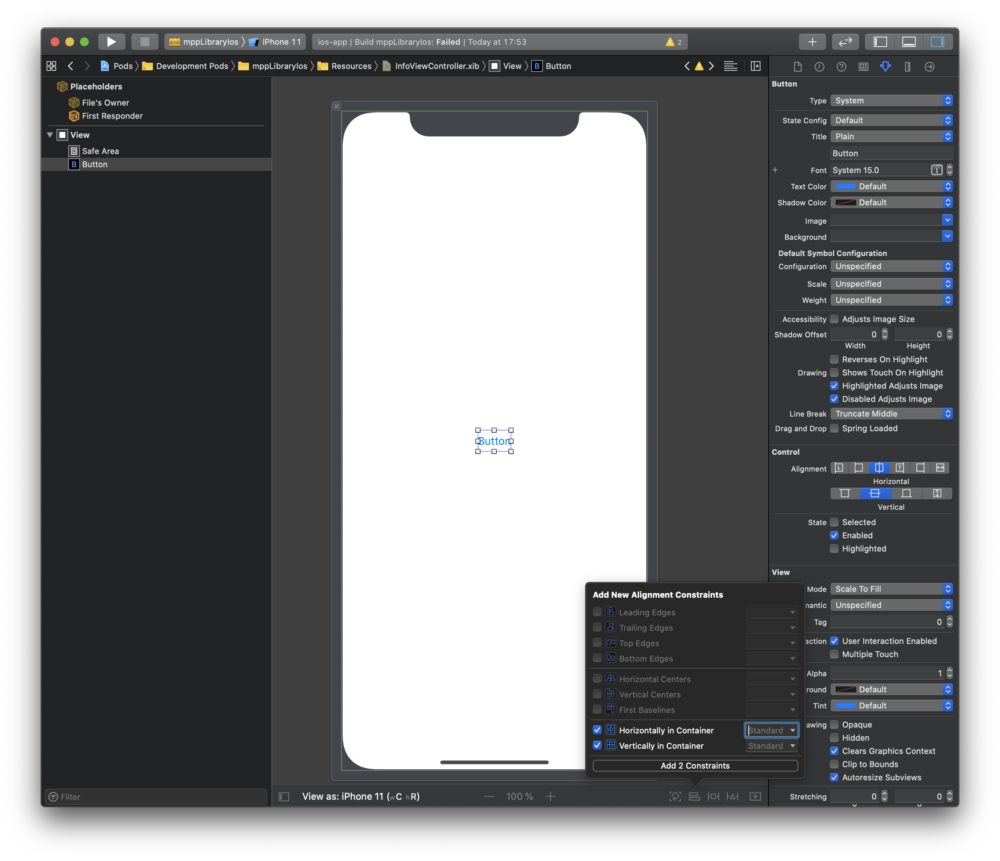
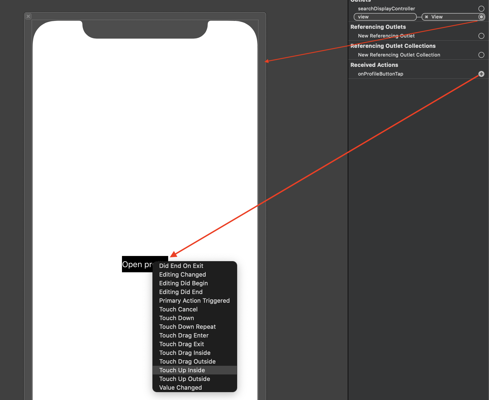
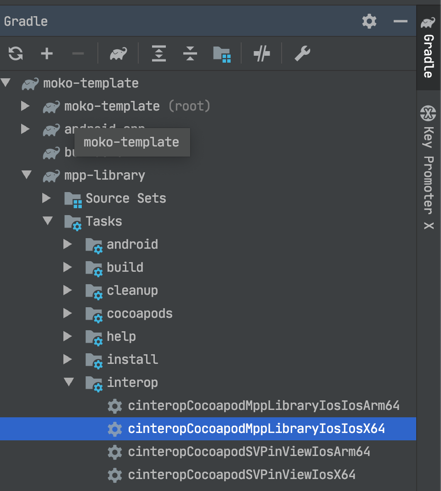

summary: MOKO Widgets #6 - платформенные экраны
id: moko-widgets-6-ru
categories: lang-ru,moko,moko-widgets
status: published
Feedback Link: https://github.com/icerockdev/kmp-codelabs/issues
Analytics Account: UA-81805223-5
Author: Aleksey Mikhailov <am@icerock.dev>

# MOKO Widgets #6 - platform Screen
## Вводная
Duration: 5

Урок является продолжением [MOKO Widgets #5 - custom ViewFactory](https://codelabs.kmp.icerock.dev/codelabs/moko-widgets-5/). Для выполнения данного урока нужно иметь проект, полученный в результате выполнения предыдущего урока.

Результатом прошлого урока было приложение с навигацией, стилизацией экранов и различными действиями на экранах и кастомными фабриками.

На этом уроке мы реализуем платформенный экран - верстка экрана будет сделана полностью нативными инструментами Android и iOS.

## Добавление экрана с платформенным интерфейсом
Duration: 10

Возьмем `InfoScreen`, созданный на прошлых уроках как основу. На экране у нас должна быть кнопка, которая произведет переход на экран профиля, но сам интерфейс должен быть сделан на платформах.

Сначала выделим обработчик кнопки в отдельный метод:
```kotlin
class InfoScreen(
    ...
) : ... {

    ...

    fun onProfileButtonPressed() {
        routeProfile.route()
    }
}
```

Далее заменим базовый класс - вместо `WidgetsScreen` будем использовать корневой класс - `Screen`, так как мы не будем создавать контент экрана виджетами. В итоге получим:
```kotlin
class InfoScreen(
    private val theme: Theme,
    private val routeProfile: Route<Unit>
) : Screen<Args.Empty>() {

    fun onProfileButtonPressed() {
        routeProfile.route()
    }
}
```

На уровне общего кода IDE не покажет никаких ошибок, но каждая из платформ требует свою реализацию.
Например для Android `InfoScreen` становится обычным `Fragment`, в котором интерфейс нужно создавать через `onCreateView`, а для iOS `InfoScreen` даже не скомпилируется, так как не реализован абстрактный метод класса `Screen` - `fun createViewController(): UIViewController`. Из-за разницы платформ нам нужно использовать `expect` класс, но `expect` не может иметь никаких реализаций методов (как `onProfileButtonPressed`), поэтому сделаем `InfoScreen` абстрактным классом, а от него унаследуем `expect class PlatformInfoScreen`.
```kotlin
expect class PlatformInfoScreen(
    theme: Theme,
    routeProfile: Route<Unit>
) : InfoScreen
```

## Реализация экрана на Android
Duration: 10

Добавим `actual` реализацию для класса `PlatformInfoScreen` на android (можно через меню с действиями `opt + Enter` от `expect` объявления класса).
Начальная реализация должна быть следующая:
```kotlin
actual class PlatformInfoScreen actual constructor(
    theme: Theme,
    routeProfile: Route<Unit>
) : InfoScreen(theme, routeProfile) {
    
}
```

После этого нужно реализовать создание интерфейса так, как того требует android. Для начала сделаем верстку экрана, для этого нужно добавить директорию `res` в `mpp-library/src/androidMain` и потом в ней `New -> Layout XML File`. Назовем лейаут `screen_info`.
В файле лейаута сделаем следующую верстку:
```xml
<FrameLayout xmlns:android="http://schemas.android.com/apk/res/android"
    android:layout_width="match_parent"
    android:layout_height="match_parent"
    xmlns:app="http://schemas.android.com/apk/res-auto">

    <Button
        android:id="@+id/profile_btn"
        android:layout_width="wrap_content"
        android:layout_height="wrap_content"
        android:layout_gravity="center"
        app:backgroundTint="@android:color/black"
        android:textColor="@android:color/white"
        android:textAllCaps="false"
        android:text="Open profile" />
</FrameLayout>
```
То есть просто расположим кнопку открытия профиля по центру, а саму кнопку немного стилизуем.

Остается загрузить эту верстку в классе экрана - для этого переопределим метод `onCreateView`:
```kotlin
actual class PlatformInfoScreen actual constructor(
    ...
) : ... {

    override fun onCreateView(inflater: LayoutInflater, container: ViewGroup?, savedInstanceState: Bundle?): View? {
        val view = inflater.inflate(R.layout.screen_info, container, false)
        view.findViewById<Button>(R.id.profile_btn).setOnClickListener {
            onProfileButtonPressed()
        }
        return view
    }
}
```

Чтобы запустить и проверить остается заменить в `mpp-library/src/commonMain/kotlin/org/example/mpp/App.kt` класс, используемый для создания экрана:
```kotlin
class App : BaseApplication() {
    override fun setup(): ScreenDesc<Args.Empty> {
        ...

        return registerScreen(RootNavigationScreen::class) {
            ...

            val mainScreen = registerScreen(MainBottomNavigationScreen::class) {
                ...

                val infoScreen = registerScreen(PlatformInfoScreen::class) {
                    PlatformInfoScreen(theme, bottomNavigationRouter.createChangeTabRoute(2))
                }

                ...
            }

            ...
        }
    }
}
```

Теперь можно открыть приложение и на главном экране вкладка `Info` будет оформлена так, как мы сделали в платформенной реализации.


## Реализация экрана на iOS
Duration: 15

Добавим `actual` реализацию для класса `PlatformInfoScreen` на ios (можно через меню с действиями `opt + Enter` от `expect` объявления класса).
Начальная реализация должна быть следующая:
```kotlin
actual class PlatformInfoScreen actual constructor(
    theme: Theme,
    routeProfile: Route<Unit>
) : InfoScreen(theme, routeProfile) {

    override fun createViewController(): UIViewController {
        TODO("not implemented") //To change body of created functions use File | Settings | File Templates.
    }
}
```

Нам остается добавить реализацию создания `UIViewController` нашего экрана. 
Для этого нам потребуется:
- Создать локальный `CocoaPod`, в котором будет наша нативная реализация экрана;
- Подключить новый `CocoaPod` к `mpp-library`;
- Создать объект нативного класса в методе `createViewController` в `Kotlin`.

### Создание CocoaPod
Создадим файл `mpp-library/mppLibraryIos.podspec` с содержимым:
```ruby
Pod::Spec.new do |spec|
    spec.name                     = 'mppLibraryIos'
    spec.version                  = '0.1.0'
    spec.homepage                 = 'Link'
    spec.source                   = { :git => "Not Published", :tag => "Cocoapods/#{spec.name}/#{spec.version}" }
    spec.authors                  = 'IceRock Development'
    spec.license                  = ''
    spec.summary                  = 'Shared code between iOS and Android'
    spec.module_name              = "#{spec.name}"

    spec.source_files             = "src/iosMain/swift/**/*.{h,m,swift}"
    spec.resources                = "src/iosMain/bundle/**/*"

    spec.ios.deployment_target  = '11.0'
    spec.swift_version          = '5.0'

    spec.pod_target_xcconfig = {
        'VALID_ARCHS' => '$(ARCHS_STANDARD_64_BIT)'
    }
end
```
Это настройки локального `CocoaPod`, согласно которым файлы исходного кода будут находиться в директории `mpp-library/src/iosMain/swift`, а файлы ресурсов (изображения, xib и прочее) в директории `mpp-library/src/iosMain/bundle`.

Теперь подключим данный `CocoaPod` к проекту - добавим в `ios-app/Podfile`:
```ruby
...

target 'ios-app' do
  ...

  pod 'mppLibraryIos', :path => '../mpp-library'
end
```

После этого можно выполнить `pod install` (в директории `ios-app`) чтобы была произведена настройка `Pods` проекта.

Теперь нужно добавить файлы для нативной реализации. Для этого в Xcode создаем файлы:
- `mpp-library/src/iosMain/swift/InfoViewController.swift`
- `mpp-library/src/iosMain/bundle/InfoViewController.xib`

Создаем в группе `mppLibraryIos`:


Positive
: На вопрос о создании Objective-C Bridging Header ответьте "Нет"

Для таргета `mppLibraryIos`:


Positive
: После создания обоих файлов нужно повторно выполнить `pod install` чтобы файлы были корректно подключены к проекту.

### Реализация нативного экрана
В файле `mpp-library/src/iosMain/swift/InfoViewController.swift` добавим реализацию:
```swift
@objc public class InfoViewController: UIViewController {
  @objc public var onProfileButtonPressed: (() -> Void)? = nil
  
  @IBAction func onProfileButtonTap() {
    onProfileButtonPressed?()
  }
  
  @objc public static func create() -> InfoViewController {
    return InfoViewController(
      nibName: nil,
      bundle: Bundle(for: InfoViewController.self)
    )
  }
}
```

Positive
: Директива `@objc` говорит компилятору что для класс `InfoViewController` и поле `onProfileButtonPressed` должны быть доступны из Objective-C - это требуется для работы с данным классом из Kotlin (Kotlin имеет interop с Objective-C и C, но не Swift).

Positive
: По умолчанию в swift используется видимость `internal`, поэтому для работы с классом из вне фреймворка требуется указать видимость `public`.

Positive
: Для создания объекта `InfoViewController` мы передаем `nibName = nil`, чтобы система использовала имя класса для поиска `xib`, а так же `bundle` полученный от класса - чтобы поиск xib производился в правильном framework (в mppLibraryIos.framework)

Далее перейдем к настройке интерфейса в `mpp-library/src/iosMain/bundle/InfoViewController.xib`:

1. Укажем в `File's Owner` наш класс `InfoViewController`:


2. Добавим кнопку на корневую `View` и настроим связи - центрирование по контейнеру:



3. Настроим внешний вид кнопки - заголовок, цвет текста, цвет фона:


4. Укажем связь `View` и `File's Owner` - корневая `view` привязывается к аутлету `view`, действие `onProfileButtonTap` привязывается к кнопке на событие `Touch Up Inside`:



5. Далее попробуем собрать фреймворк - для этого в схемах включим отображение схему `mppLibraryIos` и, выбрав ее, произведем сборку:


Если все было успешно собрано, значит можно переходить к подключению нативного фреймворка в Kotlin.

### Подключение нативного экрана к mpp-library

Сначала требуется добавить новый `CocoaPod` в список подключенных к Kotlin.

`mpp-library/build.gradle.kts`:
```kotlin
...

cocoaPods {
    ...

    pod("mppLibraryIos")
}
```

После добавления настройки нужно вызвать `Gradle Sync` и в панели управления Gradle мы сможем вызвать задачу `cinteropCocoapodMppLibraryIosIosX64`:



После завершения работы задачи `cinteropCocoapodMppLibraryIosIosX64` требуется сделать `Gradle Sync`, чтобы IDE корректно считала сгенерированные данной задачей klib'ы с нативными классами.

Positive
: Если не видно из Kotlin классов от CocoaPod - можно удалить директорию `mpp-library/build/classes` и вызвать по новой cinterop таску, после чего `Gradle Sync`.

Далее можно открыть `mpp-library/src/iosX64Main/kotlin/org/example/mpp/info/PlatformInfoScreen.kt` и внести изменения:
```kotlin
actual class PlatformInfoScreen actual constructor(
    ...
) : ... {

    override fun createViewController(): UIViewController {
        val vc = InfoViewController.create()
        vc.setOnProfileButtonPressed {
            onProfileButtonPressed()
        }
        return vc
    }
}
```

На этом все готово и можно запустить iOS приложение, в котором увидим:


